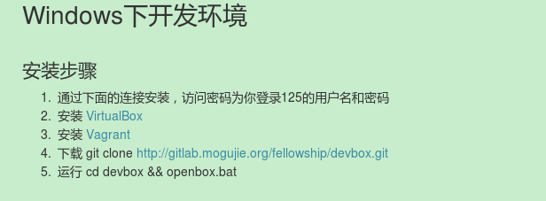
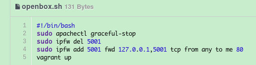
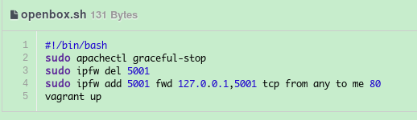
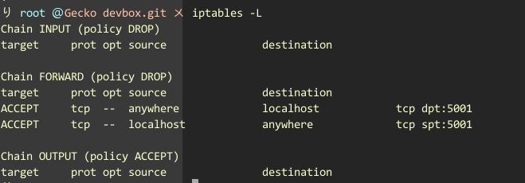
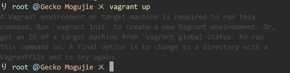

2014-07-09 日报
---
Author:子渊

###昨天的工作
搭建Ubuntu和Win下开发环境。

首先是按照给出的文档进行搭建，步骤如下:
> 
>
> *PS: 其中Windows中的Vagrant文件无法下载*

然后手动下载安装。按照步骤，现可以进行访问(通过:http://localhost:5001)

后来，如果需要通过访问http://mogujie.me，这个方式进行访问，没有成功，比较了Mac和Windows的两个openbox脚本，发现，Windows中只有一句话`vagrant up`,而Mac中则有一段修改防火墙的脚本，如下：
> 
> 
> *意思为将所有访问本机80端口的包转发到5001端口上，5001则是映射虚拟机的80端口*

**注意的地方:**由于Windows中的文件分隔符为`\`,所以在进行书写配置文件的时候需要进行转义，写成`\\`

目前Windows上没能进行端口转发。

由于对Windows不熟悉，所以之后的搭建工作转到了Ubuntu下。

不建议使用apt-get进行安装vagrant和virtualbox，由于版本的问题，最新的vagrant需要virtualbox 4.3支持，而apt-get安装的virtualbox只有4.1版本。

之后可以mac版本的指南开始，如下:
> 

其中，由于ipfm为Unix系统专用防火墙，所以对于Ubuntu，则需要使用iptables这样一个对应的程序。按照之前Mac的效果，即进行端口转发，我采用如下的命令进行模拟:
```
iptables -t nat -A PREROUTING -d 127.0.0.1 -p tcp --dport 80 -j DNAT --to-destination 127.0.0.1:5001
#将访问本机80端口的包转发到5001上
iptables -t nat -A POSTROUTING -d 127.0.0.1 -p tcp --dport 5001 -j SNAT --to 127.0.0.1
#设置返回路径
iptables -A FORWARD -o eth0 -d 127.0.0.1 -p tcp --dport 5001 -j ACCEPT
iptables -A FORWARD -i eth0 -s 127.0.0.1 -p tcp --sport 5001 -j ACCEPT
```
其中省略保存和读取命令。

保存之后，在`iptables -L`中可以看到如下规则:
> 

表明已经做了转发设置。

但是在实际操作中，如果按照这个标准进行转发，我的所有数据包都无法进行交换。这个地方很不理解。

####遇到的比较坑的地方
1. 第一个就是配色问题，一开始的时候，由于没有注意，相类似与下面的情景，我没有注意到输出的错误信息，导致走了很多弯路
> 

2. 对所有的数据进行备份，类似于修改iptables规则，如果失败，恢复起来比较麻烦

####之后的安排
现在虚拟机基本能用，只是无法使用`www.mogujie.me/*`来进行访问，需要改成`locahost:5001/*`,不知道在Ubuntu下是不是有比较好的解决办法。

然后按照安排完成接下来的任务。