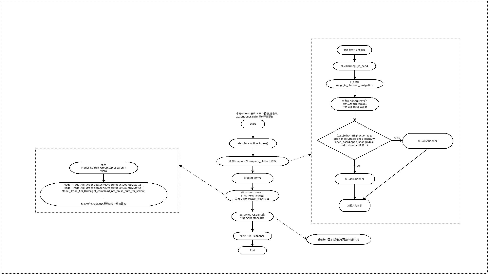

###今日工作
1. 完成DPX-10,由于前端需要修改代码,发布推迟到明天.
2. 完成文档,已添加WKI:
    + UBuntu开发环境搭建
    + Ubuntu下搭建OpenVPN
    + Kohana框架请求分发流程
    
3. 完成文档,但没上传WIKI:
    + 商铺管理首页加载流程图

###明日工作
1. 了解数据库中表结构,生成数据库模型图.
2. 了解Redis.生成文档
3. 熟悉业务流程

###附商铺首页加载流程图
