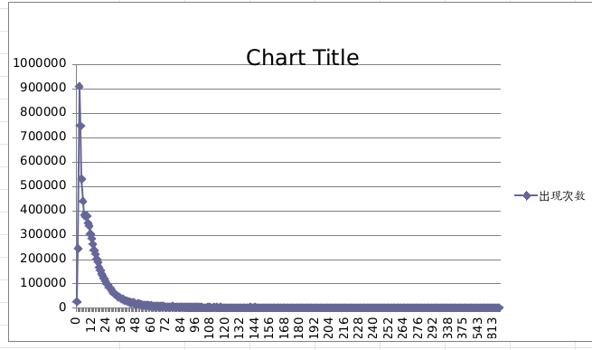
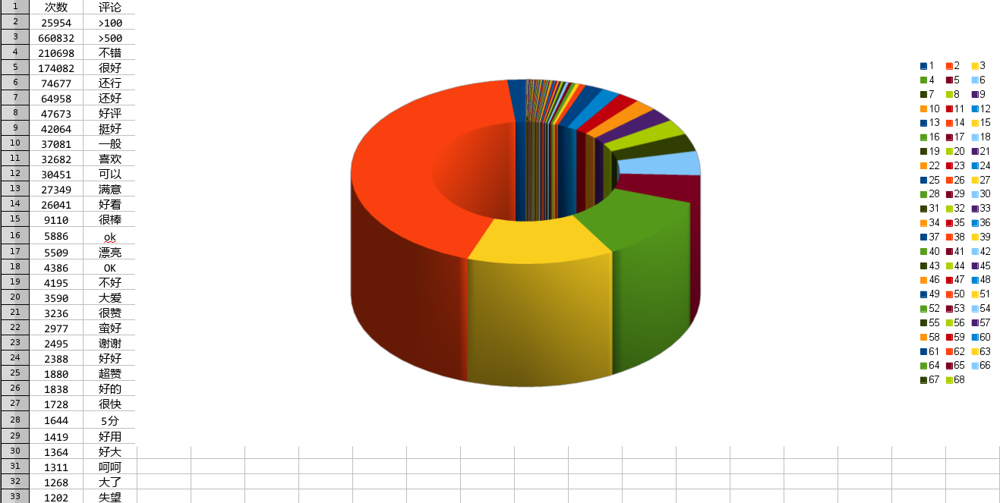
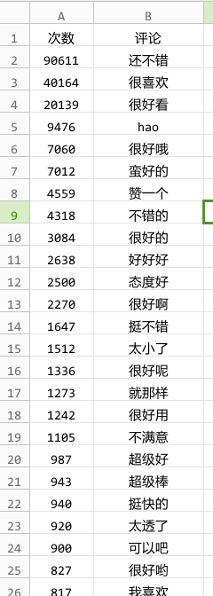
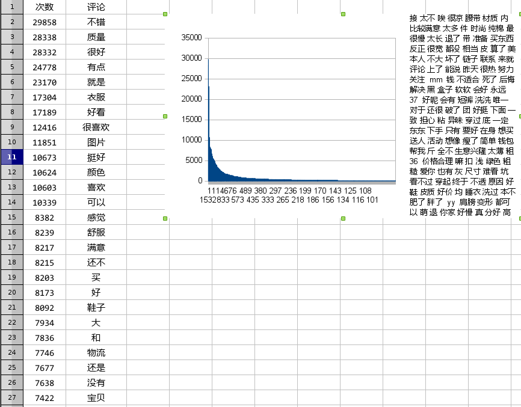

现有评论数据分析
---

###数量分析

从数量上说,按长度进行分类,可以明显的看出趋势.

> 

可以得出,蘑菇街用户的评论短句式偏多.之后对几个不同区域之间的评论进行分词分析.其中,在最多的双字评论中,出现最多的几个评论为:

> *不错,很好,还行,还好,好评,挺好,一般,喜欢...*
>
> 

大多数为评价相关词,比如自己的一个感受,所以在短词,可以考虑通过2,3,4字评论,抽出用户常用情感词,对此进行同义归类.形成蘑菇街的情感词库

考虑到双字评论有90万数据,5字以内评论占了所有评论的40%左右,同时,这部分可以相对精确的分析语义,可以以此进行商品的评价,定级.

三字评论部分和两字部分相同

> 

现在可以统计出,用户的常用关键字,不过只有评论一个维度,并没有根据商品的类目以及其他标签进行多维度分析

其次,针对长评论部分,选取评论长度为20的进行分词分析,数据如下:

> 

发现其出现其他非相关情感词概率比较高,没有对语气副词,等进行过滤,对结果产生一定影响.

之前项目采取的办法是将长评论按照几个特定的标点进行拆分,以小短句的形式进行判定,可以借鉴.

几点注意,对于否定词的判定采取的是逆向最大匹配的方式,即倾向于将形容词与否定词结合.

###新设计

如果我来进行设计新的评论分析,则在原项目的基础上,对其匹配的方式进行修改,之前只是对应的词进行附权值,这边可以采用装饰模式,所有词的倾向度为0,对与形容词,则
有明确的正负值,而对于程度副词,则是一个比,形容词结合,权值相加,带上副词则进行乘,否定词取反,如:漂亮-2,很-1.5,不,如果有一句评论为这衣服很不漂亮.则程序过程为,
将word权值设为2,然后有'不',则成为-2,又有很,则为-2*1.5=-3.这一点新加入.

###新词发现
对于新词的判定,则可以通过其分布进行判断,有一个新词的队列(固定大小,FIFO),然后类似于内存最近最少调度算法,再次出现则将其在队列中的位置放置在最后.设定一个
阀值,如10,即出现十次进入词库.同时记入log.方便后期人为的去除.

###火星文

对于火星文,现在算下来,出现无法识别文字的概率为<1%,可以进行乎略.

###别字

别字问题,该问题有点扎手.不过出现别字的概率<1%,且出现情形比较一致,如"一般般"-"一斑斑","稀饭"-"喜欢","不造"-"不知道"...可以进行人为的添加规则.

###比较棘手的
1. 评论的过滤,通过观察分词的结果,可以发现评论中通常会出现一些拼音和汉字同时出现的情况.在分词下,往往会将拼音和汉字进行分离.造成分析困难.所以考虑是否在过滤是
同一去除拼音,数字.

2. 对于长语句,如:

> 有点小小的失望 但是还是挺好的 挺显瘦的

分词的效果如右:

> 没有|图片|漂亮|有点|小小的|失望|但是|还是|挺好|的|挺|显|瘦|的|

显瘦为一个词语,但是并没有进行正确的区分.后来发现在双字评论中,发现"显瘦"词,词频为391,所以,可以通过对<5评论的采集分析,生成可靠的词库.

