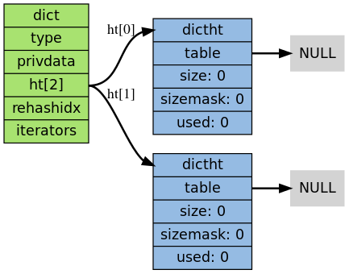
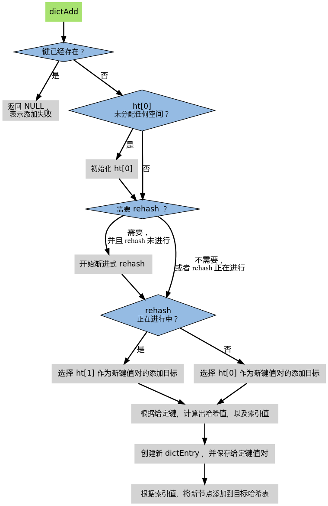

redis介绍(一)
---

###调试环境搭建
+ 下载redis源代码包,可以访问["redis"](http://www.redis.io/download)官网进行下载.这边,我使用的是2.8.13的稳定版本.
+ 解压之后使用eclipse for c/c++导入工程,选项是依据makefile的那项.
+ 导入之后会出现一个语法错误,但事实上,这个错误是可以乎略的.就是在热带开始redis.c的第2969行,会有如下的代码:

```
    snprintf(buf,1024*16,ascii_logo,
        REDIS_VERSION,
        redisGitSHA1(),
        strtol(redisGitDirty(),NULL,10) > 0,
        (sizeof(long) == 8) ? "64" : "32",
        mode, server.port,
        (long) getpid()
    );
```

> *Eclipse会认为ascii_logo "Symbol 'ascii_logo' could not be resolved",这个可以乎略,只要在Preference->C++->Code Analysis中将这一项取消即可.*

+ 使用F10进行调试,即可.

###内存管理
*对应的代码在zmalloc.h/zmalloc.c中*

Redis对内存的使用自己封装了几个方法,可以在zmalloc.h中可以了解.在zmalloc.h中有如下一段很神奇的#define语句:

```
#if defined(USE_TCMALLOC)
#define ZMALLOC_LIB ("tcmalloc-" __xstr(TC_VERSION_MAJOR) "." __xstr(TC_VERSION_MINOR))
#include <google/tcmalloc.h>
...
#elif defined(USE_JEMALLOC)
#define ZMALLOC_LIB ("jemalloc-" __xstr(JEMALLOC_VERSION_MAJOR) "." __xstr(JEMALLOC_VERSION_MINOR) "." __xstr(JEMALLOC_VERSION_BUGFIX))
#include <jemalloc/jemalloc.h>
...
#elif defined(__APPLE__)
#include <malloc/malloc.h>
...
#ifndef ZMALLOC_LIB
#define ZMALLOC_LIB "libc"
...
```

这段代码的作用就是尝试使用其他的内存分配库,尽量不使用系统自带的malloc函数,具体的原因可以参阅[这篇文章](http://blog.163.com/xychenbaihu@yeah/blog/static/13222965520133994850357).

然后就是可以看这两个函数,zfree()和zmalloc().他们会在之后频繁遇到.由于前三个内存分配库,我电脑上没有对应的代码,所以只对redis自带的内存分配代码进行说明.

他对内存的管理,即在申请内存时,会在多申请一个区域,具体可以看**void \*ptr = malloc(size+PREFIX_SIZE);**这句话,而PREFIX_SIZE其实就是一个int的长度,这就可以知道,Redis在申请内存的时候,
会在头部加一个长度,这个长度其实就是这段内存的长度.这样每次分配内存后，返回的实际地址指针为指向memorysize的地址**((char*)ptr+PREFIX_SIZE;)**过该指针，可以很容易的计算出实际内存
的头地址，从而释放内存。

###基本数据类型介绍
*选取字符串和字典两个*

####字符串对应的代码文件为sds.h/sds.c
在sds.c的首部,就可以看到作者对这个类的定义:*SDSLib, A C dynamic strings library*,对于这个类,其实作用和Java中的String类很像.在sds的结构体里有如下几个信息:

```
struct sdshdr {
    int len;
    int free;
    char buf[];
};
```

其实应该和Java中的Buffer更像,原理和NIO中的ByteBuffer一样,一个表示现在的使用长度,一个为现在剩余的长度.不同与Buffer的一点就是,他会自动增加,增加的方式和ArrayList很像,当超出长度的时候
会进行申请新的空间,新空间的申请代码如下:

```
    memcpy(s+curlen, t, len);
    sh->len = curlen+len;
    sh->free = sh->free-len;
    s[curlen+len] = '\0';
```

可见,Redis会申请额外的空间,防止之后频繁的申请.

这个类,就是我们在使用set时的key.以及在redis操作中所能遇到的字符串.

####接下来是字典,字典的对应代码为dict.h/dict.c
在dict.h或者是.c的首部,也能看到作者对这段代码的一个定义:*Hash Tables Implementation*.这个类也使用来存放数据的.比如一个key-value串为"ziyuan"->"mike",则在此字典中的记录为key为ziyuan,value为
mike,这点和PHP中的数组很像.

在"构造函数"调用的时候,会构键如下的一个字典结构:

> 
>
> 为什么是两个table,之后会有解释.

当对字典执行添加操作时.他的流程图如下:

> 

有点lazy-load的意思,初始不赋值.其中涉及到了一个refresh,因为数据存放为了查找快捷,使用的是Hash的方式,当Hash出现冲突,或者空间不够的时候,字典会进行所谓的refresh,其实就是扩大空间,方法也很简单,使用copy on write,这也就是为什么在
字典的定义里使用两个table的原因,当进行扩大时候,后者先申请更大的空间,然后将前者的数据复制过来,然后替换前者,这样可以避免refresh占用大量时间,造成使用者阻塞.

其中refresh有两种触发情况:

+ 自然 rehash ： ratio >= 1 ，且变量 dict_can_resize 为真。
+ 强制 rehash ： ratio 大于变量 dict_force_resize_ratio （目前版本中， dict_force_resize_ratio 的值为 5 ）。

#####渐进式refresh
具体的代码可以参阅_dictRehashStep()和dictRehashMilliseconds()这两个函数

+ _dictRehashStep 用于对数据库字典、以及哈希键的字典进行被动 rehash ；
+ dictRehashMilliseconds 则由 Redis 服务器常规任务程序（server cron job）执行，用于对数据库字典进行主动 rehash ；


#####字典压缩
其实就是前面说的反情况,就是当字典中的容量远远超出需求,也会触发refresh,不过这次是申请一个小表,具体的检测代码如下:

```
/*
 * 检查字典的使用率是否低于系统允许的最小比率
 *
 * 是的话返回 1 ，否则返回 0 。
 */
int htNeedsResize(dict *dict) {
    long long size, used;
    // 哈希表大小
    size = dictSlots(dict);
    // 哈希表已用节点数量
    used = dictSize(dict);
    // 当哈希表的大小大于 DICT_HT_INITIAL_SIZE
    // 并且字典的填充率低于 REDIS_HT_MINFILL 时
    // 返回 1
    return (size && used && size > DICT_HT_INITIAL_SIZE &&
            (used*100/size < REDIS_HT_MINFILL));
            // 其中, REDIS_HT_MINFILL初始为10,即使用率小于10%的时候,就需要进行refresh了.
}
```

待续...
