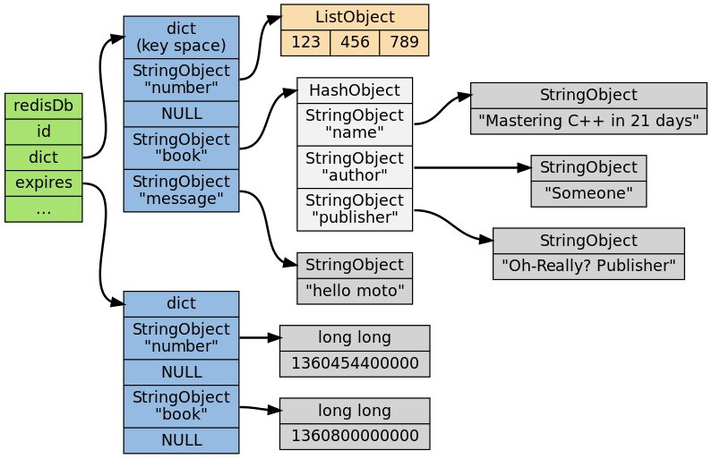
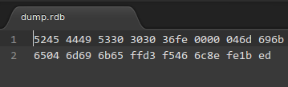
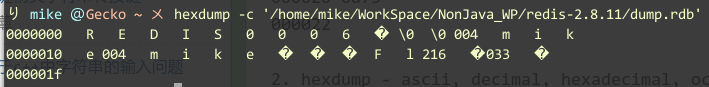
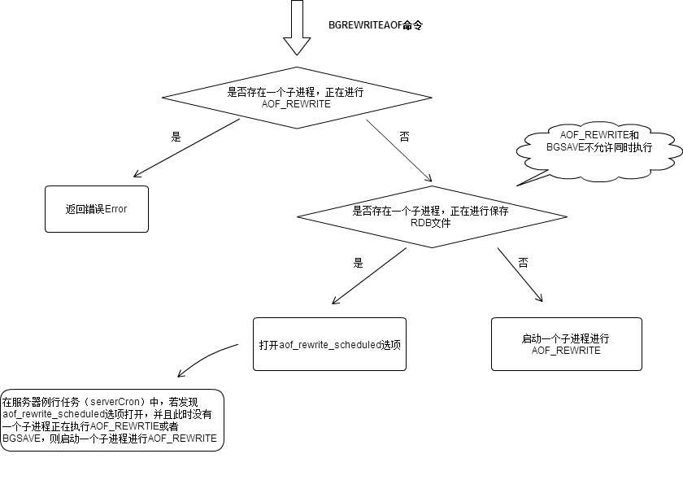

阅读Redis源码(二) -- 数据库及持久化策略
---

之前的一篇文章写了关于Redis的字典数据结构,但是,他并不是与我们直接交互的.因为我们在进行添加字段的时候,往往需要添加过期值,这一点我们在字典数据结构中没有能够得到体现.
所以,我们需要关注另外一个数据结构,**redisDb**.即Redis的数据库储存,在redis.h中,该结构体的定义如下.

```
typedef struct redisDb {
    dict *dict;                 /* The keyspace for this DB */
    dict *expires;              /* Timeout of keys with a timeout set */
    dict *blocking_keys;        /* Keys with clients waiting for data (BLPOP) */
    dict *ready_keys;           /* Blocked keys that received a PUSH */
    dict *watched_keys;         /* WATCHED keys for MULTI/EXEC CAS */
    int id;
    long long avg_ttl;          /* Average TTL, just for stats */
} redisDb;
```

最主要的两个,及我们直接交互的主要是*dict和*expires,第一个用来保存我们的数据,后一个用来记录每一个对应键值的过期时间.后面的,则是Redis内部机制所需要用的到,blocking_keys
,ready_keys有点像信号量,watched_keys则会在事务的处理上会使用到.id则是用于标识数据库.

总体来说,对外的话,redisDb看起来就像下面的结构:

> 

###过期键的清除
既然有过期键,则会有对应的清除策略,一般而言有三种,第一种就是定时清除,第二种就是惰性删除,第三种定时长删除(结合的不算在内).第一种方式就是费cpu,第二种就是费内存,第三种的意思是定时
激活清除函数,清除函数在指定时长尽可能多的清理过期键.在此,Redis采用的方式即第三种和第二种的结合体.在惰性删除的基础上添加定时长删除.

定时长删除的实现比较简单,在redis启动之时,他开起了一个时钟中断,用来执行一些定时任务,建立中断的函数如下:

```
aeCreateTimeEvent(server.el, 1, serverCron, NULL, NULL);
if (server.ipfd > 0 &&
	aeCreateFileEvent(server.el,server.ipfd,AE_READABLE,
acceptTcpHandler,NULL) == AE_ERR) oom("creating file event");
```

redis会在指定时间执行serverCron函数,而定时删除过期时间的代码,则会随着serverCron的启动而启动.对与时长的控制则在redis.c的activeExpireCycle(int type)中体现,核心代码如下:

```
void activeExpireCycle(int type) {
    static unsigned int current_db = 0; /* Last DB tested. */
    static int timelimit_exit = 0;      /* Time limit hit in previous call? */
    static long long last_fast_cycle = 0; /* When last fast cycle ran. */

    unsigned int j, iteration = 0;
    unsigned int dbs_per_call = REDIS_DBCRON_DBS_PER_CALL;
    long long start = ustime(), timelimit;
    ...
    // 设置执行时间
    timelimit = 1000000*ACTIVE_EXPIRE_CYCLE_SLOW_TIME_PERC/server.hz/100;
    // 遍历所有的数据库
    for (j = 0; j < dbs_per_call; j++) {
        int expired;
        redisDb *db = server.db+(current_db % server.dbnum);
        current_db++;
        do {
            unsigned long num, slots;
            long long now, ttl_sum;
            int ttl_samples;

            if ((num = dictSize(db->expires)) == 0) {
                db->avg_ttl = 0;
                break;
            }//判断是否超时
            ...
            if (num > ACTIVE_EXPIRE_CYCLE_LOOKUPS_PER_LOOP)
                num = ACTIVE_EXPIRE_CYCLE_LOOKUPS_PER_LOOP;
            ...
            // 遍历所有的Key,判断是否过期
            for(keys in dict)
                checkexpired();
            ...
            if (ttl_samples) {
                long long avg_ttl = ttl_sum/ttl_samples;

                if (db->avg_ttl == 0) db->avg_ttl = avg_ttl;
                /* Smooth the value averaging with the previous one. */
                db->avg_ttl = (db->avg_ttl+avg_ttl)/2;
            }

            iteration++;
            if ((iteration & 0xf) == 0 && /* check once every 16 iterations. */
                (ustime()-start) > timelimit)
            {
                timelimit_exit = 1;
            }
            if (timelimit_exit) return;
        } while (expired > ACTIVE_EXPIRE_CYCLE_LOOKUPS_PER_LOOP/4);
    }
}
```

redis会在每次检查时判断当前时间执行时间是否超出设置,超出则退出.而惰性清理则更加简单,只是在获取某个特定key的时候,加一个判断逻辑即可解决问题.

###Redis持久化
目前,Redis支持两种持久话策略,一种为RDB,一种就是AOF.RDB就是将数据库的内容以特定的格式存放文件,AOF则是将所有的命令进行保存,然后在redis重启的时候
依此执行.

现在可以看一下RDB文件,我们向一个空的redis中存入一个"mike"=>"mike"字段,然后进行save操作,可以得到如下的一个dump.rdb:

> 

这是一个16进制文件,我们可以对其进行翻译,翻译结果如下:

> 

同时可以参照官方给出的rdb的协议:

```
+-------+-------------+-----------+-----------------+-----+-----------+
| REDIS | RDB-VERSION | SELECT-DB | KEY-VALUE-PAIRS | EOF | CHECK-SUM |
+-------+-------------+-----------+-----------------+-----+-----------+

                      |<-------- DB-DATA ---------->|
```

就比较清楚了.

可以比较清除的看到那两个mike.在关于redis的官方介绍中,他们提到对于key和value都是2进制安全的,其实就是和底层的存储方式相同,直接存2进制.

对于AOF,文件,则容易阅读的多,因为,就是命令的添加,一个最简单的AOF文件内容如下:

```
*2
$6
SELECT
$1
0
*3
$3
...
```

不过,如果涉及到文件的存储策略,aof则是有另外的一套,因为这样的存储对空间的要求过大.所以redis在此有一个rewrite机制,当AOF文件达到 REDIS_AOF_REWRITE_MIN_SIZE（1M）时，
Redis就会执行AOF_REWRITE来优化AOF文件,具体的执行流程如下:

> 

经历过rewrite之后,aof的文件大小会减小.也可以看如下的伪代码:

```
def rewriteAppendOnlyFile(filename):
    # 创建临时文件
    tempFile = createTempFile():
    # 循环所有数据库
    for db in redisServer.dbs:
        # 把数据库中的每一个键值对，按照AOF协议写入临时文件
        for key, val in db.key_value_pairs():
            expired_time = getExpiredTime(key)
            # 过滤过期键
            if expired_time != -1 and expired_time < now_time:
                continue
            # 获取键值对应的命令（譬如 string->set，list->lpush)
            cmd = getCmdByValueType(val)
            # 按照aof协议保存键值对
            saveIntoAofProcotol(cmd, key,value, tempFile)
            # 若该键关联一个过期时间，并且未超时，则写入该键的过期信息
            if expired_time > now_time:
                 saveIntoAofProcotol("pexpiredat", key, expired_time, tempFile)
    # 重命名文件
    rename(tempFile, filename)
```

对于RDB目前则没有对应的重写机制.

###数据库事务
既然提到数据库,则必然会有事务的概念.所谓ACID,在Redis中,对事务的处理主要依赖与如下的几个命令:

+ MULTI //事件的开始
+ DISCARD //删除事件内容
+ EXEC //执行事件
+ WATCH //监视

值得注意的是,redis本身不带回滚功能,如果事件执行失败,则必定会造成不一致.不过作者也在介绍中说明,为了使redis足够简单,未添加该功能.关于事件处理的代码
都会在multi.c中,其中,可以看下执行时的代码:

```
void execCommand(redisClient *c) {
    int j;
    robj **orig_argv;
    int orig_argc;
    struct redisCommand *orig_cmd;
    int must_propagate = 0; /* Need to propagate MULTI/EXEC to AOF / slaves? */
    if (!(c->flags & REDIS_MULTI)) {
        addReplyError(c,"EXEC without MULTI");
        return;
    }
    if (c->flags & (REDIS_DIRTY_CAS|REDIS_DIRTY_EXEC)) {
        addReply(c, c->flags & REDIS_DIRTY_EXEC ? shared.execaborterr :
                                                  shared.nullmultibulk);
        discardTransaction(c);
        goto handle_monitor;
    }
    unwatchAllKeys(c); /* Unwatch ASAP otherwise we'll waste CPU cycles */
    orig_argv = c->argv;
    orig_argc = c->argc;
    orig_cmd = c->cmd;
    addReplyMultiBulkLen(c,c->mstate.count);
    for (j = 0; j < c->mstate.count; j++) {
        c->argc = c->mstate.commands[j].argc;
        c->argv = c->mstate.commands[j].argv;
        c->cmd = c->mstate.commands[j].cmd;
        if (!must_propagate && !(c->cmd->flags & REDIS_CMD_READONLY)) {
            execCommandPropagateMulti(c);
            must_propagate = 1;
        }
        call(c,REDIS_CALL_FULL);
        c->mstate.commands[j].argc = c->argc;
        c->mstate.commands[j].argv = c->argv;
        c->mstate.commands[j].cmd = c->cmd;
    }
    c->argv = orig_argv;
    c->argc = orig_argc;
    c->cmd = orig_cmd;
    discardTransaction(c);
    if (must_propagate) server.dirty++;
handle_monitor:
    if (listLength(server.monitors) && !server.loading)
        replicationFeedMonitors(c,server.monitors,c->db->id,c->argv,c->argc);
}
```

其核心思想就是建立一个数组,然后将事件开始之后的命令存入数组,直到等到exec命令的时候,才执行.所谓的隔离性,在redis中,因为天然的单线程,所以
根本不会存在问题.对于持久性,则是需要自己手动进行写文件才会出现的特性.在仅使用内存redis的情况下.是不具备持久性的.

待续...
