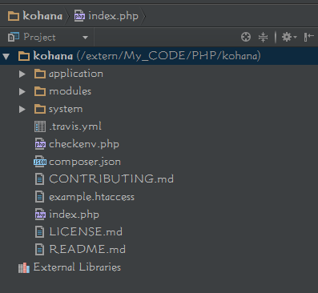
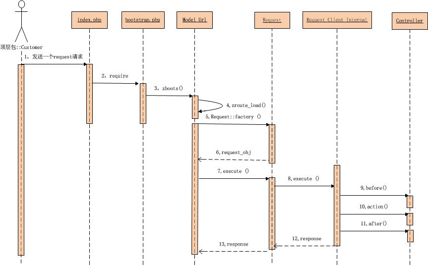

Kohana框架请求分发流程
---
下载Kohana框架代码，可以看到如下的目录结构

> 

其中index.php是程序的主入口，他的主要作用如下:

+ 设置application，module，system的路径
+ 设置Error reporting的等级
+ 如果存在安装文件，就加载它
+ 引导文件，将APPPATH/bootstrap.php引入

可知，故事的开始从index.php开始。

然后,我们可以到bootstrap.php中一探究竟.

这个类中的主要作用就是加载Kohana的核心类*Kohana*,然后配置.具体而言,可以分为如下步骤:

 + 加载Kohana类
 + 执行Kohana::init函数,该函数的作用是设置错误处理,缓存和日志记录。附加Kohana_Config的阅读器和Kohana_Log的写入器。
 + 随后调用Kohana::modules函数来开启更多的模块
 + 将模块路径添加到级联文件系统
 + 如果每个模块的init.php文件存在就引入它
 + init.php文件可以执行额外的环境设置，包括添加路由。
 + 在最后,可以设置一个路由,在刚下的Kohana框架中,bootstrap.php的最后是这么一段代码:

```
/**
 * Set the routes. Each route must have a minimum of a name, a URI and a set of
 * defaults for the URI.
 */
Route::set('default', '(<controller>(/<action>(/<id>)))')
    ->defaults(array(
        'controller' => 'welcome',
        'action'     => 'index',
    ));
```

当bootstrap.php结束之后,request就由index.php转到Request工厂，进行Request的分发。
可见如下的代码

```
if (PHP_SAPI == 'cli') // Try and load minion
{
    class_exists('Minion_Task') OR die('Please enable the Minion module for CLI support.');
    set_exception_handler(array('Minion_Exception', 'handler'));

    Minion_Task::factory(Minion_CLI::options())->execute();
}
else
{
    /**
     * Execute the main request. A source of the URI can be passed, eg: $_SERVER['PATH_INFO'].
     * If no source is specified, the URI will be automatically detected.
     */
    echo Request::factory(TRUE, array(), FALSE) //生成实例
        ->execute() // 执行,其中包括了分发,调用Controller
        ->send_headers(TRUE)    // 给定头部
        ->body();   // 得到Request中的一些参数
}
```

Request工厂会生成一个Request实例,然后对其进行处理,具体过程如下:

 + 调用Request::instance来开始出来请求。
 + 检测每一个路由的设置，直到路由被匹配。
 + 创建controller的实例，并传递请求给它。
 + 调用Controller::before
 + 调用能产生请求响应的controller的action。
 + 调用Controller::after方法。
 + 当你使用HMVC sub-requests的时候，上面5个步骤可以被重复多次。

在这个过程中,在执行Request.execute函数的时候,Request会变成Response,即返回值由Request成为了Response成为了最后返回给用户的类.

最后,当所有的Controller都执行完之后,Request Flow又会回到index.php,此时,Response则会带有经历所有过程的数据,最后返回给访问者.

最后,借用往上的一张图,来显示Request的时序图:

> 
>
> *即在执行函数8的时候成为了Request向Response的转变*
