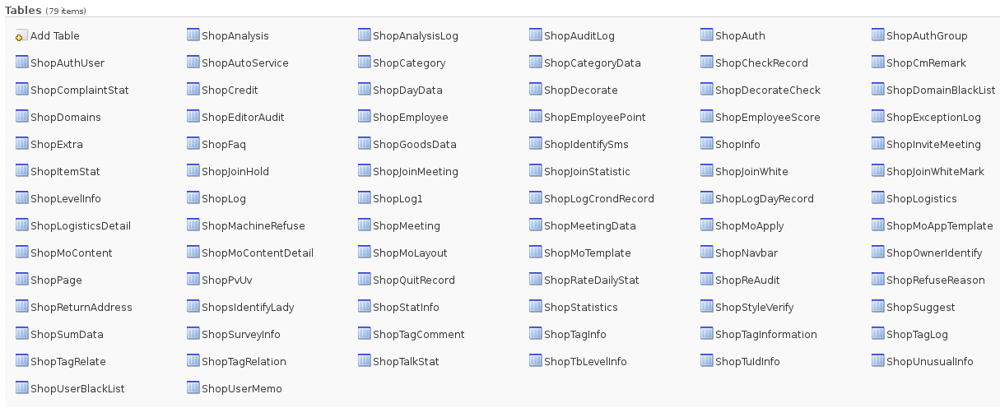
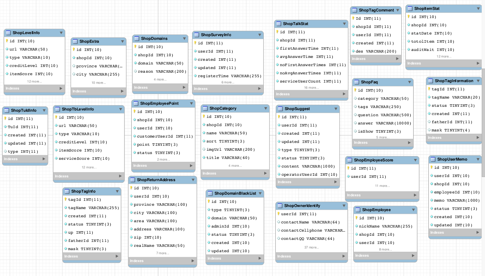
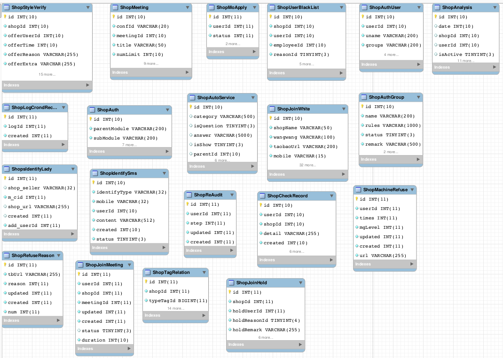
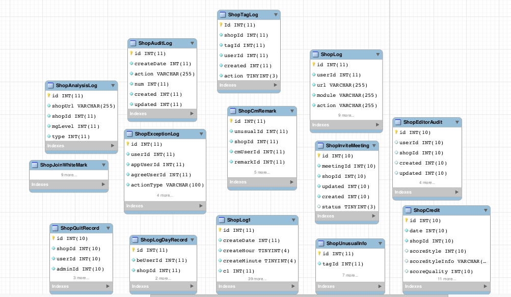
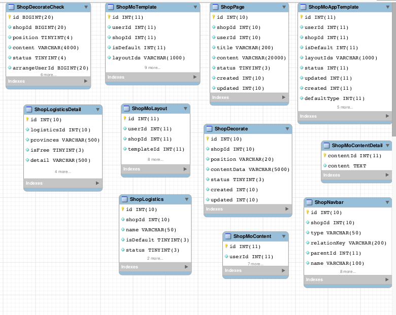
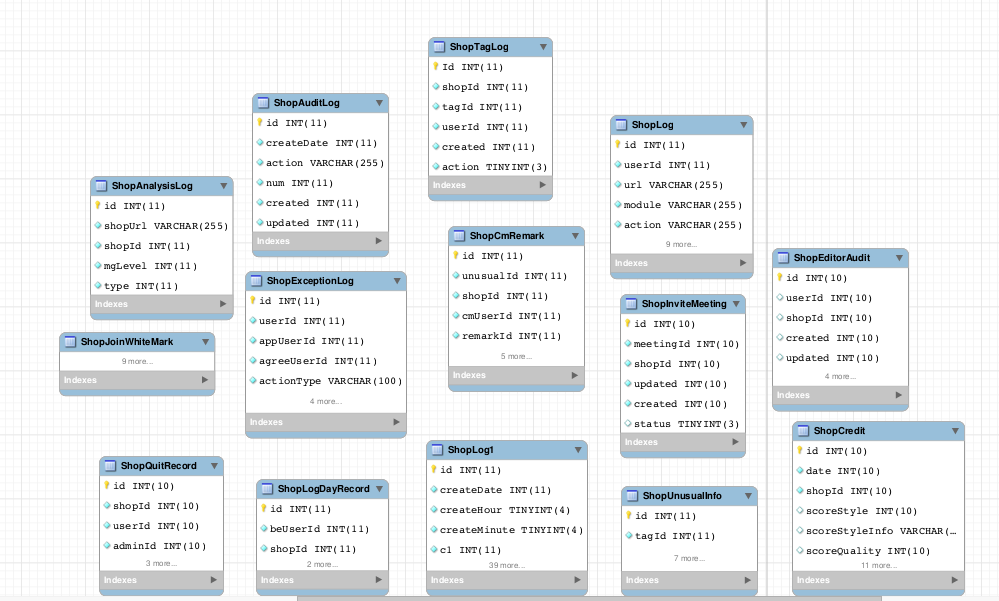

蘑菇街店铺线数据库整理文档
---
目前,从125上导出到本地的数据库表有79张*(Shop开头的为81张,其中两张为Shopping开头,故舍去)*.

具体表的内容如下:

> 

其中可以进行分类,以ShopInfo表为中心,可以分为,店铺基本信息,店铺统计信息,店铺装修信息,店铺相关日志,店铺统计信息,店铺逻辑信息(在业务逻辑中产生的关系表或者临时信息).可以分为下面的情况:

> 
>
> *其中,左上角为店铺逻辑信息,右上角为店铺装修信息,右下角为店铺基本信息,下为日志,左下角为店铺统计信息*

具体而言,先看店铺基本信息,这边所包含的数据库表为:

> 
>
> 这边大多数为静态信息,即读大于写,一般而言在入库的时候就基本确定下来.在进行业务开发的时候,很多时候也只是对其进行读取.

之后就是店铺逻辑信息,具体而言,包含的数据库表如下:

> 
>
> 这边都是一些关系表,或者是临时表,这边在业务开发中,应该是频繁读写的表,举例而言,对于shopanalysis这张表,数据部门可能会不定时的进行修改,同时,业务逻辑端会在业务实现中调用该表.亦或是shoptagrelation表,这张表,可能会频繁的进行写入,新加入的商家,可能会及时的加上tag,或者商家性质改变,都会影响到该表.

店铺日志类相关数据库表如下:

> 
>
> 这边基本是日志信息,在业务开发的时候,可以用于记录.

店铺装修信息相关数据库表:

> 
>
> 为了划分方便.我将装修逻辑相关的表也放在了这一类中,按照内容,可知,用户的装修信息,贮存在这些表中,如果需要商家修改装修,则会涉及大多数表.

店铺统计信息相关数据库表:

> 
>
> 这边是用来存储统计信息,举个例子,就是我第一个项目中,需要修改退货率和发货时间接口,按照原先的代码,是从ShopCredit表中进行获取的,后来我只修改了获取数据部分代码,如果想要更加完美,则需要将数据库中的相关列进行修改,即在这边的写入时修改.可对业务端代码透明.

<h3>出现的问题</h3>
+ 部分表comment部分出现乱码,如ShopItemStat,ShopEmployeeScore.
+ 对于废弃表没有进行标识,可以进行添加Comment或者添加前缀来标识
