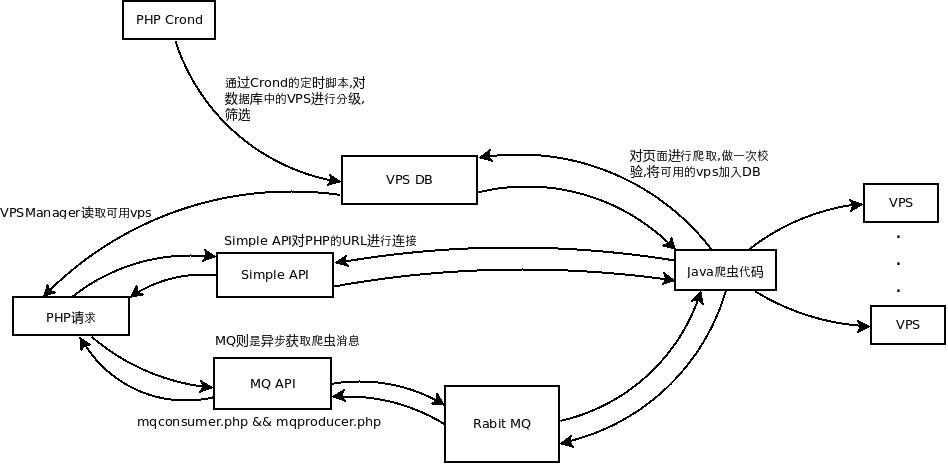
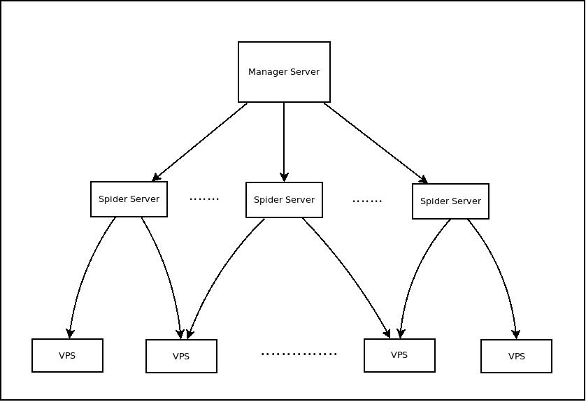
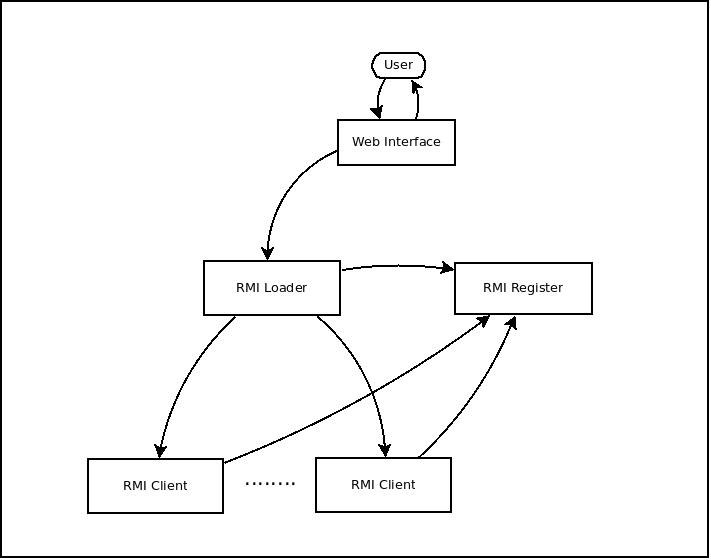

爬虫评估文档
--

###目前存在的问题
1. 爬虫代码目前没有人能比较完全的了解和掌握
2. 代码比较杂乱,随意添加的状况比较明显,没有固定的风格
3. 代码都是单机模式,部署和重启都是问题
4. 网页控件非常复杂,功能冗余,且没有使用手册,不利与后期维护
5. 核心代码对用户可见,容易造成误修改
6. 配置文件极度复杂,三木今天为了修一个bug,在配置文件上捣鼓了近一个小时.后期用约定代替配置文件的思想进行编码设计.

###优点
1. 通过工厂模式对Parser进行了同一管理,集中修改代码段
2. 逻辑简单,添加快,爬虫编写易上手
3. 有web管理界面,方便用户管理

###目前的逻辑

> 

+ *图中存在的问题,对VPS的管理有两块,并没有采用集中式的管理,目前的一个改进方法为将对VPS的管理采用PHP+Crond的方式同一管理,对于对外的接口,可以直接采用一个Restful的webservice.*
+ *其次,在内部的爬虫逻辑部分也有模糊不清的情况,因为开放了核心代码,所以代码编写人员可以随意的调取核心API,造成原本应该去藕的模块耦合在了一起.*

对于VPS数量问题,可以见如下资料,淘宝一个搜索页面包含店铺为30个,其中页面大小为292.8kb,现在我们有一台VPS,带宽为1m的情况下,下载一个页面需要2s,同时乎略解析时间.可知,如果要在一周时间内爬完所有店铺,(现有店铺池大小为90万),可以
推出,假设在搜索时,包括重复,假设为2,即访问两个页面出现一个相同店铺,可知要想在现有基础条件下爬完所有数据,需要12万秒+50msx6万=123000秒=1.5天*,且在淘宝没有对其行为产生怀疑的情况下.如果加上间隔时间,即每隔5s进行访问,则所需时间
需要变成3-4天,符合需求,为保险起见,需要进行简单测试.之后会提供一个详细的需求.

> 

+ *核心思想就是将VPS模块单独提取出来成为一个单独的模块*

> 

+ *倾向于使用管理单点,避免出现现有管理麻烦的情况*

###重构
1. 重构目的

    + 减少代码耦合度
    + 提高可扩展性
    + 动态添加新爬虫
    + 减少用户开发的代码量
    + 隐藏细节

2. 重构方案介绍

    + 沿用之前代码,整理代码

        > 对前的爬虫代码进行整理.将以业务为分包依据,而非功能.同时规范代码编写,将现有爬虫代码抽象,从而提出一个统一的行为,然后进行设计.

    + 使用jar加载的方式

        > 对用户的不同行为或者需求,单独编写爬虫程序,然后通过统一的管理界面去启动或者干掉对应的jar程序.可以使用classloader,或者通过使用shell.
        >
        > 可以简单的认为是如下的一个模型:
        >
        > 
        >
        > *同时,如果对用户提供一个联网的API接口,可以将其扩展为分布式的统一管理模式,比如各个slave上的爬虫通过socket的方式于一台管理机联系,同时提供一个集中管理页面,则新的设计如下:*
        >
        > 
        >
        > 即可拓展成如下的一个模型,同时修改Manger代码,可以保证对下的一个透明,不需要修改现有爬虫代码(完成单机之后的).

    + 使用rmi(远程方法调用)的方式

        > 设计如下:
        >
        > 
        >
        > + *由于采用了RMI技术,所以我们会对外提供一个SDK开发包,通过继承包中的类,我们可以封装其进行注册和启动的逻辑.*
        > + *提供给用户只有一个Web界面,让其通过该页面进行上传私有爬虫代码,同时将爬虫代码发送到不同的机器上.*
        > + *由RMI Register模块负责进行注册管理,然后用户通过Web上传代码之后,进行注册和监控.*
        >
        > *因为大二的时候写过类似的RMI框架,所以对此比较倾向,代码位于:[Malayans](https://github.com/MikeCoder/Malayans),同时开发包为[Malayans.Module](https://github.com/MikeCoder/Malayans.Module),示例代码为[Malayans.Module.Example](https://github.com/MikeCoder/Malayans.Module.Example),模块注册,激活基本流程跑通,只是没有图形界面*

    + 取消独立管理界面,直接针对不同的需求进行代码编写

        > 即针对每个需求进行编写不同的爬虫程序,通过编写单个的控制界面对其进行控制.

    + 使用OSGI进行热加载和热替换

        > 仅仅了解..没有深究,不是很清楚会发生什么.

3. 重构的方案对比

    1. 继续沿用原爬虫框架,对代码进行整理
        + 优点:

        > 1. 代码修改量小
        > 2. 不用修改php端代码

        + 缺点:

        > 1. 问题的根源没有解决,之后还会产生类似原因
        > 2. 补充文档比较困难

    2. 使用加载jar文件的方式
        + 优点:

        > 1. 通过分别打包,将用户代码进行强制区分,减少耦合
        > 2. 通过动态添加,可以解决添加新爬虫之后需要重启的状况

        + 缺点:

        > 1. jar加载之后无法去除,久之,可能会造成OOM.采用shell的方案则需要自己设计一套控制,监管API.
        > 2. 无法分布式部署,部署状况还是需要一个一个的安装,缺少同一管理界面

    3. 使用RMI的方式进行部署
        + 优点:

        > 1. 利用RMI的先天可分布式的优势,可以进行分布式的管理
        > 2. 通过提供RMI的开发SDK,可以避免让用户直接接触核心代码的风险
        > 3. 可以进行同一的管理,包括动态添加,停止等

        + 缺点:

        > 1. 开发难度大,开发周期比较长
        > 2. 各模块相对分散,出现问题定位困难

    4. 针对不同需求进行分别的爬虫编写
        + 优点:

        > 1. 简单,快捷
        > 2. 添加方便,扩展性好
        > 3. 一个出现问题,不会影响其余爬虫代码

        + 缺点:

        > 1. 代码冗余严重
        > 2. 缺少同一管理页面

    5. 使用OSGI
        + 优点:

        > 1. 现有框架,技术成熟

        + 缺点:

        > 1. 对OSGI不了解,编写不熟悉,开发工期无法估计.

###结论
优先采用jar加载的方式,可以在第一期的时候完成单机模式,然后后续可以完成多机模式.在确定难度的情况下,可以比较准确估计工程周期.
