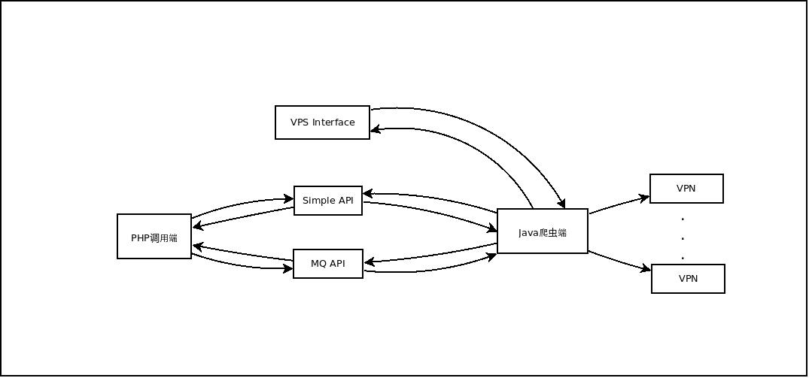
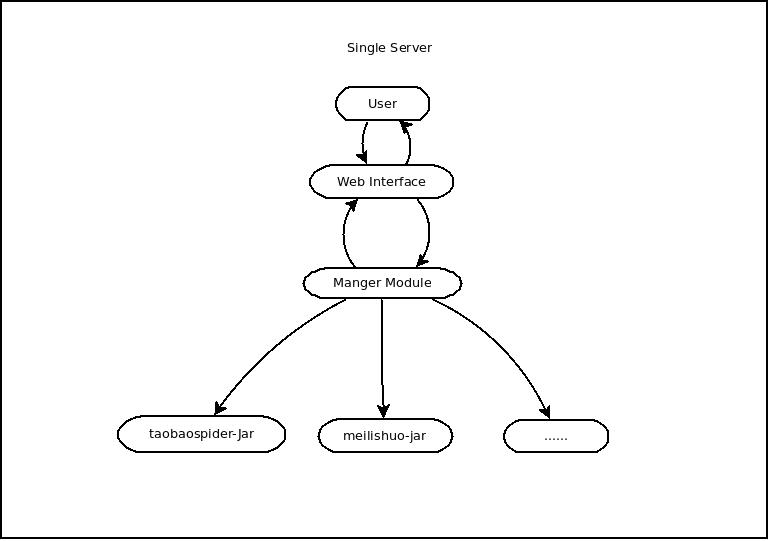
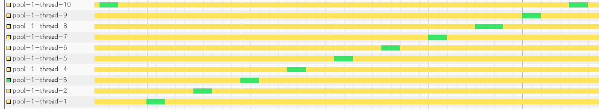
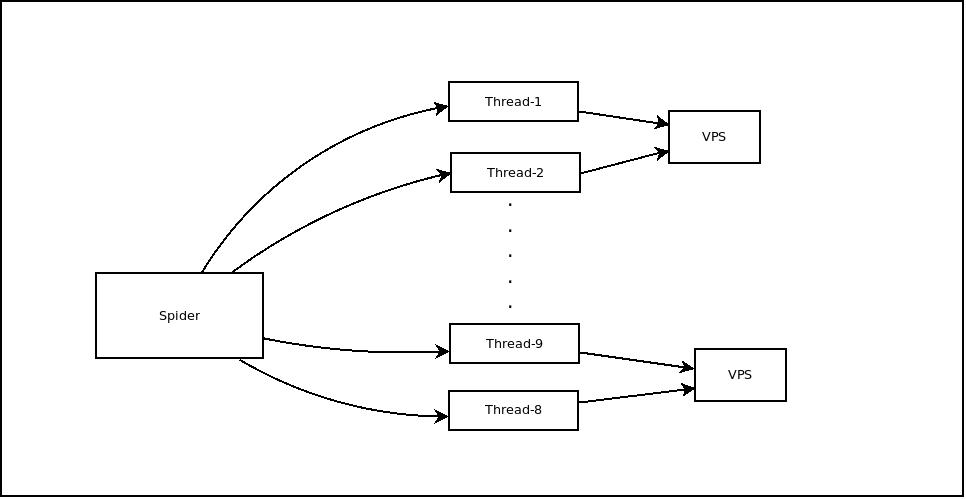
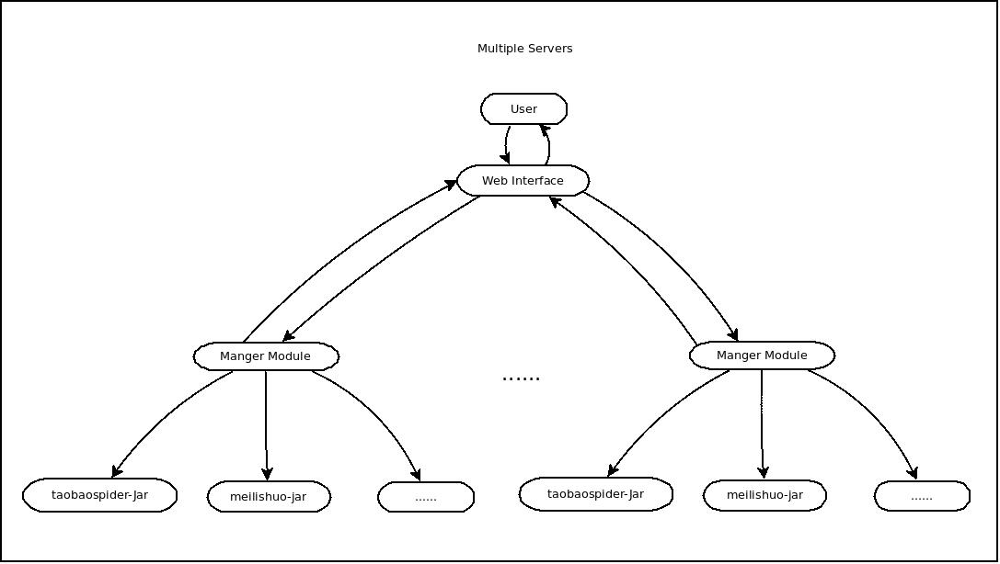

爬虫框架具体实施规划
---

###目前存在的问题
1. 爬虫代码目前没有人能比较完全的了解和掌握
2. 代码比较杂乱,随意添加的状况比较明显,没有固定的风格
3. 代码都是单机模式,部署和重启都是问题
4. 网页控件非常复杂,功能冗余,且没有使用手册,不利与后期维护
5. 核心代码对用户可见,容易造成误修改
6. 配置文件极度复杂,三木今天为了修一个bug,在配置文件上捣鼓了近一个小时.后期用约定代替配置文件的思想进行编码设计.

最后决定采用的设计为,jar通过shell脚本的方式管理,然后上层封装一个管理层.

大致的设计如下:

> 

项目分两部分进行,第一部分,即完成单机版本的设计.第二部分,完成多机版本的设计.

项目第一部分设计图如下:

> 

这一部分需要完成功能有:

+ 爬虫端开发SDK的开发.
+ jar管理程序的开发,通过调用shell命令进行控制爬虫代码.
+ 日志系统的设计
+ 网页管理系统.
+ 远程控制命令协议设计.
+ 配置文件的简化.
+ VPS统一管理.

现在经过测试,淘宝对5秒一次的访问没有做过滤操作,所以可以采用每隔5秒发送一次请求,同时,请求往返时间约为2s,在公司环境下(带宽充足),所以最差估计,在VPS上,往返时间约为4-5秒,以下为测试程序:

> 
>
> *采用每隔5秒发起一个请求线程的设计,可以看到在往返时间上,大约是2秒左右(绿色区域,没有做解析)*

######爬取规则：
>&nbsp;&nbsp;&nbsp;&nbsp;新的爬虫的逻辑同之前的一样,最大限时为7秒,一旦超时,认定该任务失效. 
&nbsp;&nbsp;&nbsp;&nbsp;间隔3秒进行下一次爬取.所以,爬取一次淘宝 list信息页面(一个list信息页面有44个店铺)的时间为10秒,要爬取90万数据,假定冗余度为3,则需要爬取270万数据,约为7万次,一次5秒计,大约需要35万秒,约8天. 
&nbsp;&nbsp;&nbsp;&nbsp;同时,根据具体店铺url进行爬取店铺,淘宝没有做阻拦。我们可以设置最短的搜索时间,所以爬取间隔仅由带宽决定,因为现有VPS为2M带宽,淘宝店铺页面大小约为250kb,所以可以达到一秒一次爬取.处理时间约为一秒,所以可以采用如下的线程模型,两条线程同时使用一个VPS交互进行通信. 
&nbsp;&nbsp;&nbsp;&nbsp;以一秒一个店铺计算,总共90万*2秒.大约25天,以上数据均为使用一个VPS,总共耗时33天,与之前的爬取速度一样。所以要想达到在一周内更新一次,至少需要5台VPS。<b>为了防止异常情况, 则8台最佳。</b>

####**附上测试时间表格:**
>**搜索页面**
    + 间隔时间:5秒,爬取搜索页面3小时,正常
    + 间隔时间:3秒,爬取搜索页面2小时,正常
    + 间隔时间:500毫秒,爬取搜索页面30分钟,拦截
    + 间隔时间:10毫秒,爬取搜索页面10分钟,拦截 

>**具体商铺页面**
    + 间隔时间:5秒,爬取商铺2小时,正常
    + 间隔时间:3秒,爬取商铺30分钟,正常
    + 间隔时间:1秒,爬取商铺30分钟,正常
    + 间隔时间:50毫秒,爬取商铺30分钟,正常
    + 间隔时间:5毫秒,爬取商铺30分钟,正常

>**通过VPS爬取搜索页面**
    + 耗时 4秒

> **通过VPS访问具体店铺**
    + 耗时 1秒

具体分析如下:

<table>
<tr>
<th>类型</th>
<th>VPS数量</th>
<th>带宽</th>
<th>页面大小</th>
<th>爬取间隔</th>
<th>一次耗时</th>
<th>数量</th>
<th>所需天数</th>
</tr>
<tr align="center">
<td>店铺信息</td>
<td>1</td>
<td>2M</td>
<td>约90K</td>
<td>1s</td>
<td>1s</td>
<td>90w</td>
<td>25d</td>

</tr>
<tr align="center">
<td>list信息</td>
<td>1</td>
<td>2M</td>
<td>约250K</td>
<td>5s</td>
<td>4s</td>
<td>7w</td>
<td>8d</td>

</tr>
<tr align="center">
<td>店铺信息</td>
<td>1</td>
<td>4M</td>
<td>约90K</td>
<td>0.5s</td>
<td>0.5s</td>
<td>90w</td>
<td>12.5d</td>

</tr>
<tr align="center">
<td>list信息</td>
<td>1</td>
<td>4M</td>
<td>约250K</td>
<td>5s</td>
<td>4s</td>
<td>7w</td>
<td>8d</td>
</tr>
<tr align="center">
<td>店铺信息</td>
<td>2</td>
<td>2M</td>
<td>约90K</td>
<td>1s</td>
<td>1s</td>
<td>90w</td>
<td>12.5d</td>
</tr>
<tr align="center">
<td>list信息</td>
<td>2</td>
<td>2M</td>
<td>约250K</td>
<td>5s</td>
<td>4s</td>
<td>7w</td>
<td>4d</td>
</tr>
<tr align="center">
<td>店铺信息</td>
<td>2</td>
<td>4M</td>
<td>约90K</td>
<td>0.5s</td>
<td>0.5s</td>
<td>90w</td>
<td>6.25d</td>
</tr>
<tr align="center">
<td>list信息</td>
<td>2</td>
<td>4M</td>
<td>约250K</td>
<td>5s</td>
<td>4s</td>
<td>7w</td>
<td>4d</td>
</tr>
</table>

线程模型类似于:

> 

VPS的管理可以分出一个类,负责当前VPS资源的调度.

Spider有一个任务管理,通过对超时访问的任务进行重新发起.

###具体任务说明
1. SDK的功能需要提供完整的爬虫框架,对外只开放两个解析方法,需要重写.一个是解析列表,一个解析具体的网店.配置文件则会配置爬虫的爬取模式,和爬取的解析类个数,和对应的爬取url特征.
2. VPS的管理由另外的程序控制(寻找和测试),爬虫内部的VPS管理,则是根据当前的负载和权重,分配给索取线程一个合适的VPS
3. 网页管理(web interface)和manger module 采用socket常连.不采取统一工程的原因是,今后的统一管理页面上线,manger module只需修改配置的管理界面ip,即可,不需要改动代码.
4. 配置文件采用Java 的properties,减少非配置文字,简化操作
5. 控制协议包括,当前状态索取,暂停爬虫,启动爬虫,删除爬虫4个,其中有针对一个,全部两个,所以可能有的状态是8个.也就是会有8种协议
6. 日志的话,可以使用log4j

###具体流程
1. 现有程序分为三个层次.最上为用户交互的web层,其次是管理jar的管理层,最后为业务方书写的爬虫程序.其中,爬虫和管理层采用本地套接字常连,用于数据交互.web和管理层过程为,管理层依据
配置文件去web层注册,web记录ip和id,在之后的交互中,由web主动与管理层联系.

2. 目前的程序缺乏报警机制,当爬虫出现问题时,则是由用户先反应.现在的机制是,web端每次打开监控时,定时去爬虫管理层取当前状态信息,如果出现报警,则可以最短时间在页面上显示.

3. 用户程序的上传过程,当前的设计是用户下载整个爬虫工程,然后进行添加代码,之后在重新部署到每一台爬虫机器上,同时重启服务.这就带来一个问题,就是重启时,所有业务方都需要进行确认.非常不方便,
新设计,则可以通过替换,重启业务方的jar文件来解决(通过Java调用Shell来启动,和停止和状态获取).同时提供一个开发包,简化提供的接口.不用在写程序时看到这样的一个包结构:
>
> 
>
> 按照之前的开发流程,如添加一个新增爬虫,所需要完成的工作如魂守在wiki上说的:[spider新增采集任务所需工作](http://wiki.mogujie.org/pages/viewpage.action?pageId=29851858),需要很多的步骤,比较复杂.同时在部署的时候还要考虑定时任务的问题,也就是说,用户部署的时候是在部署整个爬虫项目,而不是自己的一个解析器.

4. 对于底层爬虫的状态获取,可以采用检测当前指定pid的java项目是否运行来进行,同时因为采用常连,当java虚拟机停止,在管理层会有socket异常关闭的异常,依据异常对所属pid进行检测,发现停止则进行报警.

5. 对外API设计,保持原有设计,力求对php透明,不需要php端进行更多的修改.即SimpleAPI和MQAPI,这些可以通过与管理层交互,然后由他来进行任务的分发(与底层jar有长连).

6. 业务方的配置文件,目前的想法为,在配置文件中做一个类似于servlet的配置,一个url mapping和一个class name,然后程序启动时,加载这些配置,生成一个对应的解析器列表,然后依据传入的url进行选择parser解析.然后返回值.

7. 监控系统,页面上显示的数据为,爬虫机器上正在运行的爬虫数量和状态,和可能存在的报警.停止和启动爬虫则需要管理员帐号.爬虫管理层启动时,会按照配置文件,去web端注册,注册之后,web端会依据此ip和id,对管理层发出指令.而后管理层返回结果,web端显示结果.

##达到的一个效果
用户通过提供SDK开发了一个爬虫,登录管理界面将其上传,然后在控制页面上可以控制爬虫的开启,停止,删除.从而避免需要重启整个工程的尴尬.暴露接口的减少,也能限制用户的操作.

###继续的开发
力求做出一个统一的管理界面,将多台爬虫机器的状态信息汇总到一台上.

> 

该阶段主要的任务就是设计一个web,对于底层,可以通过修改配置文件,重启服务即可将控制转交给新的控制管理界面.

