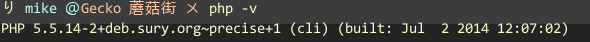
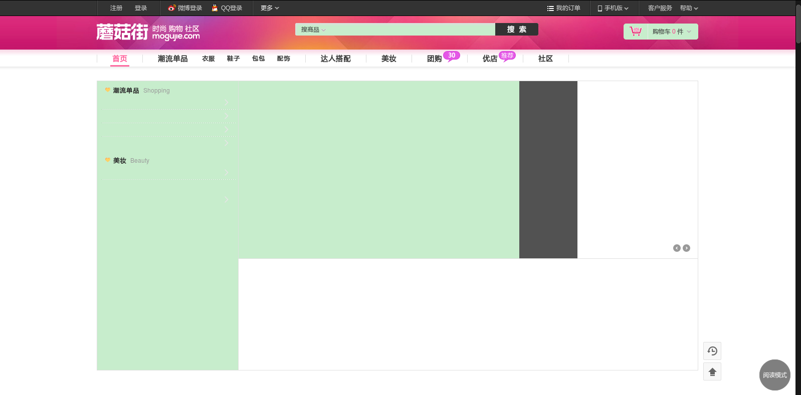

###UBuntu 本地开发环境搭建
---

####安装apache2,php5,mysql。
```
sudo apt-get install apache2
sudo apt-get install mysql-server
```
之后，打开浏览器输入[www.mogujie.me](http://www.mogujie.me)，会出现apache2的`It works`界面。

####其中php5如下方式安装(直接通过apt-get则是php5.3):
```
sudo add-apt-repository ppa:ondrej/php5
sudo apt-get update
sudo apt-get install php5
```

此时输入:`php -v`应该是：
>  

####之后，通过svn拷贝代码源。
```
svn checkout http://svn.juangua.com/trunk/mogujie
```

####然后设置apache2的配置文件，需要修改的文件如下：
[http://gitlab.mogujie.org/ziyuan/devbox/tree/master/ubuntu-apache-conf](http://gitlab.mogujie.org/ziyuan/devbox/tree/master/ubuntu-apache-conf)
将下面的文件替换你的本机的apache2配置文件夹，通常为`/etc/apache2`

然后输入命令`sudo service apache2 restart`才可以加载配置，使之生效。

####然后将下载好的代码放到`/var/www/html/www.mogujie.com`下，如果没有目录，则建立目录。

此时，应该可以访问到蘑菇街的首页，一般来说，因为缺少对应的PHP插件，如APC,GD等库，此时可以根据`/var/log/php-error.log`和`/var/log/apache2/error.log`来进行安装对应的库。[http://gitlab.mogujie.org/ziyuan/devbox/blob/master/php-conf/php.modules](http://gitlab.mogujie.org/ziyuan/devbox/blob/master/php-conf/php.modules)此处为本机应该有的模块。可以通过`sudo pecl install **`来安装，如果没有，则需要下载代码手动编译。

注意在每安转一个模块需要重启apache服务器才能见到效果。`sudo service apache restart`。

####安装完毕之后，可以打开[www.mogujie.me](http://www.mogujie.me)，则可以出现本地的蘑菇街首页。

##TODO:
目前首页显示不完全，有数据没有能够加载成功，同时php-error.log和apache2/error.log没有输出，无法定为错误。
图如下:
> 
