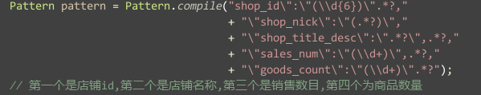

爬虫设计文档
---
关于这个项目,首先需求比较简单.或者说单一吧.唯一要做的就是将PHP传来的任务给做完.没有多余的爬取,只需要爬取一个页面上的商品描述和商店的描述.唯一好玩的一点就是需要在一周时间内
爬取180万url左右的数据.同时还要考虑对面的防刷设置.分配给的测试资源有两台16核32G的服务器.

很显然.爬虫的关键在于VPS的分配,因为一个ip访问某个网站的频率有限制.在有限的时间,要想爬取更多的网页,就需要多个vps,要多少呢.理论上,服务器的出口带宽为1000Mb,购买的VPS带宽为2Mb,
所以,考虑充分利用带宽,则需要500个.但事实上,我们的需求并没有如此之高.在实际测试中,发现最终的瓶颈在cpu上,频繁的字符串匹配,导致了cpu的飙涨.因为考虑到之后的维护,我用了整页面的
正则进行匹配,这样,之后的修改会方便很多.所以代码里会有如下的正则表达式:

> 

看上去很难维护,但是要想到,之前用doc方式进行解析需要70~80行代码,就释然了.修改解析函数的需求需要对方改变自己的页面展示,到时候,就算是用jsoup写的解析函数,也逃不过重写的事实,这样的
话,再写一个正则可以说要简单很多.

其次是,任务的获取,任务的分发者是PHP,而我的爬虫是消费者,这样的话,需要有一个传输消息的机制.有人会说用socket,简单暴力.但是,如果考虑到今后的水平拓展,则需要使用高大上的MQ,为了简化开发
我们这边选型了Redis的MQ,其实原理很简单,就是在Redis中存放一个列表,然后我顺序读取即可.当然,因为Redis没有提供类似与锁的机制,很可能会造成多爬虫的脏读.这个我们在Redis上又存了一个信号量.
前面也说了,选Redis就是为了更快的开发,所以没有选用RabitMQ,还有一个重要的原因,通过RedisMQ(就这么先叫着吧),PHP端可以读取队列的状况,从而写一个控制界面,这也是一个重要的因素.

说完了选型.之后就是我的爬虫的编写.首先,因为淘宝和美丽说对爬取搜索页有频率限制,所以我抽象了两个搜索类,一个为ShopListTask,ShopDetailsTask,两个的不同就在于,List任务完成后,会主动暂停2秒,
防止被封,而两个网站对店铺详情页则没有限制.两个接口都继承了Callable,方便之后使用线程池.

然后就是一个简单的生产者消费者了.这个不要太简单,一个分发线程,一个接收线程池,搞定了.但是在实际使用中,会发现,对于某些特定的url,正则匹配的效率非常低,而对cpu占用则到了恐怖的境界.两天测试下来
积累的错误造成了cpu占用1589%,同时,线程没有回池,又造成了系统的吞吐量严重退化,两天积累的任务数到了恐怖的8000,(正常情况,对面一分钟的任务,我10秒搞定)!然后就加上了自己之前设计的线程级监控,对
于超时线程进行回收.具体的代码如下:

```
    public void dispatchTask(Callable<String> task) {
        if (taskqueue.size() != 0) {
            logger.info("\n目前线程执行状况: \n\t"
                        + "完成的任务数:\t" + workers.getCompletedTaskCount() + "\n\t"
                        + "正在运行的线程数:\t" + workers.getActiveCount() + "\n\t"
                        + "待运行的任务数\t:" + workers.getQueue().size() + "\n\t");
        }
        MonitorTask monitorTask = new MonitorTask();
        monitorTask.setTask(task);
        monitors.submit(monitorTask);
    }
```

这是我分发任务的代码,并不是直接将任务提交到workers中,而是用monitors做了一个封装,将真实任务通过MonitorTask加入workers,这段逻辑如下:

```
    private class MonitorTask implements Runnable {
        private Callable<String> task;

        public void setTask(Callable<String> task) {
            this.task = task;
        }

        @Override
        public void run() {
            FutureTask<String> futureTask = new FutureTask<String>(task);
            try {
                workers.submit(futureTask).get(5, TimeUnit.SECONDS);
            } catch (ExecutionException e) {
                e.printStackTrace();
            } catch (TimeoutException e) {
                System.out.println("超时了吧~~~");
                System.out.println(((TaobaoDetailsTask)task).getShopurl());
                e.printStackTrace();
                taskqueue.add(futureTask); // 重新加入队列
            } catch (InterruptedException e) {
                e.printStackTrace();
            }
        }
    }
```

当然,对于调戏的输出可以乎略.我们设置了5秒的超时时间,当有线程陷入死循环空消耗cpu时,我可以即时发现,同时进行处理,将其扼杀在萌芽中.同时,如果需要监控页面,也可以在monitor中添加
相对应的接口.当然,具体的代码就不展示了.

当然还有最刺激的压力测试了.为了防止对面php疯狂的压任务,我对线程池的任务列表做了保护,当超过最大任务数时,不向RedisMQ请求任务,同时.所以今天中午,CPU脱脱的到了1500%,异常的数据,
然后为了考验我的监控器有效,我没有对其采取任何措施,于是,半小时之后,当错误数据结束,我的爬虫又重新回到正常状态.很开心.

然后,现在爬虫正式上线.目前处理的数据为每秒钟10次的调用频率.只能说,脱脱的,一点压力都没有,之前需要4台机器一个月的工作量,如今只需一台机器一周即可搞定.

总结一下,之前对Spring的理解还是太浅了.这个项目中,为了管理不同的Bean,以及不同的模块,但是通过Spring,各方都完美的集成到了一起.通过不同的配置,完成了一个没有main方法的大工程.
如今又在重写公司的VPS管理,这又是一个好玩的事情.目前项目正在推进.以后说.
