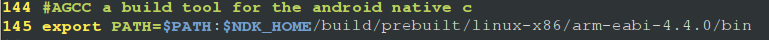

#Android上运行本地C代码
---
首先，我们不得不提到一个我们在Java程序开发中常使用的JNI模式，
这个模式后来也被Google采用，也能在Android下使用了，但是使用NDK的方式，
写出一个共享so库，然后使用Java JNI技术进行调用。这个方法在编写一些根本不需要
界面的程序时，就显得无比的蛋疼。

所以这边我们介绍一个简单的办法，即编写一个native的本地C程序，直接运行在Android
Device上面。

其实说道这边，熟悉ARM开发的人已经知道怎么办了。Android基于Linux和ARM，所以在底层，
就是和一块普通的ARM板没有什么区别，Android只是Linux上的一个小程序。

通常的编程步骤来进行，编写源文件，用编译器编译，链接器链接，然后运行。

我们这边有两个方法获得Android上的编译工具撚，一个方法是编译Android ROM时自动生成的
还有一个办法是，使用Android NDK开发工具包中带的编译工具。

通过编译ROM获得编译工具的方法具体请看[AGCC](http://plausible.org/andy/agcc)的文档，或者
可以看这篇文章[Hello World C program using Android Toolchain ](http://android-tricks.blogspot.com/2009/02/hello-world-c-program-on-using-android.html)
中文的话可以看看这篇:[android编译工具agcc](http://blog.claudxiao.net/2011/10/android_agcc/),这些文章包含了如何获取AGCC，和如何使用AGCC,
但是，说实话，这种方法我没有尝试，不知道结果，但是还是把地址给了出来，希望看到的可以尝试下。

现在说说我的方法，我的方法是采用借助Android NDK的方式，首先我们需要获得Agcc这个编译脚本，你可以在[AGCC下载](http://android-cruft.googlecode.com/files/agcc-0.2.tgz)获得这个脚本，然后你也可以参照[Vlad Blogs](http://blog.v-lad.org/archives/26)进行安装配置。值得注意的是，
这个脚本支持ndk-r4b，其他的版本我不是很清楚，因为没有测试过，而且在他的官方的注释中:
> 
> 
> 也只是说明了他支持最新的NDK的版本，ndk-r4b

好了，接下来就是部署的步骤了:
1. 安装Android SDK，这个可以到[Google官方网站](http://developer.android.com/sdk/index.html)上进行下载。
我们需要的是SDK中的adb调试工具。这个工具在最新单版本的SDK中需要进行下载。具体可以看SDK中的文档。

2. 之后，我们需要安装NDK，这个比较简单，都是解压即用的，在这就不细说了。不过注意的一点，SDK和NDK解压结束之后，
需要注册环境变量，在这，我只介绍Linux下的环境变量，至于win的，不说了。以下是我的环境变量，可以作为参考。
> 

3. 再之后，将前面下载的agcc.pl文件放到NDK目录之下，然后添加到PATH中，方便之后的调用，
同时，也可以看到该脚本存放的目录。
> 

4. 你可以尝试执行`agcc.pl`，如果出现以下结果，说明你的操作已经正确。然后就可以按照gcc的用法进行使用agcc.pl了。
> 

5. 编译简单的程序，你直接就可以执行`agcc.pl **.c -o **`，如果是复杂的程序，需要很长的参数，比如说这样:
`
agcc.pl gemini_code/main.c  -I'$NDK_HOME/build/platforms/android-8/arch-arm/usr/include/netinet'  -o gemini
`

6. 好了，之后只要出现`file gemini`可以看到如下结果，这个文件是一个ARM的可执行文件，那就大功告成，使用adb将其push到手机上执行即可。
> 

附: adb 传输文件命令:

0. `$ adb shell mkdir /data/extern_c`

1. `$ adb push gemini /data/extern_c/gemini`

2. `$ adb shell`

3. `cd /data/extern_c/`

4. `./gemini`

参考文档:

1. [夏天人字拖-http://guoh.org/lifelog/2012/02/run-native-c-code-on-android/](http://guoh.org/lifelog/2012/02/run-native-c-code-on-android/)

2. [Vlad's blog-http://blog.v-lad.org/archives/26](http://blog.v-lad.org/archives/26)

3. [Mamadou-http://betelco.blogspot.com/2010/01/buildingdebugging-android-native-c.html](http://betelco.blogspot.com/2010/01/buildingdebugging-android-native-c.html)

4. [i, Claud-http://blog.claudxiao.net/2011/10/android_agcc/](http://blog.claudxiao.net/2011/10/android_agcc/)