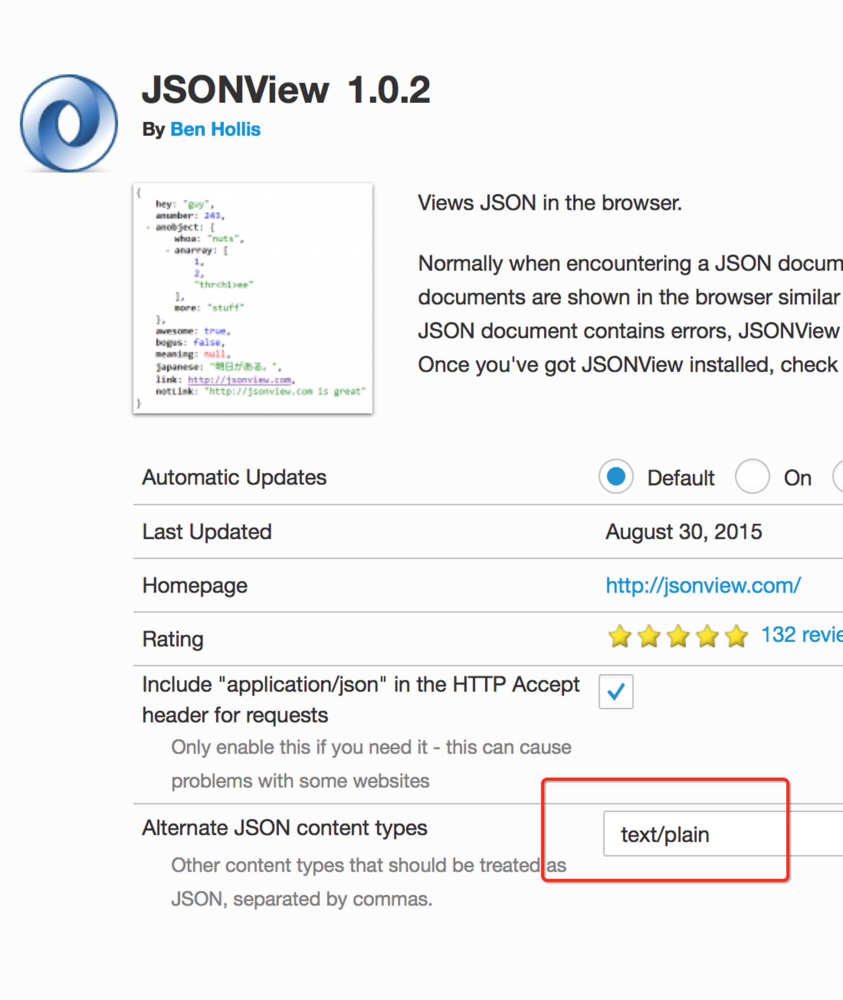

FireFox 上 JSONView 的配置
===

之前在火狐上安装过 JSONView 这个插件，用来看 json 的一个效果，可是最近升级之后，发现对 json 的效果消失了。比如说，一个比较标准的 json 格式，但是他就是不对其进行解析。


比如对:

```
{
    "data": "need content",
    "success": false,
    "code": 100
}
```

这样的数据，火狐就是显示出来，同样的插件在 chrome 上就会进行解析。于是，作为世界上最好的浏览器，一定是我的电脑问题。

解决方法先说,在 Addon 里面选择 JSONView，然后会发现有一个地方要求填写可选的使用 json 进行解析的地方，然后填上**text/plain**，就可以了，如下图：

> 

然后就可以了。

//=============================================================================================

开始查看他的源码，终于发现如下的代码:

```
// Get a list of MIME types we should treat as JSON. This will
// always be a unique list that includes "application/json".
function getJsonContentTypes() {
  // 读取我们设置的配置
  var contentTypes = prefsService.get('extensions.jsonview@brh.numbera.com.alternateContentTypes').split(/[,\s]+/);
  contentTypes.push("application/json");

  var unique = {};
  contentTypes = contentTypes
    // reject non-mime-type-looking stuff
    .filter(function(c) {
      // Note: allowing JSONView to handle text/html breaks the world
      return (c != '') && (c != 'text/html') && /\w+\/\w+/.test(c);
    })
    // unique
    .filter(function(e) {
      return !(e in unique) && (unique[e] = true);
    });

  return contentTypes;
}

function onLoad(options, callbacks) {
  // 依次检查返回值是否需要进行 Json 解析
  getJsonContentTypes().forEach(function(contentType) {
    // Get a reference to the existing Gecko viewer for this content type, if it exists
    var geckoViewer;
    try {
      geckoViewer = categoryManager.getCategoryEntry(GECKO_VIEWER, contentType);
    } catch (err) {
      // The category entry doesn't have to exist.
    }

    // Create and register the a service for each content type
    // This component is an implementation of nsIStreamConverter that converts
    // application/json to html
    var contractId = "@mozilla.org/streamconv;1?from=" + contentType + "&to=*/*";
    var service = xpcom.Service({
      contract: contractId,
      Component: JSONView,
      register: false,
      unregister: false
    });

    // Keep track of everything so we can undo it in onUnload
    services.push({
      service: service,
      contentType: contentType,
      geckoViewer: geckoViewer
    });

    if (!xpcom.isRegistered(service)) {
      xpcom.register(service);
    }

    // Remove built-in JSON viewer
    categoryManager.deleteCategoryEntry(GECKO_VIEWER, contentType, false);
  });
};
```
可以看到他会依次对服务器的 response 的 mime-type 进行判断，对不是 json 格式的数据进行忽略，由于一些网站的开发不是特别严谨，在对 mime-type 上并没有标明返回值为 json。所以导致了这个问题。

而在 html 协议中，json 又是特别重视这个的，所以在 JSONView 中，严格的遵循了这一协议，导致了对部分网站返回值的忽略。换句话说，也是我军程序员的纰漏。然后迅速的检查自己的代码，是否也存在这个问题。。。


