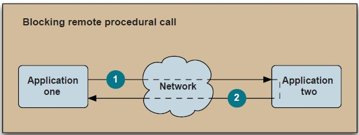

JMS阶段性总结
---

###写在开头
---
从一开始接触JMS到现在已经有一个多月了，看完了《ActiveMQ In Action》还有《Java消息服务》这两本书，也有一点心得。
不过最近的一段时间是期中考试，所以很多的时间耽搁了。所以到现在才开始书写这篇文章。

###首先一点，为什么要使用JMS
---
很多时候，我们的程序并不需要使用JMS，或者说消息机制并不需要使用到这个技术，常常使用方法的相互调用即可实现，但为什么需要使用JMS。其实很大程度上是为了追求水平的扩展。举个例子，如果一个服务，或者是一个业务，需要频繁的调用一段函数，而这个函数会形成阻塞，我们肯定会使用分布式的方法进行横向的扩展。

还有一个重要的原因就是解藕。之前，我们的业务系统都耦合在一个程序中，我们需要进行一定的解藕，重新基于消息进行架构，所以，我们采用了JMS。用来进行业务上的解藕。

简单的说，生产者只负责生产消息，并且将消息务必送达消息中间件，而消息中间件的作用就是进行消息的持久化，并且在客户端连接上来的情况下，保证消息的务必送达。并且对没有及时处理的消息进行提示，然后人工介入进行处理。

不过有一点，如果是为了在纯Java系统之间进行消息传递，则还可以使用RMI的方式。不一定要使用JMS。

还有一点，JMS之所以是一个接口的集合，而不是一个实现方法，我认为，前人一定是注重这样一种设计方式，而不是具体的实现，也就是说，学习JMS，更重要的是这中间的一系列的思想，而不仅仅是几个工具的使用。这也是我看JMS的原因。

###之前的想法
---
在所谓的JMS系统开发中,我们常常会有一个需求，就是消息发送端需要了解客户端是否已经收到消息，来确保接下来的业务逻辑不会出现大的错误，
假设我们没有使用JMS协议，而是我们自己进行编写消息传递的消息协议，用来确保消息的传递。举一个最简单的例子，我们就可以模仿TCP/IP的
三次握手协议，在每次进行消息传递的时候进行握手操作，并且在之后进行一个放手协议。这样，我们的消息发送方就可以了解到目前业务的进展
情况，并且进入下一步的操作当中。

但是，这样还是会带来一个问题，就是当消息发送之后，客户端接受了，然后进行处理，此时， 网络断了，死机了，怎么办?简单的办法，做一个
超时检测，如果在一定时间没有回复，则认为发送失败。于是进行重发。可行。但是又有一个新的问题，如果一个消息有大概三个操作，客户端在
完成一个操作之后，断开连接，然后新的消息传递到，又需要进行第一步操作，发现是已经完成的，然后常见的程序写法会认为任务已经做完，然后
返回，但实际上这个任务是没有完成的。所以为了避免这种情况，我们可以对消息的运行状况进行一个约定，比如完成第一步，就返回`MessageID+StepID`。

完美，这样消息就能高效的进行处理了。

但是，转念一想，这不就是把业务逻辑绑定到了消息传递中了吗，我们为什么要引入消息传递，很大程度上就是进行解藕，但是看看这个所谓的消息机制完全的就是之前程序的分布式版本，没有一点解藕的迹象。所以这个方法必定是失败的。因为他没有将消息传递的结构性功能发挥出来。

###保证消息传送
---
这可能是JMS最精彩的一点，也是我最关心的地方。在此，我们需要对JMS进行消息传递的过程进行一个梳理。
> + 消息提供者故障 - 消息生产者在生产消息的过程中没有能够将消息发送给消息中间件。
> + 消息消费者故障 - 消息消费者在消费消息的时候并没有返回接受成功，然后崩溃。
> + 消息中间件故障 - 消息中间件直接跪了，消息都没有发送出去。

这上面的情况都是我们在进行消息模型建立的时候经常会遇到，或者说是要进行考虑的问题。

之后将会是JMS协议使用的一些措施。

1. 第一个就是让消息有协议，就是在我们进行系统设计的时候，如何设计我们的确认机制。简单的说，是不是在消费者接受之后立刻返回，抑或是在消费者进行消息消费之后进行返回。这一点上，JMS提供了三种建议。也可以说是一个设置参数，即:
> + AUTO_ACKNOWLEDGE
> + DUPS_OK_ACKNOWLEDGE
> + CLINET_ACKNOWLEDGE
> 
> 对于第一种，我们可以在下图中得到一个详细的了解，这也是我们最常使用的一个参数，或者说是方法。
> > 
> > *将中间的NetWork视为JMS中间件*
> 
> 这个方法将消息的传递分为两个接受独立的行为，即发送给中间件和客户端。这可能是最常用的方式。简单易懂。最重要的就是，"一次而且是仅仅一次"发送。
> 
> 第二个参数，则给予我们更大的权限，也就是允许重复发送消息。即，如果在实现仅仅一次发送的时候，会产生很大的开销，且，需求可以接受重复的消息，则可以采用这个参数
> 
> 第三个参数，即是让我们自己定义何时返回ACK，只需要在我们认为需要返回的地方加上`message.acknowledge()`，即可。这给与了我们充分的自由。

当然，我们还可以使用JMS的事务性特点，这一点，之后会有一篇博文进行介绍。

只要了解了这些思想。即使我们不使用标准的JMS，也可以实现很好的消息框架。比如淘宝的MetaQ和Notify。

###New In JMS2.0
---
+ 异步发送模式 —— 传统的同步模式会导致阻塞，直到收到服务器的应答。与之不同的是，异步模式会直接返回而不会阻塞。一旦收到应答，会调用一个异步回调。新的JMSProducer和遗留版本中对应的MessageProducer都支持异步模式。
+ 延迟消息交付 —— 允许JMS客户端按照预定时间交付消息，支持延期处理。应用可以以毫秒为单位设置最短时间，消息系统在将消息交付给消费者之前必须保留这么长时间。 
+ 共享订阅主题 —— 允许可伸缩地消费来自同一订阅主题的消息。
+ 简化API接口

这是JMS十多年来的第一次升级。我们也能从一些变化中看到这几年新的业界标准和新的设计思想。

暂时就这些。之后想到什么在进行编写。