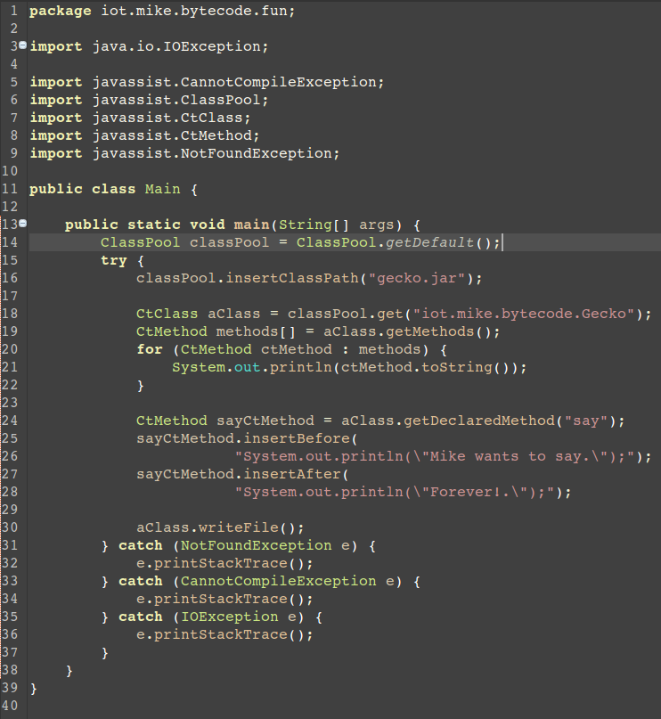

###Jar的代码注入
---
有段时间没有写博客了，主要的原因是期末考试和回老家过年，这段时间基本上没有看相关的内容，不过还是有很多可以用来分享的。

就像前一篇日志提到的一样，Java可以从字节码的方式进行玩耍。通过使用Javassist这个类库，可以很方便的进行字节码的操作。

从这个角度讲，有很多我们之前没有想到的方面也可以进行实施。比如说有这么一个jar包，需要进行引用开发，于是乎，我们可以进行一些简单的恶作剧，可以在某一个方法执行之前或之后加入一些注入代码，同时这个方法还可以进行一些简单的破解工作。

主要使用到的工具有jar打包，Javassist类库。接下来我们来讲一个简单的小例子。这个例子就是展示如何向一个已经打包好的jar注入代码。

首先，我们先就看看这个简单的类代码:
> 

> + 之所以包含main函数，主要是用来感受下代码注入之后的效果。

> 接下来我们看看运行的效果。

> 

> 这就是我们在代码中包含main函数的用途。

接下来就是我们的注入代码片段。
> 

> + 第一点，我们将gecko.jar加入classpool的classpath，然后我们将Gecko.class从这个jar中提取出来，我们用getDeclearMethods()得到现在这个类的所有方法，这一招可以用来对付那些混淆过得代码。
> + 第二点，我们再使用insertBefore()，和insertAfter()。将自己的注入代码写入class文件。然后将写入的class写入文件。

现在，我们可以在工程的目录下看到已经写入的class文件。
> 

然后就是使用jar打包命令了。这个命令的使用方法很简单，主要的重点也就这两点。
> 

因为我们的jar已经打包，所以，我们只需要解压这个包，然后把class文件进行替换。之后运行以下命令:
> 

> + 然后我们就看到一堆adding的信息，表明我们的class文件，就可以在目录下看到jar文件了。

之后，我们运行`java -jar gecko2.jar`
> 

好了，我们的实验成功了！然后就可以做一些其他好玩的事情了！