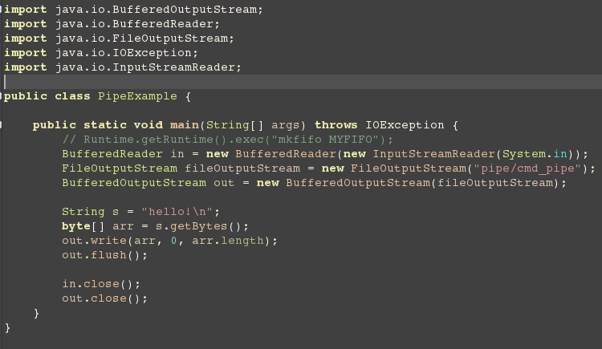
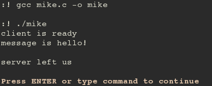

Java与C通过管道进行交互
---
最近的一个项目需要使用到Java和C通信的，因为是在安卓上，所以我们能使用的方法有限(安卓上只支持部分Java,还有C也是精简的库)。
当然，使用本地Socket是一个简答你的解决办法。但是不是特别的优美。于是，我们准备使用Linux上使用的最多的管道进行通信。

之前查阅了一些资料，因为大部分网络上介绍Java管道的都是Java中的PipedStream，这个确实是管道类，但是很可惜，为了Java的操作
系统无关性，这个管道只适用于同一个JVM中，也就是说，他无法和其他VM或者是非Java语言进行交互。所以说，使用前还是需要看清JDK
说明文档。

如果想详细了解PIPE，可以参考这篇文章[深入理解PIPE](http://blog.ddup.us/?p=285),当然，还有我们的[维基百科](http://zh.wikipedia.org/zh-cn/%E7%AE%A1%E9%81%93_%28Unix%29)

接下来开始说我的代码了。

先是Java代码：
> 

这边，我是简单的开了一个`BufferedOutputStream`,用来向管道中写入数据。

让我们来看一下C的代码:
> 

这个就是相当简单了。熟悉Linux编程就知道，先mkfifo开一个管道，然后再进行读取。

然后我们看一下运行结果:
>  

就是这样，Java中写向管道的数据被C语言得到了。不过，C向管道中写入数据，这部分还是在研究中。你们可以看看这篇文章
[How to connect a C/C++ process to a Java application](http://research.engineering.wustl.edu/~beardj/CtoJava.html)，他详细说明了几种
可以采用的方式，我也正在实验中。

