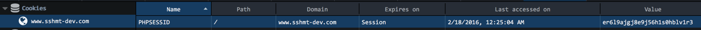

Laravel Session 相关
===

本文内容紧接之前的那篇文章，因为个人喜欢没事找事做，所以才会对一些实现细节比较感兴趣。比如 Laravel 的 Session 实现。

既然 Laravel 的 Session 并不是采用 PHP 原生的 Session 框架，那么它的这重起炉灶的一套 Session 机制，有什么更好的地方，或者说更优雅的地方？

我们先来看 PHP 的原生 Session 实现。PHP 初学者，勿喷。。

####Session 是什么
自行谷歌或者 Bing。

####PHP 原生 Session 机制
这主要涉及三个方面，Session 的生成，回收，存储

#####Session 的生成

这部分主要见于 PHP 源码，以手头的 PHP7 的源码为例，具体位于 /ext/session/session.c 中的 \*php_session_create_id 方法。 下面为了解释方便，省略部分无用代码。

```
PHPAPI zend_string *php_session_create_id(PS_CREATE_SID_ARGS) /* {{{ */
{
	PHP_MD5_CTX md5_context;
	PHP_SHA1_CTX sha1_context;

	gettimeofday(&tv, NULL); // 获得时间戳

	if ((array = zend_hash_str_find(&EG(symbol_table), "_SERVER", sizeof("_SERVER") - 1)) &&
		Z_TYPE_P(array) == IS_ARRAY &&
		(token = zend_hash_str_find(Z_ARRVAL_P(array), "REMOTE_ADDR", sizeof("REMOTE_ADDR") - 1)) &&
		Z_TYPE_P(token) == IS_STRING
	) {
		remote_addr = Z_STRVAL_P(token);
	}
    // 如果可能，获得用户的地址

	/* maximum 15+19+19+10 bytes */
	spprintf(&buf, 0, "%.15s%ld" ZEND_LONG_FMT "%0.8F", remote_addr ? remote_addr : "", tv.tv_sec, (zend_long)tv.tv_usec, php_combined_lcg() * 10);
    //%.15s	remote_addr ? remote_addr : "" 这是用户的地址
    //%ld		tv.tv_sec	当前的时间戳
    //%ld		(long int)tv.tv_usec 当前毫秒数
    //%0.8F	php_combined_lcg(TSRMLS_C) * 10 一个随机数

	switch (PS(hash_func)) {
		case PS_HASH_FUNC_MD5: // 用 MD5 做处理
			PHP_MD5Init(&md5_context);
			PHP_MD5Update(&md5_context, (unsigned char *) buf, strlen(buf));
			digest_len = 16;
			break;
		case PS_HASH_FUNC_SHA1: // 用 SHA1 做处理
			PHP_SHA1Init(&sha1_context);
			PHP_SHA1Update(&sha1_context, (unsigned char *) buf, strlen(buf));
			digest_len = 20;
			break;
	}
	efree(buf);

	if (PS(entropy_length) > 0) { // 这个东西是用来减少碰撞概率的
        ...
        // 具体的方式是从一个随机的文件中读出随机长度的内容
	}

	outid = zend_string_alloc((digest_len + 2) * ((8.0f / PS(hash_bits_per_character) + 0.5)), 0);
	ZSTR_LEN(outid) = (size_t)(bin_to_readable((char *)digest, digest_len, ZSTR_VAL(outid), (char)PS(hash_bits_per_character)) - (char *)&ZSTR_VAL(outid));
    // 散列后的二进制数据digest用字符串表示成可读的形式，并放置在outid字符串里
	efree(digest);
    // 此时的 outid 就是最终的 Session ID
	return outid;
}
/* }}} */
```

总的来说，这个碰撞的概率确实挺低的，而且入侵的难度很高。

通常，PHP 默认是通过 Cookie 将这个 Session ID 存储到客户端，所以我们打开伟大的 FireFox，通过开发者工具，就可以看到如下的 Session ID。

> 

那么，如果用户禁用了 Cookie，PHP 则会自动切换到 URL 重写的模式，比如生成这样的 URL:
> *http://mikecoder.cn/index.php?SESSIONID=2bd170b3f86523f1b1b60b55ffde0f66*

#####PHP 中 Session 的回收和存储
前面说太多了- -，这边简单点。

在 php.ini 中 session.gc_maxlifetime 为 session 设置了生存时间(默认为1440s)。

如果 session 文件的最后更新时间到现在超过了生存时间，这个 session 文件就被认为是过期的了。在下一次 session 回收的时候就会被删除。

那下一次 session 回收是在什么时候呢？这和 php 请求次数有关的。在 PHP 内部机制中，当 php 被请求了N次后就会有一次触发回收机制。到底是请求多少次触发一次是通过以下两个参数控制的：

```
session.gc_probability = 1
session.gc_divisor = 100
```

这是 php.ini 的默认设置，意思是每100次PHP请求就有一次回收发生。概率是 gc_probability/gc_divisor。

那么这些 Session 存在什么地方？当然是文件里。php.ini 中的 **session.save_path**这一项，就是负责session文件的存放位置。当然，如果不填写，Ubuntu 默认则是 **/var/lib/php/session** 下。

说了这么多，似乎PHP 原生的 Session 机制，并没有什么大的问题，而且看上去实现的还算是优雅。那么，为什么 Laravel 需要重新设计一套与原生没有一点联系的 Session 机制？

####Laravel Session 由来
详情见[Laravel 开发者的自白](https://github.com/laravel/framework/issues/5416#issuecomment-68366445), 英文不太好，翻译轻喷。

1.
