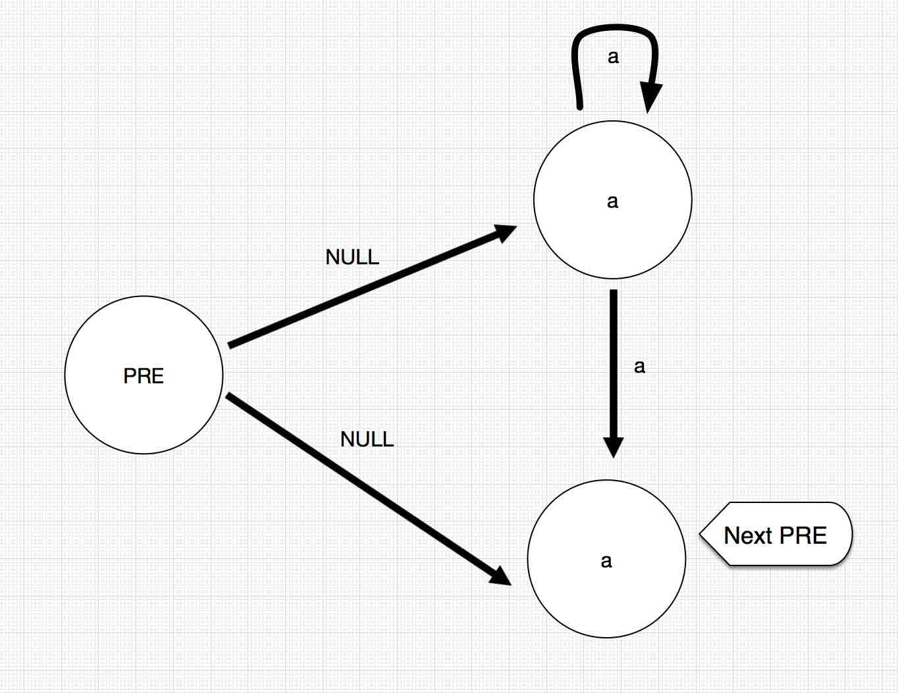

Regular Expression Matching的DFA解法
===

事情的缘由是，在LeetCode上遇到了这么一题:[Regular Expression Matching](https://leetcode.com/problems/regular-expression-matching/),大体的意思是用要求我们构建能实现一个简单的带规则的字符串匹配。

其实题目的意思已经比较明白，就是希望我们能实现正则的简单功能。比如`.`代表所有的字符，`*`表示重复0到正无穷次。这道题可以用DP或者Trie树解决，并且效率也比较高，但是，因为最近正好写了脚本解释器，所以正好尝试用下有穷自动机来解题。

有穷自动机分为两种，一种是NFA,一种是DFA。两者之间的区别就在于构造的方式，对于NFA来说，输入一个字符，它对应的是一个状态集，而对于DFA,则是一个固定的状态。两者也可以互相转换。相比较而言，对于这种相对比较简单的规则索引，我比较倾向于使用DFA。

首先我们需要对其进行构建DFA结构。因为本题的规则相对比较简单。比如说`a*`这样的结构，我们可以构造出如下的NFA结构：

> 

对于`a`这样的结构，我们可以构造如下的结构：

> 

所以，我们定义Node，和Path两个类作为节点和状态转移的两个对象:

```
    class Node {
        String           token;
        LinkedList<Path> paths;
        boolean          isEnd;

        public Node(String token) {
            this.token = token;
            isEnd = false;
            this.paths = new LinkedList<Path>();
        }

        @Override
        public String toString() {
            return "Node{" + "token='" + token + '\'' + ", paths=" + paths + ", isEnd=" + isEnd + '}';
        }
    }

    class Path {
        String token;
        Node   next;

        public Path(String token, Node next) {
            this.token = token;
            this.next = next;
        }

        @Override
        public String toString() {
            String print;
            if (token != null && token.equals(next.token)) {
                print = "Path{" + "token='" + token + '\'' + ", next=" + next.token + '}';
            } else if (token == null) {
                print = "Path{" + "token='NULL" + '\'' + ", next=" + next + '}';
            } else {
                print = "Path{" + "token='" + token + '\'' + ", next=" + next + '}';
            }
            return print;
        }
    }
```

于是乎，可以有如下的一个建立DFA的代码:

```
    private Node buildDFA(String regex) {
        Node start = new Node("START"), pre = start;
        for (int i = 0; i < regex.length();) {
            String current = "" + regex.charAt(i);
            if (i + 1 < regex.length() && regex.charAt(i + 1) == '*') {
                Node n = new Node(current), m = new Node(current);
                Path p = new Path(null, n), q = new Path(null, m);
                pre.paths.add(p);
                pre.paths.add(q);
                n.paths.add(new Path(current, n));
                n.paths.add(new Path(current, m));
                pre = m;
                i = i + 2;
            } else {
                Node n = new Node(current);
                Path p = new Path(current, n);
                pre.paths.add(p);
                pre = n;
                i = i + 1;
            }
        }
        pre.isEnd = true;
        return start;
    }
```

比如说，`c*a*b`，则对应的产生一个如图所示的DFA结构：

> 

然后则是对照着输入字符进行状态的转换。代码如下:

```
    private boolean checkDFA(Node start, int index, String str) {
        if (str.length() == index) {
            if (start.isEnd)
                return true;
            else if (start.paths.size() == 0) return false;
        }

        for (Path path : start.paths) {
            if (path.token == null) {
                if (checkDFA(path.next, index, str))
                    return true;
            } else if (index < str.length() && path.token.equals(".")) {
                if (checkDFA(path.next, index + 1, str))
                    return true;
            } else {
                if (index < str.length() && path.token.equals("" + str.charAt(index)))
                    if (checkDFA(path.next, index + 1, str))
                        return true;
            }
        }
        return false;
    }
```

匹配完成即可。当然，这只是正则引擎的极少数的部分，仅仅只是完成了`.`和`*`的工作，而正则引擎的规则还有很多。路漫漫其修远兮。

在我的脚本解释器中，我是通过正则匹配来进行字符串的分割，然后通过不同Token之间的定义来标示不同字符的含义。比如，我通过如下的一个正则来分割文本

```
\\s*((//.*)|([0-9]+)|(\"(\\\\\"|\\\\\\\\|\\\\n|[^\"])*\")|[A-Z_a-z][A-Z_a-z0-9]*|==|<=|>=|&&|\\|\\||\\p{Punct})?"
```

从而达到我的切割单词的目的。从而将所有切割的单词作为一个Token，通过对Token的识别和组合，继而形成我自己的语法规则，然后通过建立的抽象语法树进行值的运算。最后达到一个脚本解释执行的效果。当然，同样的，任重而道远。


**完整代码在[GITHUB](https://github.com/MikeCoder/oj-code/blob/master/java/src/main/java/mike/code/oj/leetcode/RegularExpressionMatching.java)上**
