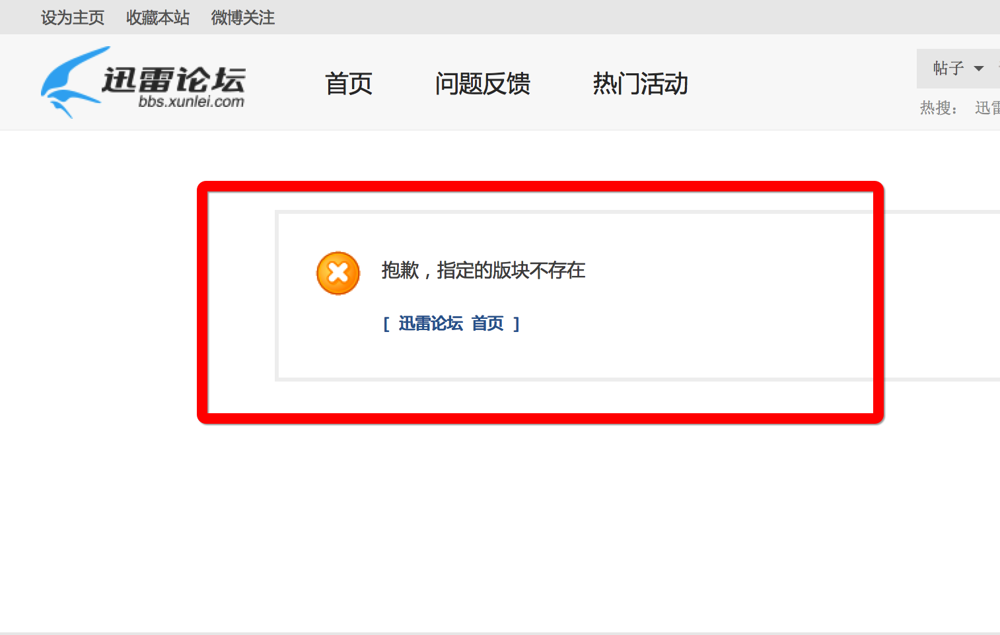

Mac 迅雷无法删除任务和新建任务的解决办法
===

###解决办法先上
找到如下的文件夹:**/Users/$(Your Name)/Library/Application Support/Thunder**,然后删除它。再次重新启动迅雷即可。

如果你在网上搜索到如下的几个问题：

+ [http://iask.sina.com.cn/b/SCgOVrcS09.html](http://iask.sina.com.cn/b/SCgOVrcS09.html)
+ [http://zhidao.baidu.com/question/1239812616479652619.html](http://zhidao.baidu.com/question/1239812616479652619.html)

就可以按照如上的方法进行解决。

同时，吐槽下 Mac 迅雷的官网。我们可以看到 Mac 迅雷的官网如下：

> 

然后我们点击红框中的问题反馈，然后就看到这么个界面:

> 

真是个悲伤的故事。

###解决思路
一开始遇到的时候，也是以为是程序的问题，于是乎重装了。而且试了历史版本的重装。发现依旧是没有任何乱用。于是就想是否是配置文件的问题，因为发现不管如何重装，我的账号依旧是登陆状态，所以推断是配置文件的问题。于是开始找 osx 上的应用程序一般会在什么位置存放自己的配置文件。

在[这篇文章](http://www.2cto.com/os/201203/124833.html)的帮助之下,基本上锁定了以下的几个文件夹：

+ Library/Application Support
+ Library/Caches
+ Library/Favorites
+ Library/Preferences
+ Library/StartupItems

然后就是苦逼的控制变量法，其中不停的备份，不停的删除，最终确定了目标就是 **Application Support**，然后大手一挥，*rm Thunder*，一切终归平静。

###问题原因
这个还真的不是很清楚。感觉像是文件的权限不够或者是文件损坏。

当时还是太过激动，当发现了问题之后，第一时间用**Alfred**清空了回收站。其实应该将正确的文件夹和错误的文件夹做一个比较。然后确定 bug 的根源，也算是吃一堑长一智。以后注意。

