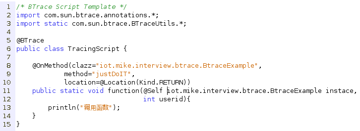
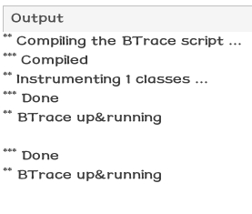
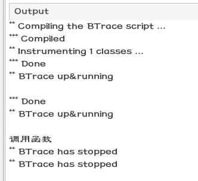

Btrace调试Java代码
---

之前有一个同学提到了一个需求，就是需要在程序跑起来之后查看程序的调用情况，和一些参数变化，当然，如果
没有部署到生产环境中，我们可以用强大的Eclipse使用Debug模式进行单步调试。但是一旦部署到了生产环境中，
我们的强大的调试工具就失去了作用。

于是我们可以参考使用JVisualVM中的[Btrace](https://kenai.com/projects/btrace/)。当然本文章的大部分内容都有参考周志明的[深入理解Java虚拟机](http://www.amazon.cn/mn/detailApp?asin=B00BTCMPKG&tag=baiduiclickcn-23&ref=pz_ic_db_j_5bkindle2259)
接下来的内容就是简单的介绍下Btrace的一个简单的示例。

当然，使用JVisualVM连接JVM的简单步骤我们就简单的跳过了。我们直接上程序例子。

首先是我们的Example代码。
> 
>
> 代码很简单，之所以需要在执行之前加入scanner，只是因为我们需要为之后的Btrace嵌入做一个缓冲。然后可以
手动的形式启动我们的代码。

然后我们按下快捷键ctrl+F11，运行程序，然后就可以在JVisualVM中看到我们的程序了。就像这样:
> 

然后右键点击他，然后就是点击Trace Application，然后就可以看到传说中的Btrace代码界面了。就可以看到这个:
> 
>
> 需要注意的是，这边遵循的并不是我们常见的Java语法，所以需要注意的地方就是，我们写下的每一行代码都需要仔细的
检查，并且写之前需要读[**Btrace的文档**](https://kenai.com/projects/btrace/pages/UserGuide)。

于是乎，我们写下这样一段代码用来在调用到`iot.mike.interview.btrace.BtraceExample`的`justDoIT`方法的时候在Btrace的
控制台输出`"调用函数"`这四个汉字。我们只需要写下这样的一段代码就可以达到我们的效果。
> 
>
> + 这边出现在方法之上的注解，说明这个方法的调用位置，同时也包含了这个方法调用时的参数。
> + 然后就是方法的内容了。这边没有什么好说的了。

点击控制版面上的`start`按钮，就可以泡一杯咖啡，然后静静的等待代码的替换。你会看到如下输出:
> 

然后在我们的Eclipse终端输入一句话，激活程序，我们就可以在Btrace控制台看到输出了。
> 

这样，我们就成功的在代码运行时动态的添加了调试代码。当然，如果这个技术仅仅用来调试，确实是有点大才小用的遗憾。说到这边，
有的同学应该也已经知道了，我想说的用途了。就是破解程序，使用Btrace跟踪程序的调用栈，然后精确定位，精确打击。

这边说个简单的例子， 就说我们刚刚的代码，假设有一个函数，是用来验证用户名的，且用户名是从加密的数据库中读取的，就像我
们的userid,于是，我们精确定位之后，我们直接打印出这个userid。

只需要在我们的Btrace代码里添加如下的一行代码:
> 

然后重复上述步骤，分分钟就把用户的信息拿到了，然后通过[CGlib](http://www.oschina.net/p/cglib/)，或者是[Javassist](http://www.csg.ci.i.u-tokyo.ac.jp/~chiba/javassist/),基于[Javassist](http://www.csg.ci.i.u-tokyo.ac.jp/~chiba/javassist/)的例子可以看我的博客-[Jar代码注入](http://mikecoder.net/?post=71),然后进行类的替换，然后进行打包，就是一个破解了的程序。简单易学。

就是这样，Java永远都有好玩的东西等着我们。