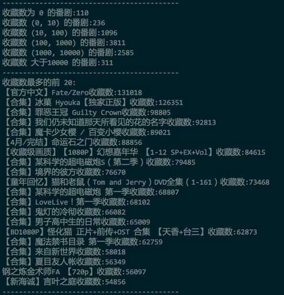

B 站看片记
---

这是我很早之前就想做的一个项目。因为，作为一个非动漫骨灰级玩家，或者说是一个刚刚接触这个领域的人来说。尝试下口碑较好的作品是比较好的入门方式。所以，我找了个专家 [May](http://maywanting.wang) 咨询了下，并且得到了一个动漫的列表吧。

然后就开始看了。很大程度上，很多的作品都是直接从 B 站上看的，因为有个好处，就是 B 站上有弹幕，而且往往好玩的并不是作品本身，而是弹幕引发的二次讨论。所以，我想对动漫的好看程度或者说是槽点进行一个排名。通常情况下，B 站上都是只提供几种简单的排序，比如播放数，弹幕数，硬币数，收藏数来进行。而且通过分析他的请求，可以发现他的数据都是通过离线计算出来的。

比如说，我希望得到 2016.08.01 ~ 2016.08.12 中弹幕最多的完结动漫，所以，这个请求是: [http://www.bilibili.com/list/damku-32-1-2016-08-06~2016-08-12.html](http://www.bilibili.com/list/damku-32-1-2016-08-06~2016-08-12.html)，其中，damku 是按照弹幕数排序，32表示完结动漫分类，1表示页码，2016-08-06~2016-08-12表示时间周期。所以很容易的就可以找到规律。

所以，很容易的就能理解 B 站的 cache 策略。离线计算数据，然后凌晨生成静态文件，供搜索或列表使用。

不过这边问题就来了，因为 B 站是不能查询超过 3 个月的数据，所以没有办法获得一个整体的数据来让我进行分析。比如我可能就是希望获得从 B 站建站开始的数据，所以，就得一个人进行数据的积累。不过也能理解，毕竟他对每一个时间段都进行了缓存。比如3个月算，他需要缓存 3600 个页面，这只是一个月的量。

废话不多说。Long story short.

###数据采集
排序未动，爬虫先行，所以这边采用了 python 作为爬虫的宿主语言，爬虫非常简单，真的非常简单，所有的代码如下:

```
#!/usr/bin/env python
# encoding: utf-8

import json
import urllib
import re
import datetime

csv_file = '完结动漫数量数据.csv'

regex = '<a href="/video/av(\d+)/" target="_blank" class="title" title="(.*?)">[\s|\S]+?desc">([\s|\S]+?)</div>[\s|\S]+?title="观看"></i><span number="\d+">(\d+)</span>[\s|\S]+?title="弹幕"></i><span number="\d+">(\d+)[\s|\S]+?title="收藏"></i><span number="\d+">(\d+)</span>';
base_url = 'http://www.bilibili.com/list/damku-32-'
video_base_url = 'http://www.bilibili.com/video/av'

animes = {}

def writeCSVFile(file, date, num):
    file = open(file, 'a')
    file.write(str(date) + ', ' + str(num) + "\n")

if __name__ == '__main__':
    start_date = datetime.date(2008, 8, 1)
    end_date = datetime.date.today()

    current_date = start_date

    while current_date != end_date:
        writeCSVFile(csv_file, current_date, len(animes))
        for page in range(1, 30):
            url = base_url+str(page)+'-'+str(current_date)+'~'+str(current_date)+'.html'
            pageContent = urllib.urlopen(url).read()
            if pageContent == '':
                break;

            pattern = re.compile(regex)
            for item in pattern.finditer(pageContent):
                if item.group(1) in animes:
                    animes[item.group(1)]['endDate'] = current_date
                else:
                    animes[item.group(1)] = {'aid': item.group(1), 'title': item.group(2), 'desc': item.group(3), 'playNum': item.group(4), 'comNum': item.group(5), 'collNum': item.group(6), 'startDate': str(current_date), 'endDate': str(current_date)}

            open('anime.data', 'w').write(json.dumps(animes, ensure_ascii=False))

        current_date = current_date + datetime.timedelta(1)
```

1. 本来想做一个延时，防止被 B 站封 IP，还有加 VPS 。结果发现他根本就没有管。。所以直接暴力了。
2. 测试的时候发现，B 站对这种静态页面都是采用的直接生成对应文件的办法。比如说：8-1号到8-2号的完结动漫按弹幕排序，就直接是[http://www.bilibili.com/list/damku-32-1-2016-08-01~2016-08-02.html](http://www.bilibili.com/list/damku-32-1-2016-08-01~2016-08-02.html)
3. 虽然是个很原始的办法，但是对待高流量的时候，确实非常有效。让我想到了某个朋友的公司，对于高并发的处理也是这样。


###数据的结果
这是从 B 站建站以来每天增加的动漫数量: [https://github.com/MikeCoder/bilibili-funnest-anime/blob/master/anime.csv](https://github.com/MikeCoder/bilibili-funnest-anime/blob/master/anime.csv)
> 

然后对动漫数据进行统计，可以看到所有动漫的一个数据:[https://github.com/MikeCoder/bilibili-funnest-anime/blob/master/anime.data](https://github.com/MikeCoder/bilibili-funnest-anime/blob/master/anime.data)

###然后就是最适合吐槽的动漫排序
1. 首先对整体的动漫进行分类排序，比如按照播放数、弹幕数、收藏数进行分别的排序:
> + 弹幕排序
>
> 
>
> + 播放数排序
>
> 
>
> + 收藏数排序
>
> 

2. 可以发现，FZ 确实是出奇的好。事实也是。从剧情到人物塑造，到特效，都基本很少有槽点。 但是，有一个很大的缺陷，就是出现在 top 榜单的都是所谓的合集(本来想到一个类似的问题，就是如何寻找知乎上所有的神回复)。但是，动漫本来不就是看合集的嘛。所以这个问题留给下一个，如何寻找 B 站上所有的神吐槽。
3. 不过，很遗憾的，鄙人喜欢的《黑契》、《军火女王》、《HellSing》、《Monster》无一上榜。

###待续
1. 因为自己想获得新的动漫观看列表，所以才想到了这个下策。。。但是结果却并不是很好，因为这么排序出来的结果都并不是我的菜。不过却引发了另外的问题。比如说，不管用什么方式排序，为0的总是110部动漫。似乎有隐情。
2. 对比分析这些数据，似乎也能得到一些比较好玩的结论，比如说，每年的哪几个月份的动漫往往可以获得比较高的评价等等。
3. 总之可以做的很多。而且，似乎也能从这边做一个动漫的排序的小项目。

###写在最后
1. 为什么数据采集用 python, 数据分析用 php
    + Python 写起来快啊。PHP 简单啊，特别是 Python 用了 json 存之后，直接 json_decode 就出来了啊。另外，我说我是来炫耀会的语言多的，你信么。而且，这种简单的数据处理，也用不到 Mahout 或者 Pandas 这种牛刀。
2. 其实还是有问题，比如说，一些动漫的命名，比如动漫的命名不一致，但是确实同一内容，应该票数是计入一起的，但是这边我并没有针对这种情况做处理
3. 虽然并没有找到自己比较喜欢的动漫列表，但是依旧可以从弹幕的前50中，挑一些比较喜感的动漫，在睡前观看。
4. 最后夸下 B 站，已经支持 H5播放器了，对于 Mac Firefox 党来说，无疑是个非常好的消息，毕竟，为了用 Safari 的唯一理由就是，在看片的时候，发热量小一点。

