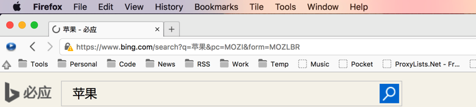

FireFox 充分自定义
---

故事的起因，是这样的。不知道什么原因，我突然发现火狐的标签页字体变了, 如下图。

> 

那个苹果的苹字明显不是雅黑字体。但是却又不知道是什么原因，而且地址栏的字体也和标签栏一样。都是一个巨丑无比的字体。作为一个对字体有着一定偏执的人来说，这明显是不能忍的。于是 bing 了一下，据说是修改系统默认字体就好了。

于是我就改了 Mac 的自带字体。但是第一次，失误了。导致了所有的文字都无法显示。无奈之下，备份系统之后，重新重置了。

但是，很快发现，并不是系统字体的问题，因为就算是系统自带的 **Helvetica**, 苹果的苹也不是那个样子，于是就开始了苦逼的查文档之旅。

后来发现了几篇排版乱七八糟的文章: [这](http://laycher.com/?p=1010), [这](https://www.firefox.net.cn/read-36351) 还有[这](https://www.firefox.net.cn/read-38187)。

但是他们有个共同的特点，就是说话说一半。

而且在最新的48.0.1里，已经没有那个 chrome 文件夹了。

所以，这边只好找官方文档了。

但是由于年代久远，只有这么一篇现存于世：[Customizing Mozilla](http://www-archive.mozilla.org/unix/customizing.html), 可以看到他的时间点还是 2008 年，那个时候，也是我刚刚开始接触火狐。当时最吸引我的还是在那个 flash 满天飞的年代，有一个 flash block 插件。

话不多说，为了解决以上的字体问题，只需要在: *~/Library/Application Support/Firefox/Profiles/y3i2x4vo.default/chrome/userChrome.css* 这个目录中，修改这个 css 文件就可以了。注意的是 **y3i2x4vo.default** 这个文件夹，每个人都是不同的，但是，这个目录下只有这一个。如果没有，可以删掉所有的文件夹，然后重新启动火狐，就可以找到了。

里面的内容可以按照上面的那篇文章进行自定义。

这里，我需要修改的是标签页的字体，其实就可以写上这么一段:

```
#urlbar {
    font-family: 'Microsoft YaHei Mono' !important;
    font-size: 12px !important;
}

#TabsToolbar {
    font-family: 'Microsoft YaHei Mono' !important;
    font-size: 12px !important;
}
```

这样，我们就把地址栏和标签页的字体修改成了可能是世界上最好的中文字体 --- 微软雅黑。

但是，这远远不够，按照 CSS 的语法，可以这样。

```
* {
    font-family: 'Microsoft YaHei Mono' !important;
    font-size: 12px !important;
}

#urlbar {
}

#TabsToolbar {
}

.bookmark-item > .toolbarbutton-text {
}

menupopup > * {
}
```

这样所有的字体都将变成最好的中文字体了。

另外附上完整的 userChrome.css 模板:

```
/* Set font size and family for dialogs
 * and other miscellaneous text
 */
window {
    font-size: 3.5mm !important;
    font-family: helvetica !important;
}

/* Place the sidebar on the right edge of the window
   Side effect: also moves the mail folder to the right side
(Bug 226926)

 */
window > hbox {
    direction: rtl;
}

window > hbox > * {
    direction: ltr;
}

/* PERSONAL TOOLBAR */
/*
 * Note: Rules affecting icons on the PT do not apply to folder contents.
 * Those are governed by "Bookmarks menu" rules.
 */

/* Kill bookmark icons in the Personal Toolbar */
toolbarbutton.bookmark-item > .toolbarbutton-icon {
    display: none;
}

/* Alternatives: */
/* Select only bookmark folder icons */
/*
.bookmark-item[type="menu"] > .toolbarbutton-icon {
  do something...
}
 */

/* Select only tab group icons */
/*
.bookmark-item.bookmark-group > .toolbarbutton-icon {
  do something...
}
 */

/* Example: only kill icons on normal bookmarks */
/*
.bookmark-item:not(.bookmark-group):not([type="menu"]) > .toolbarbutton-icon {
  display: none;
}
 */

/* Visual aids for no-icons operation */

/* Make tab group bookmarks italic and brown */
.bookmark-group > .toolbarbutton-text {
    font-style: italic;
    color: brown;
}

/* Make bookmark folders bold and navy blue */
.bookmark-item[type="menu"] > .toolbarbutton-text {
    font-weight: 900;
    color: navy;
}

/* BOOKMARKS MENU */

/* Kill "normal" bookmark icons in the bookmarks menu */
menuitem.bookmark-item > .menu-iconic-left {
    display: none;
}

/* Other examples: */

/* kill icons for bookmark folders in Bookmarks menu */
menu.bookmark-item > .menu-iconic-left {
    display: none;
}

/* kill icons for bookmark groups in Bookmarks menu */
menuitem.bookmark-group > .menu-iconic-left {
    display: none;
}

/* Style the now-iconless bookmark menu items (mimicking the PT styles) */
/* bookmark folders */
menu.bookmark-item {
    color: navy !important;
    font-weight: 900 !important;
}

/* tab group bookmarks */
menuitem.bookmark-group {
    color: brown !important;
    font-style: italic !important;
}

/* You could select normal bookmarks this way */
/*
menuitem.bookmark-item {
  do something...
}
*/

/* TABBROWSER TABS */

/* Kill tabbrowser icons */
/* Note: this leaves some empty vertical space in the tab strip in some themes */

/* Kill all tab icons, no matter what */
/*
.tabbrowser-tabs .tab-icon {
  display: none;
}
 */

/* Alternatively, kill only default tabbrowser icons (no site icon) */
.tabbrowser-tabs *|tab:not([image]) .tab-icon {
    display: none;
}

/* Show icons (no matter what) when hovering over the tab */
/*
.tabbrowser-tabs *|tab:hover .tab-icon {
  display: -moz-box;
}
 */

/* Show tab loading indicator while the tab is loading */
/*
.tabbrowser-tabs *|tab[busy] .tab-icon {
  display:-moz-box;
}
*/

/* Shrink tab titles by 10% */
.tabbrowser-tabs .tab-text {
    font-size: 90%;
}

/* Turn off the great big icons on editor/mail toolbars (bugs 78843/94581) */
.toolbar-primary-icon {
    visibility: collapse;
}

/* Make menus big, pretty and readable (like the old SGI look):
 * menubar isn't used after 12/19 builds, but is needed for NS6;
 * the rest are for post-12/19
 */
menubar, menubutton, menulist, menu, menuitem {
  font-family: helvetica !important;
  font-style: italic !important;
  font-weight: bold !important;
  font-size: 4mm !important;
}

/* Next two don't work as either "slider" or "scrollbar".
 * Apparently scrollbar size is controlled by images
 * used for the up/down/left/right arrows.
slider {
   height: 20px !important;
}
slider[align="vertical"] {
   width: 20px !important;
}
*/

/* Single line text fields */
input {
  /* Set font size and family of text fields */
    font-family: clean !important;
    font-size: 13px !important;
  /* Set background color to something a little prettier */
    background-color: rgb(200, 255, 220) !important;
  /* Add some key bindings.
   * For an explanation of how to do this,
   * see below under "Custom key bindings".
   */
    -moz-binding: url("resource:///res/builtin/myHTMLBindings.xml#myInputFields") !important;
}

/* Multi-line textareas */
textarea {
    background-color: rgb(200, 255, 220) !important;
}

/* The  dropdown address and autocomplete windows are grey.
 * To make them match better with the URL field and look more like 4.x:
 */

/*  URL dropdown box  */
#ubhist-popup {
    background: white !important;
    border: 1px solid black !important;
    padding: 0px !important;
}

/*  autocomplete text field  */
.textfield-popup {
    background: white !important;
    border: 1px solid black !important;
}

#ubhist-popup > .popup-internal-box, .textfield-popup > .popup-internal-box {
    border-left: 1px solid white !important;
    border-top: 1px solid white !important;
    border-right: 1px solid white !important;
    border-bottom: 1px solid white !important;
}

/* 3. Add a border (line of 1px) to the tooltips. */
.tooltip-label {
    border: 1px solid !important;
}

/* MAIL
 *
 * For other things you can change in mail windows,
 * see the files in the source tree under themes/modern/messenger
 */

/* Specify the font used for the subject in the message pane
 * (it was bold, fixed-width and too wide).
 */
.subjectvalue {
    font-family; helvetica !important;
  font-weight: normal !important;
}

/* Make the thread and folder panes readable. */
treechildren {
    font-size: 14px !important;
}

/* Change the background colour of the messages (top right hand
 * pane in 3-pane view) of Mail/News from gray to white.
 */
outliner {
    background-color: white !important;
}
```

最后，没想到 Firefox 会用 chrome 这个名字作为文件夹，不知道后来谷歌取名的时候，有没有参考这个。
