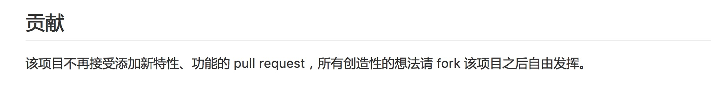
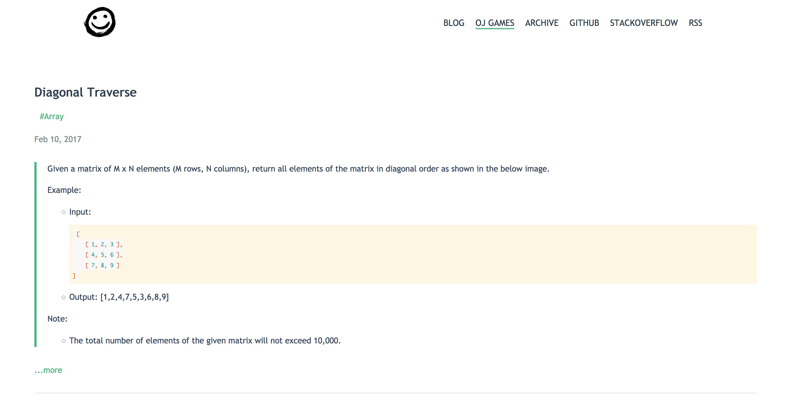
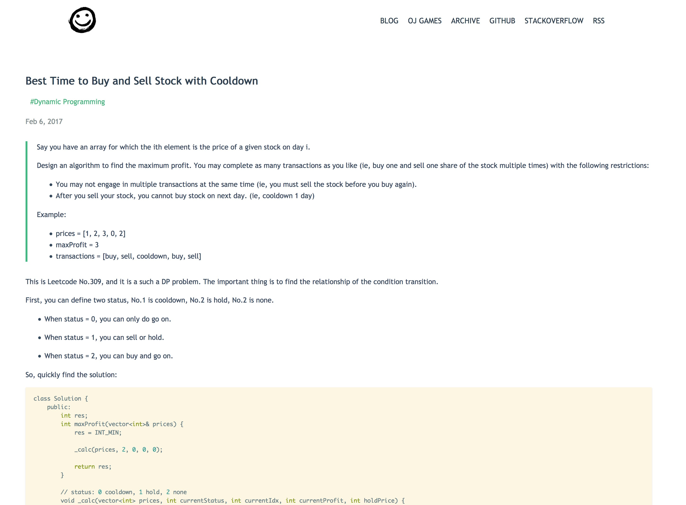
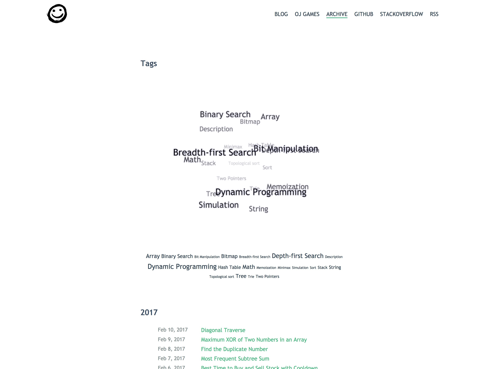

Hexo Gandalfr 主题发布
---

主题地址: [hexo-theme-gandalfr](https://github.com/MikeCoder/hexo-theme-gandalfr)

在线预览: [Example](https://mikecoder.github.io/oj-code)

起因：因为之前考虑到英文博客的主题问题，之前一直用 even 主题，但是始终觉得不是特别中意。于是找到了 [apollo](https://github.com/pinggod/hexo-theme-apollo)。

发现这是我比较喜欢的类型。简单，足够简单。但是有两点不足：

1. 文章没有 Tag 提示。
2. 文章中的代码段没有高亮。
3. 在较大屏幕上显示的时候，有点小。（主要内容 600px 是有点小了）

所以这边也就是修改了下，并且打包上传。因为原作者已经停止继续开发了。
> 

####安装
```
# cd to your hexo dir
npm install
npm install --save hexo-renderer-jade hexo-generator-feed hexo-generator-sitemap hexo-browsersync hexo-generator-archive hexo-tag-cloud
git clone https://github.com/MikeCoder/hexo-theme-gandalfr.git themes/gandalfr
cd themes/gandalfr
cp _config.yml.example _config.yml
# modify the config file by yourself
```

####配置
```
theme: gandalfr

# Dependent on the hexo-generator-archive plugin
archive_generator:
    per_page: 0
    yearly: false
    monthly: false
    daily: false
```
1. 注意需要在 hexo 的根目录里加上 hexo-tag-cloud 的依赖，不然，标签云不显示。即 package.json 文件。
2. 具体的 hexo-tag-cloud 的安装文档可以阅读这: [hexo-tag-cloud](https://github.com/MikeCoder/hexo-tag-cloud).

####效果展示

首页效果:
> 

文章详情页:
> 

归档页:
> 

其实也是水一篇。。。
