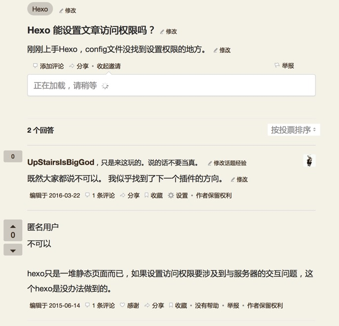

Hexo 博客加密插件
---
**插件的[GITHUB](https://github.com/MikeCoder/hexo-blog-encrypt)**

距离上一篇 [Hexo 博客加密插件简述](http://mikecoder.cn/?post=147)
> 先凑个数，等刷完了 TODO，再来发布 1.0.0 版本

已经过去五个月了啊。。。不过现在倒是真的完成了这个插件。原因其实很简单，我不是 hexo 用户，而且当时只是证明，某人觉得做不到的东西，其实很简单。在技术论证结束之后，我就不管了。不过后来的一个 star 和私信给了我完善的理由。

###缘由
虽然我不是一个 Hexo 用户，但是，看到这样的知乎问答:

> 

其实很讨厌一种人，常常吐槽某个东西，却不愿意自己改善，宁可选择接受。

说正事。这个插件的主要用途就是为博客加密，文档在这:[GITHUB](https://github.com/MikeCoder/hexo-blog-encrypt)

###原理
其实说穿了，也很简单。因为 Hexo 是纯静态博客系统，所以不可能采用后台密码校验的方式进行处理。所以这个校验就落到了前端上。但是，如果直接 js 进行密码校验，这就好像，我把钥匙放在钥匙孔里，然后对小偷说，你看，我锁好了。

所以这边只可能采用密文的方式，这边感谢开源，这边我使用的是[ brix / crypto-js ](https://github.com/brix/crypto-js) 项目，进行博客加密。加密方式选用的 AES，这个基本可以确保拦截住 99% 的用户了。

有个小细节，就是考虑到中文，我这边是先进行 Base64 编码，然后再 AES，防止出现中文的坑。

###安装
+ 在 hexo 根目录的 *package.json* 中添加 '"hexo-blog-encrypt": "1.0.\*"' 依赖。
+ 然后执行 *npm install* 命令。
+ 该插件会自动安装

###如何使用

####对于简单的使用
+ 在 hexo 根木录的 **_config.yml** 中添加配置信息:

```
# Security
##
encrypt:
    enable: true
    blogs:
        - title: hello world
          password: mikemessi
        - title: fff
          password: fff
```

+ 这个配置的意思是，开启加密 --- enable: true
+ 对于标题为 hello world 的博客，设置密码为 mikemessi，对于标题为 fff 的博客，密码设置为 fff

```
---
title: hello world
date: 2016-03-30 21:18:02
tags:
---
```
+ 这边要注意，标题一定要一致(前后空格无所谓)

###对于进阶使用
+ 你可以自定义加密后文章在列表页的内容，以及输入密码前的样式，具体可以看下面的配置:

```
# Security
##
encrypt:
    enable: true
    blogs:
        - title: fff
          password: fff

        - title: hello world
          password: mikemessi
          more: 文章已经被加密，请在文章页输入密码查看</br>
          template:
                    <link rel="stylesheet" href="//cdn.bootcss.com/bootstrap/3.3.5/css/bootstrap.min.css">
                    <link rel="stylesheet" href="//cdn.bootcss.com/bootstrap/3.3.5/css/bootstrap-theme.min.css">
                    <script src="//cdn.bootcss.com/jquery/1.11.3/jquery.min.js"></script>
                    <script src="//cdn.bootcss.com/bootstrap/3.3.5/js/bootstrap.min.js"></script>
                    <div id="security">
                        <h4>Hello world, use your password to see the detail.</h4>
                        <div>
                            <div class="input-group">
                                <input type="text" class="form-control" aria-label="请输入密码" id="pass"/>
                                <div class="input-group-btn">
                                    <button type="button" class="btn btn-default" onclick="decryptAES()">解密</button>
                                </div>
                            </div>
                        </div>
                    </div>
                    <div id="encrypt-blog" style="display:none">
                        {{content}}
                    </div>

    default_more: 文章已经被加密，请在文章页输入密码查看</br>
    default_template:
                    <link rel="stylesheet" href="//cdn.bootcss.com/bootstrap/3.3.5/css/bootstrap.min.css">
                    <link rel="stylesheet" href="//cdn.bootcss.com/bootstrap/3.3.5/css/bootstrap-theme.min.css">
                    <script src="//cdn.bootcss.com/jquery/1.11.3/jquery.min.js"></script>
                    <script src="//cdn.bootcss.com/bootstrap/3.3.5/js/bootstrap.min.js"></script>
                    <div id="security">
                        <h4>请输入密码查看</h4>
                        <div>
                            <div class="input-group">
                                <input type="text" class="form-control" aria-label="请输入密码" id="pass"/>
                                <div class="input-group-btn">
                                    <button type="button" class="btn btn-default" onclick="decryptAES()">解密</button>
                                </div>
                            </div>
                        </div>
                    </div>
                    <div id="encrypt-blog" style="display:none">
                        {{content}}
                    </div>
```

+ 可以看见，和上面的配置文件对比来看，多了 **default_template** 和 **default_more** 配置项，blogs 里也多了 **template** 和 **more** 配置项。
    + default_more : 这个是指在文章列表页，我们看到的加密文章描述。当然这是对所有加密文章生效的。
    + default_template : 这个是指在文章详情页，我们看到的输入密码阅读的模板，同理，这个也是针对所有文章的。
    + more : 这个就是针对这篇博客，自定义的文章列表页的文章描述，只针对该博客生效。
    + template : 和上述类似，只对当前博客生效。
        + 最后的 content 显示 div 的 id **必须** 是 'encrypt-blog'，同时为了好看，也希望进行隐藏。
        + 同时，必须要有一个 input 输入框，id **必须**是"pass"，用来供用户输入密码。
        + 输入密码之后，务必要有一个触发器，用来调用 'decryptAES' 函数。样例中以 button 来触发。

