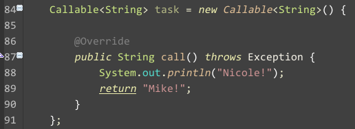
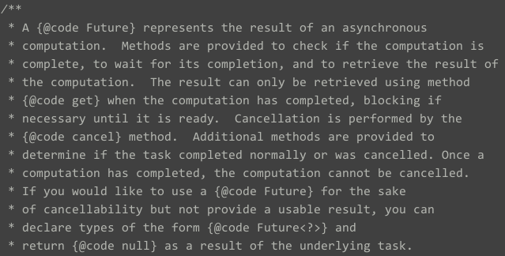

Java的Callable和Future接口及Fork/Join模型
---

目前已经大三下了，马上就要准备实习了，所以也开始好好复习之前的一些内容了，对于Java中的callable和future之前也是有所了解，但是
因为项目的原因，一直都没有好好的系统的学习，所以这段时间，就将其他的事情放在一边，好好的准备面试了。

之前看过了Java中的集合框架，估计最近也要写一篇响应的博客好好复习以下。

那么，现在就开始好好的玩Callable了！

首先看一下Callable的一个最简单的示例，就是他～
> 
>
> 最明显的一点，我们可以发现最简单的一个和Runnable的区别，就是他的call方法(相当于run())是存在返回值的，这一点有什么好处呢。我得感触
的最深的一点就是可以异步的获取线程的值了，因为之前我常做的一件事情就是在某个线程中申请一个static变量，然后进行传值，但是不好的一
点就是线程的可见性，因为Java的内存模型的原因，线程中修改的值最先是在线程内部的内存中写入之后才会写入主内存中，这一点就需要添加`volatile`
关键字了，然后就是不好看的代码了。所以从这个角度上说这个改变还是很有必要的。

然后，我们可以使用Executor去调用，这边也需要详细说明一下Executor这个东西，因为这并不是Java与生俱来的一个特点，而是一个在Java5时引入
的一个神奇的东西，之前，在我没了解到这个东西之前，我是采用自己编写的线程池，不过也是一个简单的东西，就是使用几个Vector保存建立的线程
为什么使用Vector呢，很简单，当时考虑到并发的问题，就直接使用所有方法为同步的Vector了，所以效率么，呵呵了。

看下面的代码，详细说明了使用Exector调用Callable的过程:
> 
>
> 这段代码的注释已经说明一切了。不过，这边出现了一个新的东西，那就是Future，为什么会有这个东西。我们就先看看JDK的注释是什么吧。
> 
> 
> 
> 不愿意看英文的同学可以自行谷歌。我就说一个地方，就是调用他的get()方法是一个阻塞的。所以可以使用这个做一个[生产者消费者模型](https://webcache.googleusercontent.com/search?q=cache:5aXQn3y5rQ4J:zh.wikipedia.org/zh-cn/%25E7%2594%259F%25E4%25BA%25A7%25E8%2580%2585%25E6%25B6%2588%25E8%25B4%25B9%25E8%2580%2585%25E9%2597%25AE%25E9%25A2%2598+&cd=1&hl=zh-CN&ct=clnk&gl=cn)。
> 
> 再看看Future这个接口，我们就只看到这四个方法，他们分别是:
>
> 
> 
> 所以这个接口的主要作用就是给我们一个显示的线程状态的描述，并且可以显示的操作线程的一些动作，而不是之前的需要编写额外的代码。

说完了这个，我们就可以看看Java7带给我们的一些更加完善的并发机制，这些是我们之前需要编写大量代码才能实现的效果。

首先就是传说的work-stealing模型。
> 
>
> + 此图盗自[并发编程网](http://ifeve.com/java7-fork-join-and-closure/),望见谅。

这是一个很好玩的事情。简单的说就是，两个人写带码，一个人写完了，然后看到另外一个人的任务还没有做完，于是就帮他做。就是这个效果。

接下来就是一个更加传说化的Fork&Join框架，下面介绍一个演示的小DEMO。这是摘自Oracle官网的示例[Counting Occurrences of a Word in Documents](http://www.oracle.com/technetwork/articles/java/fork-join-422606.html):
> 这个例子的基本模型就是下图所示:
>
> 
> 
> + 由于代码长度较长，所以这边以链接的形式给出，希望阅读的同学可以点击[GitHub-ForkAndJoin.java](code/ForkAndJoin.java)

运行这个代码之后，你就能很明显的了解到什么是传说中的Fork&Join了，他的思想说到底很像Map/Reduce，都是将很大的一个任务拆分成很小的一块，
最后进行合并。在这个例子中，他就对查找文件和查找文件夹进行了任务的切分，就是说，每次进行相应任务的时候并不是一个串行的过程，而是一个
并发的过程，这个编程模型的优势就在于，进行大规模的任务时，效率极大的提高。

下面是甲骨文官方提供的一个效率图:
> 

我们可以看到在多核系统上的性能的提高。所以，我们应该对我们的业务进行进一步的切分，将其转为Fork&Join的模型，然后进行高效率的开发。

至此，本文结束。

**PS:[参考网页]**

 > + [Oracle - Fork and Join: Java Can Excel at Painless Parallel Programming Too!](http://www.oracle.com/technetwork/articles/java/fork-join-422606.html)
 > 
 > + [并发编程网 - work-stealing](http://ifeve.com/java7-fork-join-and-closure/)
 > 
 > + [IBM - JDK 7 中的 Fork/Join 模式](http://www.ibm.com/developerworks/cn/java/j-lo-forkjoin/)