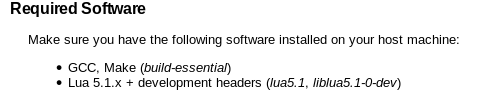
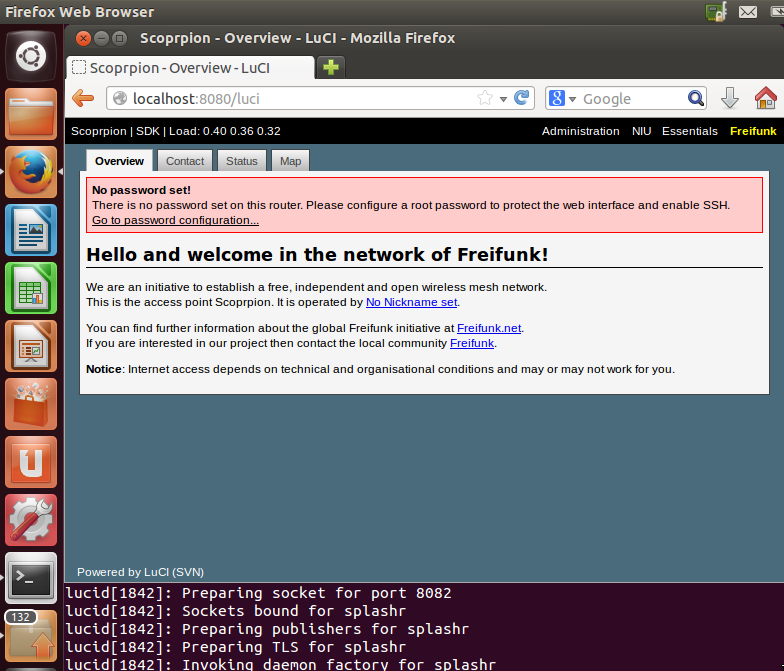

LuCI编译文档.md
---
首先介绍以下LuCI项目，LuCI作为“FFLuCI”诞生于2008年3月份，目的是为OpenWrt固件从 Whiterussian 到 Kamikaze实现快速配置接口。Lua是一个小巧的脚本语言，很容易嵌入其它语言。轻量级 LUA语言的官方版本只包括一个精简的核心和最基本的库。这使得LUA体积小、启动速度快，从而适合嵌入在别的程序里。UCI是OpenWrt中为实现所有系统配置的一个统一接口，英文名Unified Configuration Interface，即统一配置接口。LuCI,即是这两个项目的合体，可以实现路由的网页配置界面。

当然，之前都是扯淡的。开始正题。

*注意:以下所有操作基于原版`Ubuntu12.04 x64`系统*

官方网站上有一个简单的安装介绍。就是[这](http://luci.subsignal.org/trac/wiki/Documentation/DevelopmentEnvironmentHowTo)。

基本上按照他的方法就可以了。首先要保证你有GCC,Make。然后就是最重要的一点，要有Lua，并且必须是**5.1**版本！
> 

然后就是最简单的SVN checkout。

运行如下命令：
> `svn co http://svn.luci.subsignal.org/luci/branches/luci-0.10` 

或者用这个命令：
> `svn co http://svn.luci.subsignal.org/luci/trunk`

然后运行`make runhttpd`就好了。

当然，如果出现 make error 是正常的，不用惊慌。我这边遇到了两个问题。

1. 是很常见的缺少curses.h这个头文件。
>
> 解决办法也是相当的无脑，安装curses库即可，即运行：`sudo apt-get install libncurses5-dev`就行了。

2. 最重要的是下面，这个我之前也没有遇到过，就是：`undefined reference to "crypt"`
> 
>
> 后来进过高人指点。就是[这篇文章](http://blog.csdn.net/kwongfung/article/details/8162010)。找到了解决办法。就是修改makefile的依赖顺序。
> 
> 主要修改有两个文件。
>
> + **ontrib/uhttpd/uhttpd-src/Makefile** 的第73行修改为： 
> `$(CC) -o uhttpd $(LDFLAGS) $(OBJ) $(LIB)`
> + **modules/admin-full/Makefile** 的第14行修改为： `$(LINK) -o src/$(BWC_BIN) $(BWC_OBJ) $(BWC_LDFLAGS)`
> + **libs/nixio/Makefile** 的第93行修改为： `$(LINK) $(SHLIB_FLAGS) -o src/$(NIXIO_SO) $(NIXIO_OBJ) $(NIXIO_LDFLAGS_POST) $(NIXIO_LDFLAGS)`
> 
> *PS:最重要的是修改顺序，如果在相应的行数没有看到相似的语句，请进行搜索后再修改。*

最后，直接使用`make runhttpd`就能运行了，当出现如下语句的时候，打开浏览器，访问[http://localhost:8080/luci](http://localhost:8080/luci)即可。
> 

运行界面一览：
> 

享受生活，享受代码。