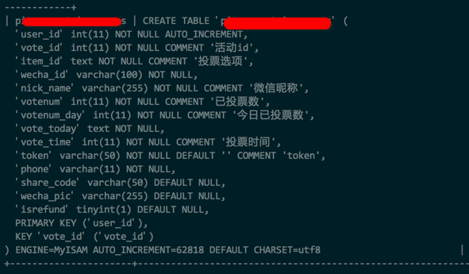
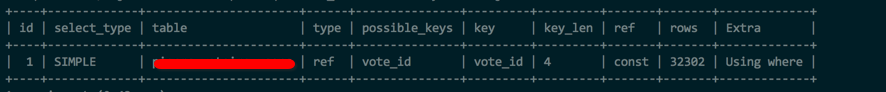

一次 MySQL 调优经历
---

最近有一个朋友遇到一个问题，就是突然之间网站的响应时间变成了秒级，而且 MySQL 占用了大量的 CPU 资源。具体如下图:
+ CPU 资源占用:
> 

+ 响应时间:
> 

可以看到这一个很明显的异常值。所以，我就开始排查。一切都是常规的思路，连上服务器，然后看看当前都是些什么任务。
+ 当前任务:
> 

可以看到，基本上所有的 query 都是在等待表锁。然后查了下这张表的表结构，还有 select 和 update 的执行情况。

+ 表结构:
> 

+ SELECT 语句执行情况:
> 以 *SELECT x FROM `xx` WHERE ( `vote_id` = xx ) AND ( `token` = 'xx' ) AND ( `wecha_id` = 'x' ) LIMIT 1* 为例
>
> 

可以看到虽然是走了索引，但是依旧是扫描了 3w 多行数据。加上之前等待锁的时间。最后造成的问题就是，这个简单的 select 就已经花了3秒时间。

仔细研究了这几个出现最多的语句，发现这个和他们最近上线的一个投票业务相关。所以这个，可以断定就是有人在刷票。当然，最佳的方案就是，在前端代码加上防刷机制，比如 ip 校验什么的。

但是考虑到当时的情况。改代码这个基本就是不现实的处理方法。因为时间来不及。而且代码是第三方的，修改起来难保全无错误。

所以，这边主要考虑的还是从数据库下手。

因为，MySQL 是支持表级锁和行级锁的，所以这边我们主要是进行锁级的优化，比如把表级锁改成行级锁。完美。这段看到现在，有没有发现我是在一本正经的胡说八道。给位仔细看上面的表结构截图。我们可以看到由于历史遗留问题，这个库依旧采用了 MyISAM 引擎，这就带来了一个很严重的问题。

这货只有表级锁。但是，它支持插入和查询同时进行(有屁用，这个场景就是 update 和 select 频繁)。 所以，又有了一个方案，把这个数据库引擎从 MyISAM 改成 InnoDB。看似完美。

但是，InnoDB 的行级锁是基于索引的。也就是说，他所谓的行级锁，如果在索引不好的情况下，依旧会锁上一大堆数据。比如上述的执行情况来看，在走了索引的情况下，依旧扫描了3w 多行数据。可见这个索引真不咋地。

加索引？这是由多想不开在字符串列加索引，而且还是一个 update 极度频繁的业务场景下。

所以以上方案都被自己否决掉之后，就考虑到大招了。修改隔离级别,关于 MySQL 的隔离级别，建议不清楚的阅读我 **2013** 年写的文章 [《MySQL 锁分析》](http://mikecoder.cn/?post=69)。

这个操作，反复和对方进行沟通，确认无资金交易，和其他重要业务之后，将隔离级别下调至 **read-uncommitted**。

这个操作非常危险，因为它会带来脏读的风险，不过，他确实可以让 select 和 update 并行，虽然 update 之间还是要等待锁。

优化后的当前任务执行情况:
> 

然后就是结果了：
> 

可以看到，最后的下降非常明显。

最后的最后，面对这样的一个常 update 和 select 的场景，有没有好一点的实现解决思路呢？

因为这张表设计的真的不合理。常用来搜索的字段都是 char 型。所以，我最后提出的一个优化方案就是：

1. 修改引擎为 InnoDB
2. 增加字段 wechat_id_idx, token_idx，这两个字段都是 int 型，生成的方法就是(以最好的语言 PHP 举例)：*$token_idx = base_convert( md5($token), 16, 10);*，将 char 转换成 int
3. 基于上述两个字段建立索引

以上就是全部，最后的最后的最后。也是意外之喜，我的油费有找落了。 哈哈。

> 
