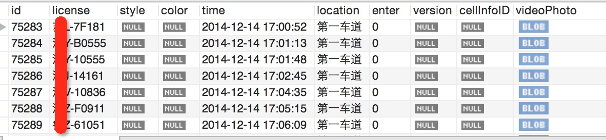

PHP显示数据库中的图片
===

故事的开始是这样的，因为需要在旧有系统上添加一个小功能，就是显示出数据库中存储的图片。不过也不想吐槽这数据库的设计，居然将图片存储在数据库里。但是毕竟是任务就开始了，首先查一下数据库的格式，如下图：

> 

常见的Blob格式，所以我就以为代码会很简单，如下的代码就可以了:

```
<?php
include('db-util.php');

$id = $_GET['id'];

$db = db_connect();
$img = db_getImgById($db, $id);

header('Content-type: image/jpeg');
echo $img;
```

但是，却出现无法识别图片的情况。觉得很奇怪，于是就把网络的请求结果和实际图片做了一个对比，结果如下:

> 

可以很明显的看到前面多了两个字节的'\n'字符。第一反应是缓冲区的数据，以及HTML协议中的'\r\n'造成的。所以看一下缓冲区数据:

```
$var = ob_get_contents();
var_dump($var);
```

果不其然发现了一个坑: **string(2) " "**。然后就尝试清空一下缓冲区，就是**ob_clean()**方法。然后就可以了。

当然，这个并不是唯一的解决办法，在php.ini中有关于缓冲区的配置，将**output_buffering = 4096**改为**output_buffering = Off**，然后重启PHP即可。为什么会出现这个缓冲区，按照配置文件中的说法，是为了提高服务器的性能，而且默认的4096也是一个推荐配置，故意设置成为一个内存页的大小。所以，当系统默认使用大页的时候，这边就要跟着进行修改了。

同时，使用buffer还可以实现很多好玩的效果，比如模板等。同时附上一段好玩的代码：

```
<?php
    header('Content-type: multipart/x-mixed-replace;boundary=endofsection');
    print "\n--endofsection\n";

    $pmt = array("-", "\\", "|", "/" );
    for($i = 0; $i < 10; $i++) {
        sleep(1);
        print "Content-type: text/plain\n\n";
        print "Part $i\t" . $pmt[$i % 4];
        print "--endofsection\n";
        ob_flush();
        flush();
    }
    print "Content-type: text/plain\n\n";
    print "The end\n";
    print "--endofsection--\n";
```

代码需要关闭Apache或者Nginx缓冲之后运行，且只能跑在火狐上，因为我只知道火狐支持**multipart/x-mixed-replace**协议。

The End;
