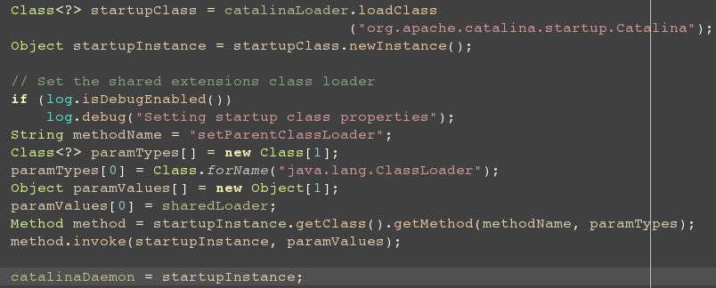
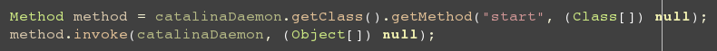
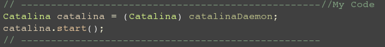

Some Confusion about the source code of Tomcat
---
Some day before, I began to read the source code of the [tomcat](http://tomcat.apache.org/)

First, the server starts from the main method in the  [org.apache.catalina.startup.BootStrap](), but when I go into the code `bootstrap.init()`, 
and I was confused by the following code.Like:
> 

Just for easy to debug the tomcat, I change the code like this:
> 

The code can still work. And in the Tomcat source code, there are many code block like this, For example,in `org.apache.catalina.startup.BootStrap.start()`
 we can find the following code:
 > 
 >

Still for easy to debug, I turn the code into:
 >
 > 

 The code still works fine.So I was confused, Here are my questions.

 1. what's difference between the two kinds of code?
 2. Why the coder of Tomcat do not write the code like what I write? what's the benefit?
 3. If the Tomcat with my kind code works in a production environment, what will happen or nothing will happen?

Any answers or advice should be grateful.