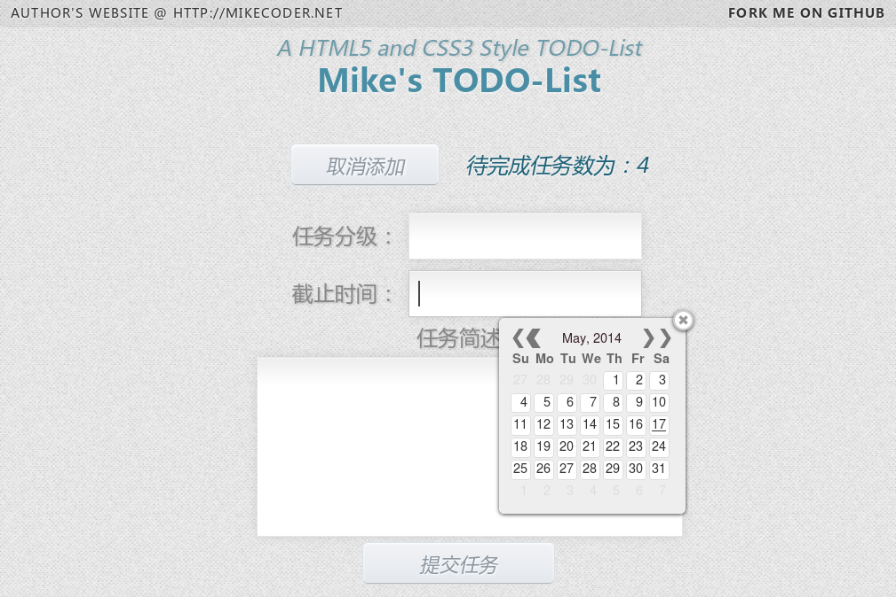
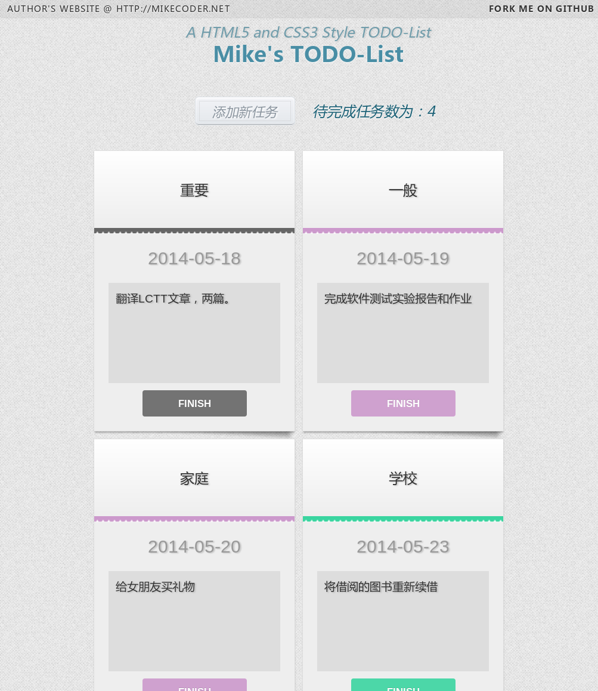

TODO-List项目介绍
---

###写在开始
---
说到这个TODO-List，我对他的需求可以算的上是刚需，之前都是使用的Any.DO，这也是个很好的按卓上的软件，只是可惜电脑上没有对应的软件，或者说没有对应的网页。所以我就自己写了这么一个用来记录我的计划的Web应用。

主要的技术选择有这么几个限制：
> + 由于我需要多平台兼容，最方便的就是使用Web应用。
> + 由于我的租用的虚拟主机只提供PHP环境，所以只能使用PHP作为逻辑处理语言。
> + 同时考虑到不同终端的屏幕分辨率不同，只能采用响应式的布局方式。

本来之前自己擅长的方向是Java服务器端技术，这个可以说的上是没有任何基础。所以代码不是很好，基本上都是现学现卖的。

###接下来是项目的具体介绍：
---

####效果图展示：
+ 如果想更加直观的感受，请点击这个网址:[http://mikecoder.github.io/ToDoList/](http://mikecoder.github.io/ToDoList/)
> *这是一个简化版本,只提供了界面展示，后台功能没有能实现，主要是GITHUB Pages不支持PHP。*

+ 主界面图：
> 
> 
> *这边就是展示所有任务的地方，按照添加的顺序进行展示。*

+ 添加任务区域：
> 
>
> *这就是添加任务的界面，需要注意的是，这边是支持HTML语法的。如果想在简述中添加回车，你需要添加的**是` `而不是回车。***

+ 平板上的显示效果：
> 
>
> *针对不同的手机屏幕，网页会在一行里展示不同的任务数，这个例子中就是两个，而不是之前的四个。*

###安装步骤：
---
1. 从GITHUB中clone到本地，执行如下命令：
> `git clone https://github.com/MikeCoder/ToDoList.git`

2. 然后进入该目录：
> `cd ToDoList`

3. 在MySQL中执行`sql`文件夹下的`init.sql`脚本。可以参照以下命令：
> + `mysql -uusername -ppassword to login your mysql server.`
> + `source init.sql(with full path) to init your database.`

4. 最后按照你电脑的特定设置，修改`config.php`中的变量：
> + `vi config.php`
> + 主要是修改这三项，因为数据库名默认是`todolist`，如果你需要修改，则也需要在`init.sql`中进行相应的修改。
> + 这是一个示例配置文件:
> > 

5. 将他拷贝到你得网站根目录，然后打开浏览器访问[http://localhost/todolist/](http://localhost/php/todolist/),你就可以看到我们的ToDoList了。
> + Ubuntu下默认的网站根目录是:`var/www`，其他的Linux发行版类推。
> + Windows的话则需要具体看安装的文档了。

###最后,祝愉快。