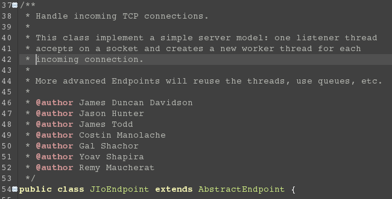
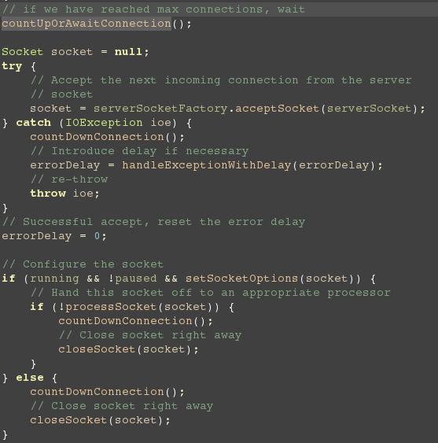
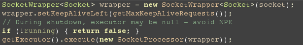
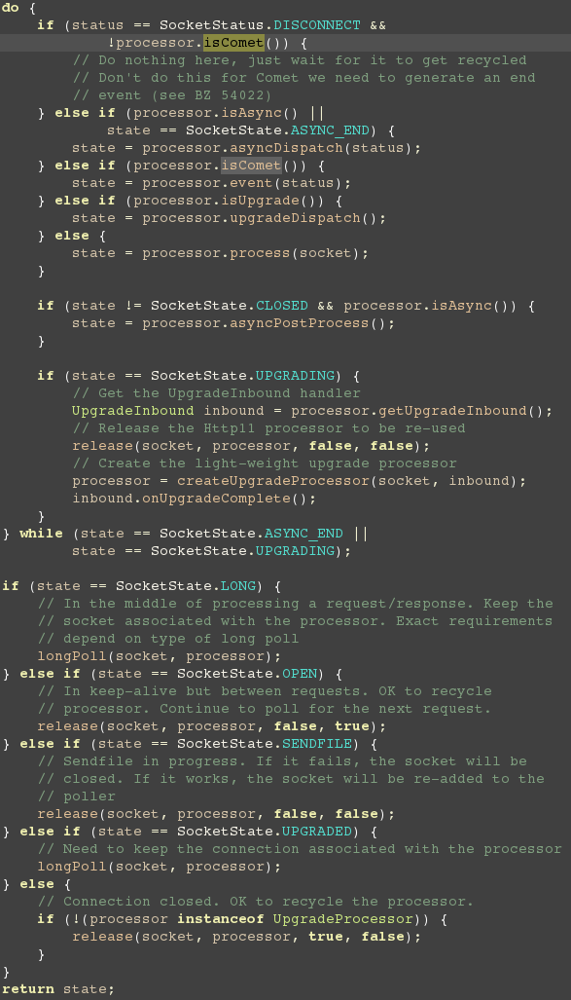

#Tomcat接受HTTP请求详解
---
在前一篇文章中我们提到了[Tomcat的启动的详细过程](http://mikecoder.net/?post=74)，当然，这只是很简单的通过代码的解释，
在Tomcat的启动的过程中还用了生命周期的方式去管理组件，这一部分内容可以参考这篇博客:
[I'm Tiger - Tomcat组件生命周期管理](http://imtiger.net/blog/2013/10/17/tomcat-start-process/)

####代码详解
---
接下来，我来详细的分析下Tomcat的处理HTTP请求的详细过程。首先我们需要知道Tomcat中有一个叫做`Connector`的接口，一开始
我也以为这是接受HTTP请求的地方，因为HTTP实质上还是一个TCP数据包，所以，在不使用NIO的情况下，会建立一个Socket套接字
来进行数据的交换，所以，一开始我的方向是在`Connector`和他的子类中寻找，不过，很快就放弃了，因为他的接口只提供`Request`
和`Response`的访问接口，所以，我觉得因该有个地方将这个操作封装了。于是乎，我开始下断点分析。于是我们找到了建立`ServerSocket`
的类，那就是`org.apache.tomcat.util.net.DefaultServerSocketFactory`,他的作用也很简单，就是建立一个`ServerSocket`，但是至少
我们的源头找到了。

然后我们在他的注释中发现了这样一段代码:
> 

于是乎，我们的注意力可以放到这个`AbstractEndpoint`上了。然后我们可以看到这是个Abstract类，按照设计模式的思想，虚类实现公共部分代码，
我们可以相信，实现套接字的连接类就是`AbstractEndpoint`的子类，于是，我们又找到了`org.apache.tomcat.util.net.JIoEndpoint`,通过注释，我
们不难看出，这就是我们寻找的类:
> 

之后就可以看到那个接收器中的处理函数，这个函数在`Acceptor`中，`public void run()`.在此，我只摘录了主要的代码。如下:
> 
> 
> + 这边我们很快意识到，之前看到的那个工厂类在这边得到了调用，这个类才是真真的启动函数。
> + 然后我们假设所有的行为都没有抛异常，则之后的行为就是按照这个步骤开始。即
>	> `processSocket(socket);`

然后我们跳到这个函数，看到了如下的代码:
> 
>
> + 代码就是将Socket传入`SocketProcessor`中,进行处理。
>
> + 之后的处理函数就是这样的。（省略了其他部分）
> 
> + 在这边，Handler是负责处理HTTP请求的类，通过调试分析，我们可以看出，`Process`并不是在JIoEndpoint中定义的，而是外界传入的。
> +在这边，以[HTTP1.1协议](http://zh.wikipedia.org/zh-cn/%E8%B6%85%E6%96%87%E6%9C%AC%E4%BC%A0%E8%BE%93%E5%8D%8F%E8%AE%AE)为例，
	他会调用`Http11Protocol`中的`Http11ConnectionHandler`来进行处理。

继续，我们就去`Http11ConnectionHandler`一探究竟。这边代码很简单，没有什么实质性的内容，于是我们立马想到，代码一定在虚类中，于是我们找到`AbstractConnectionHandler`。
果然看到了那段代码,传说中的`public SocketState process(SocketWrapper<S> socket, SocketStatus status)`:
> 
> 
> + 这边不得不说，Tomcat真的是设计上很完善，所有的代码都是不停的回调，而且都是使用虚类或者接口进行传参。在阅读上有点吃力。同时在注释上还是比较吝啬的。
> + 不过这边的总体思路还是使用合适的Processor去处理对应的Socket.

####实例解析
---
为了更好的展示，我在网站的根目录下放了一个`index.html`,里面就一句话，`Hello World!`。然后我们开始调试。

首先在`org.apache.tomcat.util.net.JIoEndpoint`中的`Acceptor`中加上一个断点，然后打开浏览器，打开`localhost:8080`,就可以看到那个熟悉的调试界面:
> 
>
> + 然后我们继续下去，会发现，他会调用线程池然后使用`SocketProcessor`。
> + 然后，在run方法中调用`handler.process(socket, status);`
> + 这边的代码可以看上面最长的那张图片。
> + 之后就进入了`AbstractHttp11Processor.process(SocketWrapper<S> socketWrapper)`方法。这边主要的目的就是设置IO以及一些标志(Timeout, keepAlive等)。还有生产Request,和Response,也就是在这边将HTTP协议转换为我们常使用的Request和Response。
> + 在往后就是一些收尾工作了。

至此，Tomcat完成了一次HTTP请求解析。
