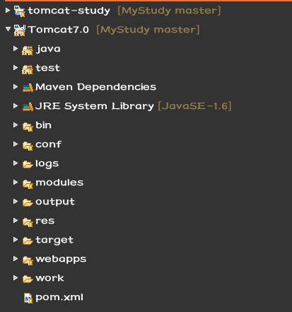
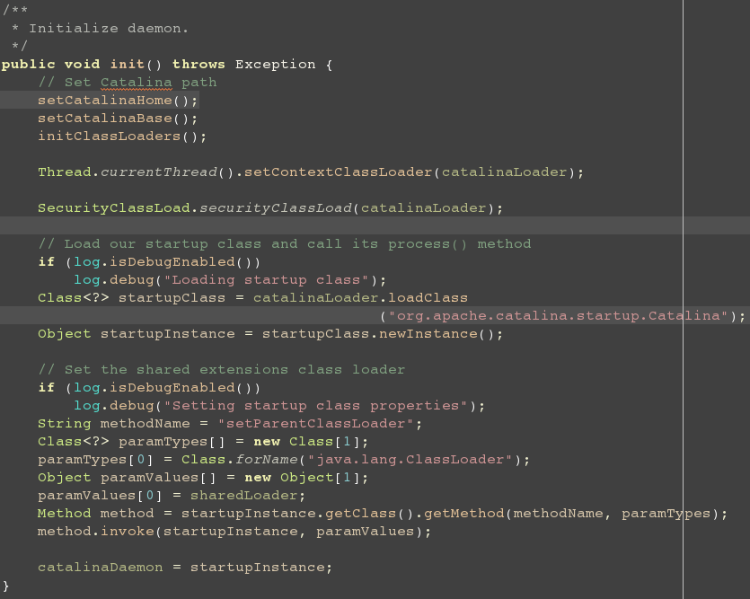
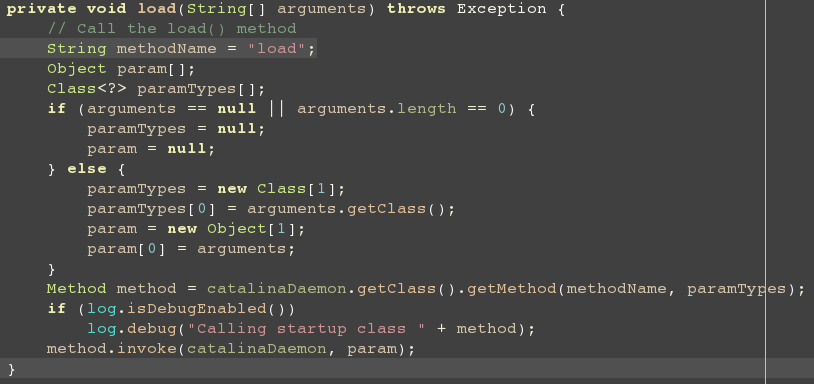

Tomcat的启动
---
本来，受Oracle面试官的指导。从年前就开始阅读Tomcat的源代码了，在这边就准备把自己的阅读心得拿出来共享下。

作为这个系列的第一篇文章，我们先从如何在Eclipse中运行开始。这一点上，
我是借鉴了[I'm Tiger](http://imtiger.net/blog/2013/10/14/run-tomcat-in-idea-or-eclipse/)这篇文章。所以在这边，如果希望跳过这一步骤，可以参考他的和我的已经编译好的Tomcat版本。
地址是:[I'm Tiger's Tomcat](https://github.com/imtiger/Tomcat)或者是使用我组织好的Tomcat,
[Mike's Tomcat](https://github.com/MikeCoder/MyStudy/tree/master/SourceCode/Tomcat/tomcat7-run)

下载好之后,只需按照一般的[Maven](maven.apache.org)项目导入Eclipse就可以了。过程比较简单。

然后可以进入文章的正题了，就是Tomcat的启动过程。

####首先，在Eclipse中导入工程之后会看到这样的画面:
> 
>
>*这里面，我们可以看到两个目录，一个是tomcat-study,一个是Tomcat7.0,但是我们这边主要是阅读后者的源代码，
上一个项目其实是Tomcat7.0的上级目录，没有什么太大的意义。*

####然后，我们进入`org.apache.catalina.startup.BootStrap`类，因为这边有我们亲爱的Main函数。
> > 
>
>+ 在这边，我们看到的代码是Tomcat的配置代码，简单的说，就是在Tomcat启动之前去加载那些必须的类库。
在这边加一个断点，然后一步一步走下去。进入init()方法。
>
> > 
>
>+ 这边就是BootStrap函数的init().可以看到，首先就是设置CatalinaHome,CatalinaBase,这两个函数主要的
作用，就是将Catalina的路径找到，方便之后的ClassLoader进行加载。
>  
>+ 然后进入的就是`initClassLoaders()`,这边不得不提一下，Java中的[双亲委托模型](http://zh.wikipedia.org/wiki/%E5%A7%94%E6%89%98%E6%A8%A1%E5%BC%8F)。
因为在Tomcat中，类加载器就是按照这个模型涉及的。了解了这个之后，我们来看这边的初始化类加载器的代码。
>
> > 
>
>+ 这里就很明显的体现了双亲委托模型。首先建立了一个没有父加载器的common加载器，然后他就有了两个子
加载器:server, shared。具体的意义呢，就是在程序中，所有的类都是在他的根加载器中加载，这样可以避免同名
但却被不同加载器加载，造成误读的状况。具体的解释呢，可以看[Jetty ClassLoader解析](http://jiangbo.me/blog/2012/02/14/jetty-classloader/)。
>
>+ 然后，我们继续往下(具体的一些比如`createClassLoader()`，就不说了，因为毕竟很浅显的名字)，然后我们就进入了
`init()`方法的后半段
>
> > 
>
> + 现在就是使用动态加载的技术，使用ClassLoad直接去加载`.class`文件，我们可以从代码,很好的理解，我们需要找到
`org.apache.catalina.startup.Catalina`这个类，然后将`java.lang.ClassLoader`作为参数，调用`setParentClassLoader(ClassLoader)`
方法。然后将这个动态加载的Catalina类作为一个后台的Daemon传入BootStrap的catalinaDaemon中。完成BootStrap的初始化，
同时，也开起了一个Catalina的后台Daemon。

####接下来，我们就来看Main函数的后半段。
> > 
>
> > *`// ignore the try catch code block `*
>
> * 在这边，我们可以看到，这是一个使用args的代码段，这也是当我们运行`tomcat start`时执行的函数体，
于是，我们就可以直接看`command.equals("start")`时的一些动作。即`daemon.setAwait(true)`，`daemin.load(args)`和
`daemon.start()`这三个函数。
>
> > 
>
> + 调用Catalina的`setAwait()`函数。而这个函数只有三行,作用就是典型的setter and getter方法。
> + 之后便是`daemon.load(args)`。
>
> > 
> 
> + `load()`函数的作用就是呼唤`Catalina`的`load`方法，而他的load就是将我们常用的配置文件`conf/server.xml`导入。
然后就返回了。
> + 最后就是`start()`了，其实也就是`Catalina`的`start()`...，官方的Doc里的解释就是`Start a new server instance.`
>
> > 
>
> + **到此，Tomcat最终启动。**

Have a nice day and enjoy!

参考文章:
 >+ [I'm Tiger - http://imtiger.net/blog](http://imtiger.net/blog)
 >+ [WIKI - 双亲委托模型](http://zh.wikipedia.org/wiki/%E5%A7%94%E6%89%98%E6%A8%A1%E5%BC%8F)
 >+ [Jetty ClassLoader解析](http://jiangbo.me/blog/2012/02/14/jetty-classloader/)
 >+ [Tomcat - http://tomcat.apache.org/](http://tomcat.apache.org/)