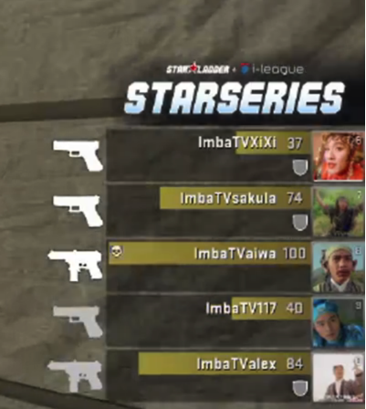

一场 CS:GO 比赛引发的思考
----

9月12日凌晨3:20，为期5天的SL-I群星联赛CSGO第二赛季线下总决赛圆满落幕。瑞典老牌豪门NIP最终在决赛上2-0完胜法国劲旅G2，问鼎冠军！

以上废话，作为一个老 CS 玩家，对于这样的比赛务必是每把必看的。所以，12日也确实熬到了3点。其中有几个插曲很有意思。

第一个就是这些伴随着我们长大的 ID:
> 

其次，就是 NIP vs G2 的第二场比赛，比赛服务器因为 DDos 攻击，卡了几次，其中一次，CT 干完了所有的 T，准备拆弹的时候，突然卡了，然后所有人眼睁睁的看着炸弹爆炸。

然后就是复盘了。G2 也是相当的大气，手枪局重赛的那会，就开始了送人头，复盘。也是挺磊落的。 那么问题就来了，如何更好的避免或者当这样的情况发生的时候，如何较好的恢复。

####关于比赛中出现异常的复盘
这个确实是一个很好玩的场景。众所周知，在比赛中，如果出现各种异常情况，导致比赛不能继续进行的。或者游戏崩溃，如何复盘。才能保证比赛的公平性。

在后 CS1.6 时期，这样的复盘就是需要选手当场看比赛的视频，然后一场一场复盘。因为新进入的选手，起始资金都是800。所以这对于掉线的一方非常不公平。

在 Dota 比赛中，就是需要裁判不停的 save，然后当掉线的情况发生的时候，恢复到最近的那个 back 中。

在 LOL 比赛中，因为游戏本身并没有暂停功能，所以当出现掉线的情况，那么，裁判就会让剩下一队的队员回泉水，等待对方重连。[对应的案例](http://www.52pk.com/gl/6370908.shtml)。这也是个很有趣的事情。那就意味着，可以通过人为的造就不好的网络状况，进行重赛。

在 Dota2 的比赛中，因为有暂停机制，所以当某一方掉线的时候，系统会暂停。防止出现以上难以处理的场景。所以说，dota2，做的真的好。

####如何去实现？为什么没实现？
既然，业内有这么一个比较好的解决方案，那么为什么其他的游戏制作商并没有采用？而是或多或少的放弃了这个 feature。
