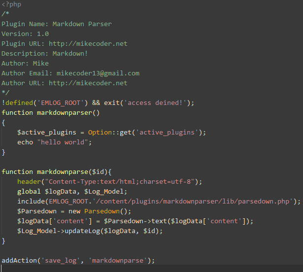

关于MarkDown编辑插件
---
因为实习找到了，然后offer也接受了，所以所谓最忙碌的大三下学期就变的有点松懈了。
因为自己之前都是做Java的，然后实习的话需要了解PHP，因为实习的公司正在做SOA的架构
转变，需要将之前使用PHP的代码用Java替换。所以开始学习PHP。

不过，几天感觉下来，使用PHP写网站，确实比Java这种语言简单，就说一个简单的数据库
连接，Java需要导包，JDBC等等，麻烦点的什么JNDI,数据库连接池。。。然后取得数据之后
又是各种类型转换。毕竟是强类型语言，相比之下，PHP就简单很多了。

先说这个插件，毕竟刚学PHP，只写过简单的留言板，所以就只能解压别人的代码，然后观察
抽取可以使用的方法。在这边感谢卡片和emlog的工作人员，插件的编写文档和自动摘要插件给了
很大的指导。

其实代码也比较简单，这是全部的代码了
> 

这边主要的就是添加钩子函数，`addAction`之后就是Emlog-Core的任务了(不得不说，这个确实是
一个很好的思路)，然后按照文档，他会在保存日志的时候，调用我的`markdownparser($id)`函数。

这边最主要的就是解析Markdown语法了，还好有人已经帮我们做了，这就是[Parsedown](https://github.com/erusev/parsedown)
感谢开源的力量。

使用上的话，需要注意在编写文档的时候需要点击**HTML源码**模式，因为直接编写，会出现解析上
的问题。

主要的介绍可以看我在论坛上的帖子:[点击这](http://bbs.emlog.net/thread-35047-1-1.html)

就这样吧，接下来就可以好好看看PHP了，然后把这个插件做的更好一点。

加油！