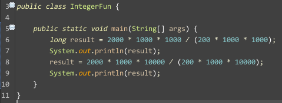
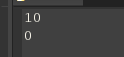
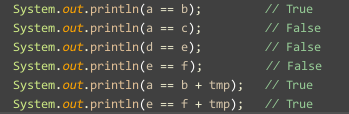

有关Java中数字的几个好玩的地方
---
###开始
---
我们先从一个简单的例子开始：
> 
>
> *你们可以大胆的猜测下结果。* 

相信很多人直接就已经没有了往下看得欲望。因为这道题目很简单，特别是还做了对比的输出。其中的道理也很简单，越界了。因为在给`result`赋值之前，后面执行的过程都是基于`int`的计算。所以最后的结果就是:
> 

好了，简单的问题结束了。开始更加有趣的事情了。

###传说中的Integer常量池
---
说到常量池，String的常量池应该是大家都比较熟悉的。毕竟作为公司的面试题目，大家都不会陌生。相信网上说到这个的也不会少，现在我们说的就是Integer的常量池。

也是先从代码开始。先看如下代码:
> 
>
> *你们也可以猜猜这个的结果*

其实也很好玩，想想看拆包和装包。就知道了。不过这边还是有几个好玩的地方，因为他的答案可能会超出你得理解。

举个例子，所谓的拆包装包只会在进行运算的地方进行。也就是说，在进行`==`操作的时候，并不是两个`int`在进行比较，而是两个`Integer`对象在进行比较。然后就可以按照`String`的理解进行答题了。

答案就是:
> 

这么说，可能理解起来还是有点困难，但是，如果看到源代码，就能很好的理解了。下面是`Integer`的`valueof()`方法，因为在进行使用int值初始化的时候，将会使用到这个函数。
> 
>
> *这边有一点说明:*
>
> + `IntegerCache.high`是`127`,`IntegerCache.low`是`-128`

然后，上面的几个例子就比较简单了，在进行`Integer e = 128;`的时候，其实是执行的`Integer e = Integer.valueof(128);`，也就不难理解为什么e和d是不一样的了。

###操作符的乐趣
---
上面的例子说了`==`在进行包装类的判定的时候的处理方式，那我们是不是可以进行类推，看看`>=`和`<=`的行为?

还是一个例子：

> 
>
> *看看这次的结果是什么*

当然全是无限循环了。很简单，因为`>=`和`<=`进行的是值运算，也就是说，即使两边都是包装类，在进行运算的时候都会进行拆包。拆包了，大家就都是基本数据类型，也就没有什么对象的特点，所有的操作都是基于值来的。

###传说中的Double,Long读半边
---
我们都知道，int是4个字节的，long,double是8个字节的。这当然是一个基本了。JVM对int的读写当然是原子操作了，这一点毫无疑问，但是，对long和double呢？我们就不知道了。我们不得不对JVM作出这样的假设，就是，他会先对前4个字节进行操作，然后再处理后4个字节。所以，在某些极端情况下，我们会遇到读出半边的情况，当然，这是极端情况下。一般也不会发生。如果你感到不放心，你大可以将你得long变量用`AtomicLong`替换。这样就能保证以上的情况绝对不会发生。

还有什么好玩的，之后再继续补充。