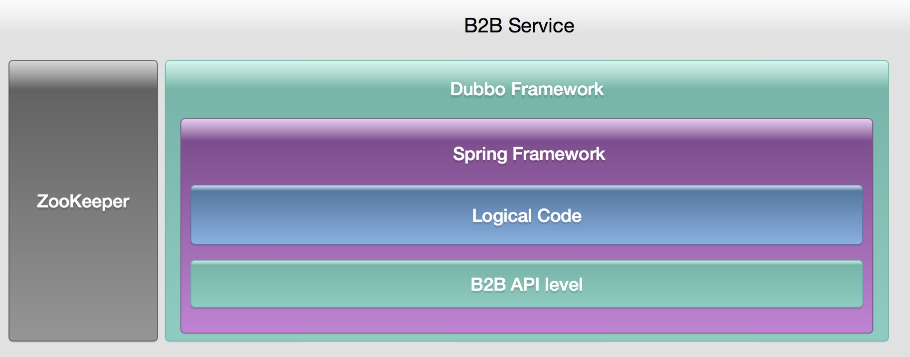
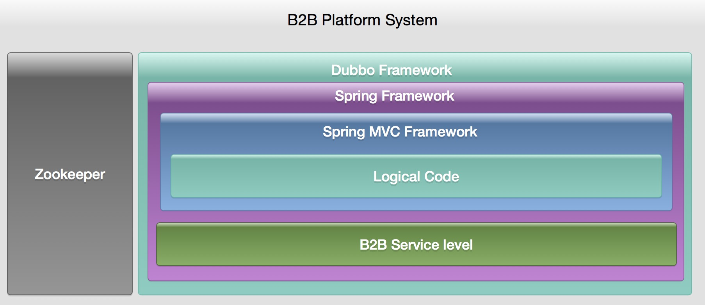

记一个非常有意思的项目
---

机缘巧合之下，和朋友聊天的时候，知道他们那有一个基于 Java 的 web 系统。于是，作为一个 Java 功底还算过得去的人，我觉得，应该可以去玩玩。

因为，作为一个 Javaer，说到 Java web 的时候，无外乎 Spring，Struts，Hibernate，或者 MyBatis。于是乎，作为复习，我拿过来看了下。不过第一眼确实是非常惊讶。

因为朋友那边没能拿到相关的文档，没有部署方式和设计方式，所以也是一头雾水。各位可以看下他的目录结构：

```
├── b2b-api-base
├── b2b-api-content
├── b2b-api-customer
├── b2b-api-lucene
├── b2b-api-mail
├── b2b-api-payment
├── b2b-api-product
├── b2b-api-salesorder
├── b2b-api-security
├── b2b-api-shipment
├── b2b-api-sms
├── b2b-api-sns
├── b2b-backend-base
├── b2b-backend-content
├── b2b-backend-customer
├── b2b-backend-lucene
├── b2b-backend-mail
├── b2b-backend-payment
├── b2b-backend-product
├── b2b-backend-salesorder
├── b2b-backend-security
├── b2b-backend-shipment
├── b2b-backend-sms
├── b2b-backend-sns
├── b2b-common-backend
├── b2b-common-config
├── b2b-common-core
├── b2b-common-frontend
├── b2b-common-public
├── b2b-root
├── b2b-service-base
├── b2b-service-content
├── b2b-service-customer
├── b2b-service-lucene
├── b2b-service-mail
├── b2b-service-payment
├── b2b-service-product
├── b2b-service-salesorder
├── b2b-service-security
├── b2b-service-shipment
├── b2b-service-sms
├── b2b-service-sns
├── system-b2b-backend
├── system-b2b-pc-platform
├── system-b2b-pc-shop
├── system-b2b-wap-platform
├── system-b2b-wap-shop
├── system-b2b-webservice
├── system-doc
└── system-fileserver
```

这一眼看过去，第一反应就是服务化过后的网站系统。但是服务化，应该也是相当大规模的网站应该采取的措施。但是对方居然在刚起步的时候使用了服务化架构。也是很有前瞻性。

仔细分析下来，他的技术选型倒还是挺中规中矩的。服务化框架使用的是 dubbo，集群管理使用 zookeeper，数据库 ORM 使用 MyBatis，MVC 使用框架 Spring MVC，组件依赖使用 Spring 的 IOC。所以这样分析下来，他的部署方式也就清楚了。本地部署 Zookeeper，然后将 dubbo 的组件注册，dubbo 服务启动之后，最后开启网站系统。简直就是干(sang)得(xin)漂(bing)亮(kuang)。

架构图的话可以参考下面：

1. b2b-service-* 对应的级别
> 

2. b2b-api-* 对应的级别
> 

3. system-b2b-* 对应的级别
> 

从整体架构来看的话，这应该算是一个非常完美的设计。包含了接近完美的 fail-over 解决方案以及快速的横向扩展方案（依托 Zookeeper 和 dubbo）。 但是，完美的设计，却在细节上存在很大的问题。

1. 在 service 上的定义我觉得太过于依赖业务。抽象不够彻底。
2. 有了应用的服务化之后，却没有一个完善的 log 跟踪机制。
3. 大量使用第三方库，导致业务更改不灵活。

先说第一点，对于单个的 service 应用，我的倾向于尽可能的独立。比如，尽可能一张表对应一个 service，而不是将一个组合的非常用任务进行包装。比如用户注册，推荐人获得积分。我觉得这样的的一个业务场景，应该是放在 system-b2b 的级别进行编写，而他是写到了 service 层。这样带来的一个后果就是，这个 api，只是少量的调用到。不过换句话说，可以通过冗余的 api 减少服务的调用次数。但是，在 service 中调用 service，又会带来联级调用问题。如果在 system 级别中实现，又会带来失败时的回滚问题还有幂等性等附加伤害。所以，这个只能根据当前现状进行取舍。因为，不管选哪种，总会带来一定的副作用。

在这一点上，我就非常赞同 Laravel 的 Model 设计。将 Model 和数据库表绑定。可以最大限度的通过不同的 model 组合来实现各种各样的功能。不过这也依托于 PHP 的弱类型 Feature。

至于后者的 log。这个项目中使用的是 LOG4J，本身并没有什么不好。而且 dubbo 本身也提供了低可用性的 log 反馈。但是并不足以作为事后取证的依据。所以，这套系统到是非常必要。业界的 ELK，貌似就是个不错的选择。

第三点，最简单的例子就是用户的认证。在这个项目中，它使用了 shiro 来作为认证方案。从 shiro 本身而言。作为 java 中一个轻量化的认证框架，本身非常完美。但是我的建议是在 shiro 之外在封装一层。而不是完全依托于 shiro。shiro 本身基于接口实现。但是，却并不满足多种登录的情况。比如，使用 token 的验证，使用第三方的登录，使用账号密码登录等等。而本项目中，只是简单的通过配置文件的方式，指定了一个认证手段。后期进行修改时，略显蛋疼。

最后吐槽一点就是数据库设计。我很清楚这个项目本身是要完成一个非常复杂业务的系统。所以他在数据库设计本身就非常复杂。光对于 product 表而言，与之对应的附表就有 10 张之多，令人咋舌。而最后，本项目实现的功能，我和朋友吐槽的一句话就是用核弹炸一只蚊子。

不过，了解完这个项目之后，还是挺有意思的。也不枉我，连续两天，总共花了6小时，摸透代码。毕竟，这样的架构设计，这样的组织结构，基本上也就只能在老东家级别的公司里才会遇到。不过，反过来看看，其实也挺无趣的。毕竟大量的工作并不是在于如何实现某个功能，而在于如何优化某个细节。

最后说一点。并不是最牛逼的就是最好的，只有最适合的才是最好的。我小时候也曾想写一个牛逼的系统来 hold 住所有的项目，而实际情况恰恰相反。并没有什么业务或者逻辑是通用的。即使有，也是抽象到不能再抽象的业务。基本上也就到了数据库 select update 单表级别了。再有，这些年，我们以通用为名，造了多少垃圾。现有业务，后有通用。而不是在项目建立之初就以通用为目的。
