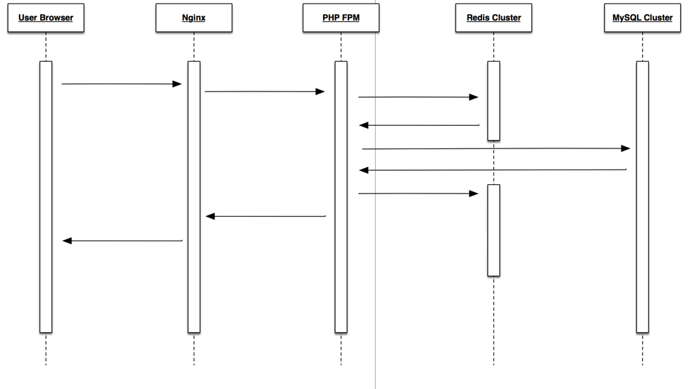

从一个问题开始谈秒杀业务场景
---

这个首先就是从一个知乎提问开始的。有一天我看到[这么一个提问](https://www.zhihu.com/question/46927678/answer/103463441)：
> 

然后，排名第一的答案就是一个静态页面，一个告知用户当前访问人数过多，请稍后再试。当然，这在很多人看来都是一个笑话。不过，对于一个之前做过秒杀业务的人来说。这真的是一段非常精妙的代码，某种角度上来说，这可以解决90%的秒杀场景。不过，用户体验太差，尤其是那些看到 console 有信息就会高潮的人来说。

所以，这边就先抛砖，来讲下我对秒杀业务的理解。

对于秒杀来说，它和传统的商城系统有着本质的区别：

1. 低廉价格
2. 大幅推广
3. 瞬时售空
4. 一般是定时上架
5. 流量时间短、瞬时并发量高

对于技术人员来说，我们其实常常会把注意力着重的放在第五点上，就是对于流量的处理。

其实，在我的观点里，初期就将全部的精力放在第五点的优化上，这并不是一个最优的解决方案。举个例子，12306售票系统。在第一版的时候，所有的火车票在同一时间点发售，导致服务器不堪重负，常常崩溃。虽然后来进行了紧急的优化，但是始终无法提供一个稳定的服务。但是，后来他采取了一个很巧妙的方法，将流量平分到一天的不同时间节点上，就是，不同票，不同发票时间。

当然，并不是说第五点的优化不重要。而是，既然可以通过业务上的手段，进行削峰操作，何乐而不为。

如果，对于不同的时间点，流量还是很大，那该如何。就如我的前东家。即使是每小时一次的秒杀，流量都极大。所以，这里就有很多的方法进行处理了。

这里就拿我的前东家的技术架构举例。

对于一个 request 请求来说，基本上是这样的一个流程：

> 

最终的落脚点在 DB，也就是说，最后的最后，如果没有采取截流措施，那么最后倒霉的就是 DB。 所以，我们先来说下截流的办法。

我们可以看到，图中总共有四个标记的地址。也就是说，仅在图中提及的就有四个可以优化的地方。

1. 用户浏览器的截流。
    + JS 防止用户重复点击，这个方法很简单，就是通常的秒杀页面，都会有一个秒杀的按钮，按下按钮，参与秒杀。所以，只需要让用户在一定时间内只能点击一次，将请求数降低即可。
    + 静态抢购结束页面，当用户访问页面的时候，本身就有一定几率跳转到一个只会提示失败的页面。就像小米之前做的那样。不过，就如上文说的，这个方法，风险很高。
    + ...

2. Nginx 的截流。
    + 限流，对于 Nginx 来说，本身就有限流模块，即`ngx_http_limit_conn_module指令`, 通过设置这个参数，就可以确保流入后端的流量是可控的。同时前端对被拦截的请求做秒杀失败的反馈。
    + ...

3. PHP-FPM 和 Redis && PHP-FPM 和 MySQL
    > 这就是一个好玩的地方了。这就是最重要的就是业务逻辑代码了。这边我主要说一下我之前实现的一个逻辑还有一个参与过的业务逻辑。
    >
    > + 对于到达这一步的用户，我们已经默认他已经达到了参与秒杀的条件，所以按照到达的顺序，我们在 Redis 中做一个计数。因为 Redis 是单线程，所以必然的，他有一个原子操作的天然特性。所以，通过设定数字，我们可以保证最后到达数据库的请求和最终的商品数量保持一致，不会产生超卖的问题。不过这个方法有一个弊端，就是，最终参与的人数必然是按照时间顺序排列的。并不能有效的控制秒杀的时间。比如，业务希望，这个秒杀活动能够持续5分钟。
    > + 针对上一个需求，就是有一个优化版的业务逻辑。就是当用户进入到这一步时，我们按照时间顺序分成不同的队列，比如可以按照分钟数来区分。每个队列对应一个可售商品的数量。然后接下来的操作同一。这样的好处就是可以有效的控制秒杀活动的时间。不会造成，一瞬间商品的可售数量变为0。

4. 额外的手段。
    + DNS 截流
    + ...

上述，只是轻描淡写的说了可以通过 Redis 来做一个计数，用来控制最终操作 DB 的请求数量。但是，并没有对 Redis 的 HA 做一个阐述。因为，对于单点的 Redis，在大流量的冲击下，依旧会有崩溃的风险。所以，一般都会使用 Redis Cluster 的解决方案，通常而言就是一致性 Hash 的方案。但是，这个方案就会带来一个雪崩的风险。为了避免雪崩，其实也没什么太好的办法。除了及时的监控，报警和及时的危机处理。同时，业务代码中也务必要有 Redis 无响应的处理代码，即，按秒杀失败处理。

至于 DB 的优化，这个就需要针对特定的表结构，和业务详说。不过 OneSQL 倒是提供了很多好的思路。

不过，上述的一些措施，只能针对常见的秒杀业务，如果是确定的超高流量的秒杀，就需要和现行业务进行分离，使用热点库，热点缓存的方式，将该秒杀和业务分离开来。防止秒杀的崩溃造成系统的不稳定。

最后的最后，这只是在短时间内想到的一些。毕竟只是一个菜鸟的抛砖引玉行为。 : )
