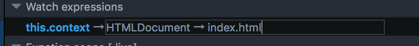

优雅的给动态添加的 DOM 元素添加监听器
===

故事的起因是因为有个美女遇到个问题，就是使用 jquery 添加新的元素，但是不能给这个元素绑定上事件。举个例子来说:
```
$(".btn").on('click', function(){
    $("#container").append('<button type="button" class="btn">+</button>');
});
```
效果就是点击按钮生成一个新按钮。然后，我们也希望新添加的按钮也能绑定上这事件。作为一个 js 小白。我当然不知道怎么实现。所以就很傻逼的想了一个很 low 的办法。就是，在新添加的元素里加上 onclick 然后给他添加事件。如:
```
function addBtn() {
    $("#container").append('<button type="button" class="btn" onclick="addBtn()">+</button>');
}
$(".btn").on('click', addBtn);
```
如你所见，非常，不优雅。因为将业务逻辑和展示层的 html 混在了一起。导致了逻辑的复杂。所以这边通过万能的文档，我发现了一个被遗弃的 jquery 方法，**live**，于是，我把 jquery 版本换成了1.7，然后测试了一发。发现是可以实现的。但是线上的版本是1.9，所以这个被废弃的方法是肯定不能采用的。

所以，办法也挺简单的，就是看 jquery 1.7 的源码，看看这个申请的 live 是如何实现的。源码如下：
```
live: function( types, data, fn ) {
    jQuery( this.context ).on( types, this.selector, data, fn );
    return this;
}
```

因为，根据 Jquery 的官方文档，他的建议是通过 on 方法替换到之前的所有的被废弃的函数。所以这边，我们很容易的就是通过这段代码来搜索希望找到的优雅的实现方式。通过伟大的火狐，我们可以通过调试，发现他的 context 其实是:
> 

即，$(document) 对象，所以这边我就尝试了按葫芦画瓢，使用了如下代码替换掉本文的第一段代码:
```
$(document).on('click', '.btn', function() {
    $("#container").append('<button type="button" class="btn">+</button>');
});
```
结果出奇的好。他优雅的实现了我们想要的功能。但是，作为一个曾经的后端码农，这个 $(document) 对象，让我感觉很不安。因为，讲道理的话，这个对整个页面的添加监听器，从直觉上会对页面的性能产生影响。所以，无奈，只能再看代码。

这次首先先了解的是JS 的事件模型，主要就是两种，一种是捕获式，一种是冒泡式。一般情况下，我们几乎用不到两者的区别，唯一的时候就是在多层dom 元素都有同一个监听器的时候。比如 click 事件。有一个 button 在 div 里面，那么，是 div 的事件先被触发还是 button 的事件被触发？这就是两者的区别。

具体自行百度，不是本文重点。

我们主要涉及的就是 JQ 的事件模型。简要的流程图如下:
> 

虽然图简单，我们看不到底层的 js 实现，但是，通过查看源码，我们就可以看到在 Event.add 方法里:
```
// Only use addEventListener/attachEvent if the special events handler returns false
if ( !special.setup || special.setup.call( elem, data, namespaces, eventHandle ) === false ) {
    // Bind the global event handler to the element
    if ( elem.addEventListener ) {
        elem.addEventListener( type, eventHandle, false ); // 捕获式
    } else if ( elem.attachEvent ) {
        elem.attachEvent( "on" + type, eventHandle ); // 冒泡式
    }
}
```
通过调试，我们可以看到，我们的 on 方法其实是捕获式的，这就可以联想到，为什么使用$(document) 是可以的，因为，他最大。如果我把这个对象缩小会怎么样。所以，我这边改成了如下代码:
```
$('#container').on('click', '.btn', function() {
    $("#container").append('<button type="button" class="btn">+</button>');
});
```
事实是，可行。而且，现在点击其他地方也不再会触发 Jquery 的 click 事件。一切又回到了和谐的社会。

最后觉得，在不会的情况下，还是看源代码解决问题最快。之前帮同事 debug 一个安卓的图片缓存问题，断点一直打到 SDK 深层，最终定位了 bug。这种感觉，确实很好。

不过，看了 JQ 的代码，真的觉得 JS 就是看人的想象力了。比如，下面这段代码是可以执行的！你敢信？

```
ﾟωﾟﾉ= /｀ｍ´）ﾉ ~┻━┻   //*´∇｀*/ ['_'];
o=(ﾟｰﾟ)  =_=3;
c=(ﾟΘﾟ) =(ﾟｰﾟ)-(ﾟｰﾟ);
(ﾟДﾟ) =(ﾟΘﾟ)= (o^_^o)/ (o^_^o);
(ﾟДﾟ)={ﾟΘﾟ: '_' ,ﾟωﾟﾉ : ((ﾟωﾟﾉ==3) +'_') [ﾟΘﾟ] ,ﾟｰﾟﾉ :(ﾟωﾟﾉ+ '_')[o^_^o -(ﾟΘﾟ)] ,ﾟДﾟﾉ:((ﾟｰﾟ==3) +'_')[ﾟｰﾟ] };
(ﾟДﾟ) [ﾟΘﾟ] =((ﾟωﾟﾉ==3) +'_') [c^_^o];
(ﾟДﾟ) ['c'] = ((ﾟДﾟ)+'_') [ (ﾟｰﾟ)+(ﾟｰﾟ)-(ﾟΘﾟ) ];
(ﾟДﾟ) ['o'] = ((ﾟДﾟ)+'_') [ﾟΘﾟ];
(ﾟoﾟ)=(ﾟДﾟ) ['c']+(ﾟДﾟ) ['o']+(ﾟωﾟﾉ +'_')[ﾟΘﾟ]+ ((ﾟωﾟﾉ==3) +'_') [ﾟｰﾟ] + ((ﾟДﾟ) +'_') [(ﾟｰﾟ)+(ﾟｰﾟ)]+ ((ﾟｰﾟ==3) +'_') [ﾟΘﾟ]+((ﾟｰﾟ==3) +'_') [(ﾟｰﾟ) - (ﾟΘﾟ)]+(ﾟДﾟ) ['c']+((ﾟДﾟ)+'_') [(ﾟｰﾟ)+(ﾟｰﾟ)]+ (ﾟДﾟ) ['o']+((ﾟｰﾟ==3) +'_') [ﾟΘﾟ];
(ﾟДﾟ) ['_'] =(o^_^o) [ﾟoﾟ] [ﾟoﾟ];
(ﾟεﾟ)=((ﾟｰﾟ==3) +'_') [ﾟΘﾟ]+ (ﾟДﾟ) .ﾟДﾟﾉ+((ﾟДﾟ)+'_') [(ﾟｰﾟ) + (ﾟｰﾟ)]+((ﾟｰﾟ==3) +'_') [o^_^o -ﾟΘﾟ]+((ﾟｰﾟ==3) +'_') [ﾟΘﾟ]+ (ﾟωﾟﾉ +'_') [ﾟΘﾟ];
(ﾟｰﾟ)+=(ﾟΘﾟ);
(ﾟДﾟ)[ﾟεﾟ]='\\';
(ﾟДﾟ).ﾟΘﾟﾉ=(ﾟДﾟ+ ﾟｰﾟ)[o^_^o -(ﾟΘﾟ)];
(oﾟｰﾟo)=(ﾟωﾟﾉ +'_')[c^_^o];
(ﾟДﾟ) [ﾟoﾟ]='\"';
(ﾟДﾟ) ['_'] ( (ﾟДﾟ) ['_'] (ﾟεﾟ+(ﾟДﾟ)[ﾟoﾟ]+ (ﾟДﾟ)[ﾟεﾟ]+(ﾟΘﾟ)+ (ﾟｰﾟ)+ (ﾟΘﾟ)+ (ﾟДﾟ)[ﾟεﾟ]+(ﾟΘﾟ)+ ((ﾟｰﾟ) + (ﾟΘﾟ))+ (ﾟｰﾟ)+ (ﾟДﾟ)[ﾟεﾟ]+(ﾟΘﾟ)+ (ﾟｰﾟ)+ ((ﾟｰﾟ) + (ﾟΘﾟ))+ (ﾟДﾟ)[ﾟεﾟ]+(ﾟΘﾟ)+ ((o^_^o) +(o^_^o))+ ((o^_^o) - (ﾟΘﾟ))+ (ﾟДﾟ)[ﾟεﾟ]+(ﾟΘﾟ)+ ((o^_^o) +(o^_^o))+ (ﾟｰﾟ)+ (ﾟДﾟ)[ﾟεﾟ]+((ﾟｰﾟ) + (ﾟΘﾟ))+ (c^_^o)+ (ﾟДﾟ)[ﾟεﾟ]+(ﾟｰﾟ)+ ((o^_^o) - (ﾟΘﾟ))+ (ﾟДﾟ)[ﾟεﾟ]+(ﾟΘﾟ)+ (ﾟΘﾟ)+ (ﾟΘﾟ)+ (ﾟДﾟ)[ﾟεﾟ]+(ﾟｰﾟ)+ (c^_^o)+ (ﾟДﾟ)[ﾟεﾟ]+(ﾟΘﾟ)+ (ﾟΘﾟ)+ (ﾟｰﾟ)+ (ﾟДﾟ)[ﾟεﾟ]+(ﾟΘﾟ)+ (ﾟΘﾟ)+ ((ﾟｰﾟ) + (o^_^o))+ (ﾟДﾟ)[ﾟεﾟ]+(ﾟΘﾟ)+ ((o^_^o) - (ﾟΘﾟ))+ ((o^_^o) +(o^_^o))+ (ﾟДﾟ)[ﾟεﾟ]+(ﾟΘﾟ)+ (c^_^o)+ ((ﾟｰﾟ) + (ﾟΘﾟ))+ (ﾟДﾟ)[ﾟεﾟ]+(ﾟｰﾟ)+ (c^_^o)+ (ﾟДﾟ)[ﾟεﾟ]+(ﾟΘﾟ)+ (o^_^o)+ (ﾟΘﾟ)+ (ﾟДﾟ)[ﾟεﾟ]+(ﾟΘﾟ)+ (ﾟΘﾟ)+ ((ﾟｰﾟ) + (o^_^o))+ (ﾟДﾟ)[ﾟεﾟ]+(ﾟΘﾟ)+ ((o^_^o) - (ﾟΘﾟ))+ ((ﾟｰﾟ) + (ﾟΘﾟ))+ (ﾟДﾟ)[ﾟεﾟ]+(ﾟｰﾟ)+ (ﾟΘﾟ)+ (ﾟДﾟ)[ﾟεﾟ]+(ﾟｰﾟ)+ ((o^_^o) - (ﾟΘﾟ))+ (ﾟДﾟ)[ﾟεﾟ]+((ﾟｰﾟ) + (ﾟΘﾟ))+ (ﾟΘﾟ)+ (ﾟДﾟ)[ﾟoﾟ]) (ﾟΘﾟ)) ('_');
```
