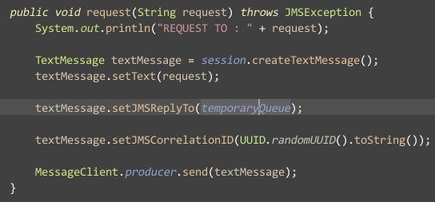

使用ActiveMQ完成Request和Reply模式
---

这几天一直在学习JMS标准，也在看<<ACTIVEMQ IN ACTION>>这本书，当中有几个比较好的例子我这边来分享下。

首先是,ACTIVEMQ的本机环境搭建问题。关于这个，我建议大家阅读这篇文章:[Using ActiveMQ > Getting Started](http://activemq.apache.org/getting-started.html#GettingStarted-UnixBinaryInstallation)

一般介绍如何启动ActiveMQ,都是运行activemq脚本，但是我喜欢用的是activemq-admin这个脚本，原因是，我可以看到监控的
状态。这样就可以做一些简单的判断了，比如当前系统的运行状况，和负载情况。

怎么判断你的ActiveMQ已经可以正常运行了呢，你只需要打开[http://localhost:8161](http://localhost:8161),当然这是默认设置的效果，你也可以
进行端口的修改。如果你看到了ActiceMQ的界面，说明MQ已经启动完成。你可以开始编写代码了。

先申明一点，为了代码尽可能的简单，和便于理解，之后的代码只是启动了一个简单的Broker，并没有启动其他的部件。当然，如果
你没有启动ActiveMQ，运行以下的代码也是可以跑的。**具体的代码，我方到了[Github](https://github.com/MikeCoder/MyStudy/tree/master/MyBlogs/code/AcitveMQ)上**，有兴趣的可以自己Download下，然后进行阅读。

这边需要提的几点就是，ActiveMQ当中并没有实现所谓的Request/Reply模型,确切的说，JMS标准并没有提供这样一种通信方式
，但是，我们可以通过其他的途径去实现这个效果，这个
效果的应用场景还是比较多的。比如，服务器需要确保消息的准确无误的传输，就需要对传递的消息进行一个回应。这边，我们就是使用
两个消息队列实现这么一个神奇的东西。

主要的原理就是如图:
> 
>
> *图片摘自[点缀星辰](http://shmilyaw-hotmail-com.iteye.com/blog/1897635)*

在Client端，也就是消息发送端来说，发送请求的时候注意设定消息的返回通道。这个例子里，我使用了一个临时的队列。代码如下:
> 

然后就是消息接受端了。如何将收到的消息的反馈发送给消息发送方。其实也很简单，就是从哪来回哪去。代码如下:
> 

然后运行程序，就可以了，不过需要注意的是，这边我并没有使用阻塞的方式，而是使用了异步的方式处理请求和回复，所以，在进行
代码编写的时候，需要确定好消息的编号问题，以免出现双方进行交互的时候，都不知道接受的哪个消息的回复。

总体来说，整个的交互过程并不复杂，只是比较繁琐。对于请求/应答的方式来说，这种典型交互的过程就是Client端在设定正常发送请求
的Queue同时也设定一个临时的Queue。同时在要发送的message里头指定要返回消息的destination以及CorelationID，这些就好比是一封
信里面所带的回执。根据这个信息人家才知道怎么给你回信。对于Server端来说则要额外创建一个producer，在处理接收到消息的方法里再
利用producer将消息发回去。这一系列的过程看起来很像http协议里面请求-应答的方式，都是一问一答。

不过，JMS确实有很多值得好好把玩的地方，之前阿里的电话面试中，也提到了很多消息确定的保证上，这一点，JMS做了很多的研究，在前人的
经验上， 我们可以得到更多的提高。

之后会有更多的关于JMS的文章。最近也在看PHP，发现Sublime配置之后，确实是一个写PHP的神器。不知道还有没有更好的方法，求推荐。