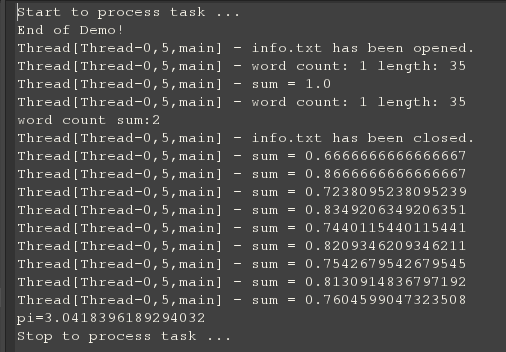

像NodeJS一样写Java(一)
---
六月过了将近一个星期了,马上要期末考试了,就没有多少心情去写一些自己感兴趣的东西了.这个模型是我很早就想去做的,因为网上吹捧NodeJS很过分.貌似到了膜拜的境地,虽然对JavaScript并不是很感冒,但作为圈子里的人,也是要看一下的.所以就有了前一篇文章[《初识NodeJS》](http://mikecoder.net?post=94)

其中，我就对NodeJS的事件机制有了兴趣，因为从来没有想过代码可以这样写，完全基于事件进行编写，虽然之前在写SWING,AWT等程序的时候，会有事件概念，但像NodeJS一样完全架构于事件只上的代码，确实没有编写过。

比如说，我们常见的读取文件的代码，如果是Java顺序读写，我们会这么写:
```
public static void main(String[] args) throws IOException {
    File file = new File("info.txt");
    BufferedReader reader = new BufferedReader(new FileReader(file));
    String data = "";
    while (!(data = reader.readLine()).equals("null")) {
        System.out.println(data);
        data = "";
    }
    reader.close();
}
```
但是，如果我们细看这段代码，如果需要你基于事件驱动进行编写，你会怎么去写？事件需要尽可能的细化，以至于可以在单线程环境下快速执行。也就是类似于操作系统中，时间片的大小选择。

我们可以从中看到几个可以确定的事件，比如说文件打开，文件准备完毕，读入一行数据，文件读取结束。所以基于这么几个事件，我们可以构建如下的伪代码:
```
task.on("open", new EventHandler() {
    @Override
    public void handle(EventObject event) {
        //打开文件
    }
});
task.on("next", new EventHandler() {
    @Override
    public void handle(EventObject event) {
        //读取一行文件，触发"ready"事件
        //触发"next"事件
        //如果出现文件末尾或读写错误则触发"close"事件
    }
});
task.on("ready", new EventHandler() {
    @Override
    public void handle(EventObject event) {
        //读写完毕
    }
});
task.on("close", new EventHandler() {
    @Override
    public void handle(EventObject event) {
        //资源回收
    }
});
```
所以，我们需要做的，就是编写一个可以运行上面代码的底层驱动驱动模块。我们姑且称之为[**NodeJave**](https://github.com/MikeCoder/NodeJava)吧,这个框架主要借鉴的是[自己实现一个基于事件驱动的单线程异步框架](http://www.oschina.net/code/snippet_103999_14286)，但是，做了一定的修改，引入了异步任务的调度和事件结束之后的资源回收。

这个框架的核心在于**TaskEventEmitter**和**TaskManager**两个类，前者主要是作为一个任务集的消息和handler对象的存储，后者主要负责对任务进行调度，当然，这边只是简单的一个阻塞链表，在没有任务的时候，让工作线程处于饥饿状态。

对于这段代码，我对他的分层设计表示佩服，写的真的很漂亮，以至于让我在后来进行改进的时候，受益匪浅。

但是，初看代码，很容易让人疑惑，特别是当PI和IO两个任务进行调度的时候，因为他们当中都有对"next"事件进行响应。
> PITask中：

```
task.on("next", new EventHandler() {
    @Override
    public void handle(EventObject event) {
        int n = ((Integer) event.getArgs()[0]).intValue();
        double xn = Math.pow(-1, n - 1) / (2 * n - 1);
        task.emit("sum", xn);
    }
});
```
> IOTask中:

```
task.on("next", new EventHandler() {
    @Override
    public void handle(EventObject event) {
        BufferedReader reader = (BufferedReader) event.getArgs()[0];
        try {
            String line = reader.readLine();
                if (line != null) {
                    task.emit("ready", line);
                    task.emit("next", reader);
                } else {
                    task.emit("close", task.getFileName());
                }
            } catch (IOException e) {
                task.emit(e.getClass().getName(), e, task.getFileName());
                try {
                    reader.close();
                    task.emit("close", task.getFileName());
                } catch (IOException e1) {
                    e1.printStackTrace(); 
                }
            }
        }
    }
});
```
那么，他们是怎么进行区分的？其实很简单，因为在**EventObject**类中，其中包括一个Source这一项，这个是用来标定消息发出者的信息的，所以，即是名称相同，也不会重复。代码中，进行消息生成的代码在**TaskEventEmitter**中，截取出来如下：
```
@Override
public void emit(final String eventName, final Object... args) {
    if (eventHandlerMap.containsKey(eventName)) {
        List<EventHandler> eventHandlerList = eventHandlerMap.get(eventName);
        for (final EventHandler handler : eventHandlerList) {
            executor.submit(new Task() {
                @Override
                public void execute() {
                    handler.handle(new EventObject(eventName, 
                                                   TaskEventEmitter.this,
                                                   args));
                }
            });
        }
    } else {
        System.out.println("No event handler listen this event: " + eventName);
        if (args[0] instanceof Exception) {
            ((Exception)args[0]).printStackTrace();
        }
    }
}
```

在这边，我们可以清楚的看到了那个EventObject的生成，因为每个TaskEventEmitter不同，从而导致了每个EventObject的不同。其次，每个任务集的消息都是存放在该任务集自己的HashMap中(即，所谓的IOTask，PITask虽然以Task结尾，但都是继承的TaskEventEmitter)，更加不存在误读了。即：
```
abstract public class TaskEventEmitter implements Task, EventEmitter {
    // This is the core of the whole system, it stores the whole infomation
    // about the event and the handles
    private Map<String, List<EventHandler>> eventHandlerMap = null;
```

所以，如果我们执行作者提供的Demo，我们可以看到一个类似与NodeJS的执行效果，单线程异步！
效果如下：
> 

其中，计算任务和IO任务交替进行。

但是，美中不足的是，这个框架存在着内存泄漏的问题，比如一个任务执行结束，并没有进行资源的释放。其次，没有任务调度的思考。这些优化，我将放在下一篇博客中进行讲解。