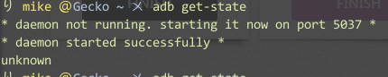
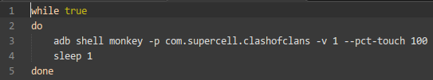

关于Clash of Clans不下线脚本
---
Clash Of Clans俗称部落战争，AKA COC。不得不说这是一个非常好玩的游戏，也是我除愤怒的小鸟之后最喜欢玩的一个游戏。

好了，介绍了部落战争的背景，开始描述写这个脚本的原因，起因就是，作为一个七本，我需要抢黑水生王，然后好不容易打到8500+，然后被偷到了8000-，心痛啊。于是开始想怎么才能不下线，一开始的想法很简单，就是隔个几分钟手去摸一下屏幕。太二了。好歹是一个曾今写过3个月安卓的人。

于是，就开始了思考如何去写这个脚本，当然，这个过程中，不断穿插着脑残的手摸屏幕的行为。

###正题开始
####扯淡的话
写脚本之前，有如下问题需要解决：

1. 使用何种手段模拟手指触碰动作。
2. 间隔时间多少为宜，且不会造成误操作。
3. 手机长时间运行游戏，散热问题如何解决。
4. 如何保证玩家可以随时介入。

*PS: 目前只想到这么几个*

一开始，我准备的是物理方法，因为我们实验室有电机和轮胎，还有电容触控笔，所有最简单的办法就是在轮胎外围粘上触控笔，然后将手机放在笔下，随着轮胎的转动，笔会不停的触控屏幕，从而不掉线。

然后，上述几个问题得到解决，但是我最终还是没有采用这个办法。原因很简单，触控笔找不到了。当然，作为一个程序猿，这个解决方法太LOW了。

于是，仗着我残存的安卓功底，我想到了[monkey](http://developer.android.com/tools/help/monkey.html)还有[monkeyrunner](http://developer.android.com/tools/help/monkeyrunner_concepts.html)，两个神器。因为作为一个写安卓的人，了解这个是必须的，而且本文的目标读者是有一定编程基础的人，所以在运行前环境的搭建就不再啰嗦，同时，**以下的操作均基于Ubuntu 12.04 x64版本**，对于Windows系统，由于不熟悉，所以希望有人帮忙写一下Windows下的对应脚本。

####前期准备
脚本所需的必要环境:
> + Android SDK
> + Bash Shell

然后，就很简单了，我们需要SDK，是为了使用谷歌提供的开发者工具，Shell则是录制脚本。

首先将手机打开调试模式，然后连上电脑，在终端中输入:`adb get-state`。一般而言，都会出现`device`字样。如果出现`unknown`就像爱这样：
> 

就说明出问题了，解决的办法也很简单，依次输入：
> + `sudo adb kill-server`
> + `sudo adb shell`
> + `sudo adb start-server`

即可，效果如下：
> 
>
> *注意：由于使用了 sudo 所以最好 cd 到SDK的目录下去，不然找不到 adb 程序*

然后就是很简单的事情了，先确定Clash of Clans的包名，这个如果有Eclipse开发工具的话，很容易的事情，点开device那栏，就能看到所有运行的程序的包名。如下图：
> 
>
> *PS:高亮的那栏即是COC*

然后就是使用monkey的时候了。monkey中有一个功能就是能触发随机事件来进行压力测试，这一点我们就可以利用来对程序进行一些测试，但是，这也就可以让我们对一些程序做一些好玩的事情，比如说这个。

按照谷歌的官方文档，通过参数的堆积，我们可以对指定的包发送指定的事件，也就是说，我们可以用如下测试命令:
> `adb shell monkey -p com.supercell.clashofclans -v 1 --pct-touch 100`

来达到向COC发送一个触摸指令。也就是模拟了一下人的手指随机触控。当然，你也可以运行如下命令:
> `adb shell monkey -p com.supercell.clashofclans -v 10000 --pct-touch 100`

来感受神级操作。

运行过程如下图：
> 

接下来，触控事件搞定了，然后就是定时发送的事情了，这边我就偷懒了，因为比较熟悉Shell，所以直接一个`while true`加上一个`sleep`就结束了，所以我的最后的脚本就是:
> 

运行的结果吗，就是在我之后的三个小时里，我都没有再因为没有活动而下线了，从而资源也没有被人偷了，于是平稳的在一夜之间，出王升八！

享受生活，享受编码。