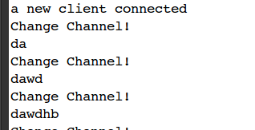

初识Java NIO
---

> **1. 以下是一个简单的读文件的演示程序:**
> > 
>
> > 从这个简单的例子中确实看不出来NIO和传统的IO有什么不同，简单的说，如果使用InputStream直接用read()函数，也能达到相同的效果。所以，接下来就是IO和NIO的原理图。
>
> **2. IO和NIO的区别:**
> > 这张图片展示的是IO的工作原理，也很容易理解，一个线程负责一个流。
>
> > 
>
> > 这张图片则是NIO的工作原理，比较复杂一点:
>
> > 
>
> > 从这两者之间，我们可以看到，IO是基于流的，而NIO是基于Channel的，也就是基于缓冲的(Channel是一个缓冲的标识符，这一点类似与Linux下的文件标识符)
>
> >  这之前的业务场景中(读一个文件)，我们看不到NIO的优势(这样的优势，我们可以理解为用较少的线程进行管理大量的文件缓冲)，或者说是让我们决定使用NIO的动机。所以，我现在准备用一个实例，而且是一个我们在一般的生产环境中会使用的例子来说明问题，就是聊天室。
>
> **3. 实例展示**
>
> > 在传统的，也就是网络上流传的聊天室的例子都是基于IO的，也就是我们常用的Stream家族来进行数据的读写，这样的例子网上谷歌(做一个有操守的程序员，坚决抵制使用baidu进行查询的行为)一下一大堆，也就不扯了，基本上的结构或者说原理都是这样的:
>
> > 
> 
> > 这种设计并不是不好，在连接数量少，且单个连接占用较大带宽的时候，这种方法依旧是首选。但是，如果是聊天室的性质，则这种设计并不是最佳，因为会有很多的线程卡在IO等待上，耗尽CPU，内存资源。所以，接下来的就是使用NIO的聊天室样例，先上一张原理图:
>
> > 
> 
> > 在这个例子中，我们需要使用NIO在不同的Channel中进行调度，然后进行读写操作。
>
> > 具体的代码在我的GitHub上，地址在这:[NIO Chat](https://github.com/MikeCoder/MyStudy/blob/master/%E6%88%91%E7%9A%84%E9%98%85%E8%AF%BB%E5%88%97%E8%A1%A8/Netty%E5%AD%A6%E4%B9%A0%28Mike%20Tang%29/NIO%E5%AD%A6%E4%B9%A0/%E5%9F%BA%E4%BA%8ENIO%E7%9A%84%E6%B6%88%E6%81%AF%E6%8E%A5%E6%94%B6%E7%A4%BA%E4%BE%8B%28%E4%BB%A3%E7%A0%81%29.md)
>
> > 最后效果可以展示,在多个客户端的连接条件下:
> 
> > 
> 
> > 当多个客户端发送请求时，服务器主线程在多个Channel之间进行切换，由于这边我为了演示，所以将缓冲区大小设置为了2个字节，所以可以看到频繁的切换。
>
> > 客户端发送消息:
>
> > 
>
> > 服务器端进行接收:
> 
> > 
>
> **4. 有此，NIO的优势得到了体现，在这个业务场景下，之前使用IO的多线程程序在这边使用一个线程即可以完成。**