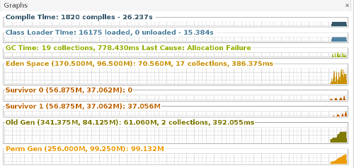
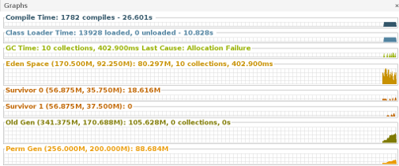

调优Eclipse
---

>#### 通过学习之后，决定尝试一次真正意义上的Java调优，于是就开始从自己的Eclipse开始。
>#### 准备环境
>1. 首先是准备环境使用的是JDK自带的JVM监控插件，一般是在JDK文件夹下的bin目录下，jvisualVM.运行的时候直接./jvisualVM就行，windows下应该是直接点击运行。然后再添加ViualGC插件进行查看Java内存的分配情况。
>2. 为了了解我的调优结果，需要知道Eclipse的启动时间，但是Eclipse自己没有类似功能，于是自己写了一个Eclipse的插件，用来记录Eclipse的启动时间。
>3. 插件的运行效果：
>		* 
>4. 监视器的运行效果：
> 		* 
>#### 进行第一步的分析
>1. 按照我的插件的提示，还有监视器的数据，我们可以知道，我的Eclipse在启动的时候一共消耗了22.2秒的时间，
>2. 按照我的上一张监视器的图片，我们可以看到，在Eden区域内，总共进行了17次的垃圾回收消耗了272ms，在Old区域也进行了2次回收消耗了361ms，然后进行JIT编译消耗了26.809秒，在加载class的时候消耗了15秒，
>3. 而且在Eclipse开启的时候，JVM为Eden分配了170.5MB内存，两个Survivor区分配了56.875MB，永久态分配了256MB,老年态则被分配了341MB。
>4. 由于启动时间的大头之一JIT编译时间上，所以可行的办法并不多，只能从JVM入手，一般可选的方案是更新JVM来更新JIT的,但是本机上我只有JDK1.7，所以这个方面不进行优化。
>5. 还有一个地方在类加载，这个地方需要扯到Java的字节码验证，所以我决定采用激进的办法去优化，就是去掉验证字节码过程，因为Eclipse在我电脑上已经多次运行无错，所以我认为字节码已经正确，无需验证。
>6. 接着就是内存的调优，因为在我的电脑上，内存的GC并不严重，加起来不到1s的时间，但是从内存的分配上，我发现由于系统没有设置最小值，导致了很多次的扩展，这消耗了一部分的时间，所以我可以从设置最小内存下限的办法减小扩展次数。
>#### 结果
>1. 取消类加载时的字节码验证，方法很简单，就是在Eclipse的配置文件中加上-Xverify：none,修改之后的效果如下：
>		* 
>2. 发现Eclipse在加载类上所花的时间大概快了500ms，多次测试之后，发现确实是500ms+-60ms之间，所以加载速度还是的到了提高。总时间也下降到了21.9s。
>3. 接下来就是内存的调优了，根据这几张数据，可以看到最后的内存稳定在，perm:155MB,old:133MB,Eden:76MB,我开始尝试直接在perm处申请128MB内存，避免频繁的扩充，结果是：
>		* 
>4. 类加载的时间明显的下降，但是128m并不是最终值，最终是99MB,但是依旧伴随这一次扩容，因为perm容纳了过80%的类，所以扩容，接于此，我将128增加到200MB，事实证明，提高不是那么明显。。。接着开始处理Old和Eden的GC问题。也是提高Old的容量，将Old的初始容量设置为256之后，我们发现，在Old区域内，已经不会产生收集动作。数据:
>		* 
>5. 然后想通过增加Eden部分来减少该部分的垃圾回收操作，但是在我的电脑上，传统的-Xmn参数是报错的，所以这个暂时先不进行。
>		* 
>6. 最后也就是选择垃圾回收器，Java中提供了5种左右的垃圾回收器，这边不详细阐述，最后的结论是，在我们这种强度的使用下，使用CMS进行垃圾回收相对比较高效，他能做到实时的清理垃圾，而不是传统的"stop the world"。最后的数据：
>		* 
>7. 最后，所有GC行为从最初的19次降到了9次。最后的时间:18.9s：
>		* 
>8. ####其实调优的意义是在现有的资源上，使JVM的性能越来越好，这次调优中，我并没有申请更多的内存，而是在现有的内存上让程序跑的更快。
>9. 我的eclipse.ini的配置，以作参考：
>		* 