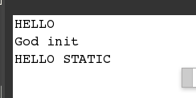

第七章、虚拟机类加载机制
---

### 1. 类加载的顺序
>+ 加载->连接(验证->准备->解析)->初始化->使用->卸载
>+ Java中没有在编译的时候进行链接，而是在运行是进行链接，是为了支持Java的动态绑定，比如说反射等一些操作。
>+ 在遇到一下几种情况下，虚拟机会立刻对类进行初始化。
>+	+ 1.遇到new,getstatic,putstatic或者invokestatic这四条字节码的时候，如果类没有进行初始化，必定就地初始化。特别注意的是，在new的时候，如果是对final字段的变量赋值，则不会触发初始化。
>+	+ 2.使用java.lang.reflect包的方法对类进行反射调用的时候。如果类没有进行初始化，则会进行初始化。
>+	+ 3.当初始化一个类的时候，发现其父类没有进行初始化，则会初始化父类先。
>+	+ 4.当虚拟机启动时，用户需要制定一个执行的主类(main函数的那个)，虚拟机会初始化这个类。

### 2. 被动引用时不会触发初始化
>1. 通过子类引用父类的静态字段。父类不会初始化。
>2. 通过数组定义来引用类，不会触发类的初始化。
>3. 常量在编译阶段会存入调用类的常量池中，本质上没有直接调用到定义常量的类，因此不会触发定义常量的初始。

### 3. 这边详细的举例说一下
>1. 第一个例子,这边主要是讲Main函数的那个类会在一开始的时候进行加载
>		* 
>		* 我们可以看到，静态块执行了，但是构造函数没有执行，所以这个类是被初始化但是没有构造，也就是说，这个类已经进入了方法区内存，但是没有进堆内存。
>		* 
>2. 第二个例子将的是，调用常量池中的变量不会引起初始化。
>		* 这是测试的代码:
>		* 
>		* Main函数测试：
>		* 
>		* 从下面结果可以看出来，final对象并不会初始化，但是static对象则会触发初始化。
>		* 
>		* 这是因为，在编译的时候，常量池的值一斤转换为Main函数所在类中了，也就是说，编译之后，看似联系的GodFather已经和这个主类没有联系了。所以不会引用。

### 4. 加载过程
>+ 加载阶段是指“类加载”（class loading）过程的一个阶段，也就是加载->验证->准备->解析->和初始化。
>		 1. 加载是通过一个类的全限定名来获取定义来获取定义此类的二进制字节流(未指定加载的地点，所以会出现从zip中，从网络中，从代理中读取)。
>		 2. 将这个字节流所代表的静态存储结构转换为方法区的运行数据结构。
>		 3. 在Java堆中生成一个代表这个类的Class对象，作为方法区的数据的访问接口。

>+ 加载的阶段结束之后，虚拟机外部的二进制字节流就按照虚拟机所需要的格式存储在方法区中，方法区中的数据存储格式没有明确定义，有虚拟机自己完成。

>+ 验证阶段，是确保Class中的字节流包含的信息符合当前虚拟机的要求。
>		1. 文件格式的验证(魔数，版本号，常量类型，编码...)。
>		2. 元数据验证(父类，继承，是否抽象，是否覆盖final...)。
>		3. 字节码验证(指令跳转不会乱，类型转换有效...)。
>		4. 符号引用验证(符号引用，访问权限...)。

>+ 准备阶段，是分配内存和初始化变量阶段(在方法区内进行申请内存，而不是堆)
>		* *注意的一点，static int a = 3,这句话在这个阶段,a是等于0的，只有当调用的时候，a才会付给3的常量*

### 5. 解析过程
>+ 解析过程是将常量池中的符号引用转换为直接引用的过程。(符号引用-是字面量，虚拟机无关，可以不存在。 直接引用-是指向目标的指针)
>		1. 类或者接口的解析
>		2. 字段解析
>		3. 类方法解析
>		4. 接口方法解析

### 6. 初始化阶段
>+ 这是类加载的最后一步，也是开始执行字节码。
>+ <clinit()\>函数(编译器自动收集类中所有类变量的复制动作和静态语句块(static{})中的语句产生，他的顺序一定是**先变量赋值，然后静态语句块(无论顺序)**)，所以在static的语句块中可以访问到初始值。
>+ <clinit()\>和类的构造函数不一样，他不需要调用父类的构造器，虚拟机保证，在子类的<clinit()\>函数结束之前，父类的<clinit\>函数已经执行完毕。所以，第一个<clinit()\>是Object类。
>+ 父类的<clinit()\>函数先执行，则父类的静态代码块优先于子类的变量赋值操作。
>+ 如下图：
>+ 
>+ 最后的结果是2,说明父类的<clinit()\>已经执行完毕。
>+ *如果一个类没有对变量的赋值，和静态块，<clinit()\>也不是一定存在的*。
>+ 虚拟机会保证一个类的<clinit()\>方法在多线程环境中正确的同步，但是也会造成阻塞问题，举个例子:
>+ 
>+ 然后结果就是，线程2永远的被阻塞了，所以在书写静态块的时候需要注意。
>+ 

### 7. 类加载器
>+ 只有在同一个类加载器中才有所谓的相同概念，不是同一个加载器，即使相同也是不同。
>+ 双亲委派模型。
>+ 破坏双亲委派模型。