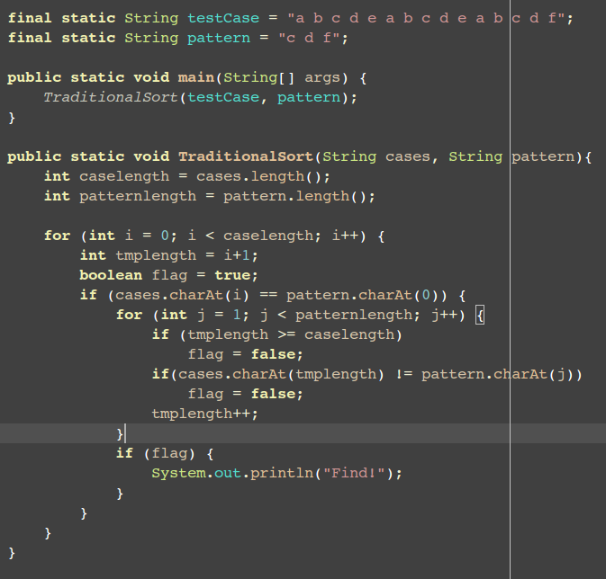
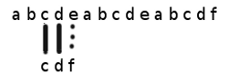
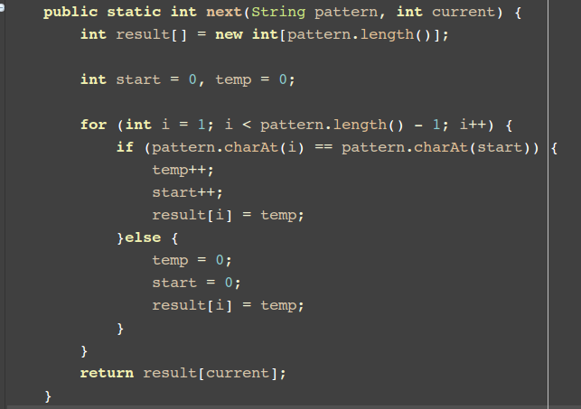
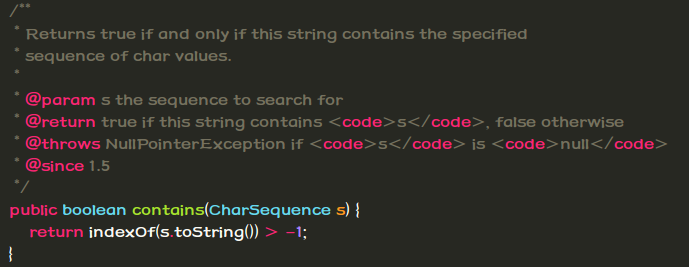
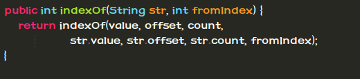
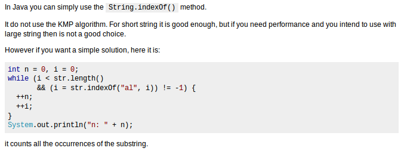

KMP字符串匹配算法
---

#### 一般的朴素字符串匹配算法:

>+ 从目标串Target的第一个字符开始扫描，逐一与模式串的对应字符进行匹配，若该组字符匹配，则检测下一组字符
>+ 如遇失配，则退回到Target的第二个字符，重复上述步骤，直到整个Pattern在Target中找到匹配，或者已经扫描完整个目标串也没能够完成匹配为止
>+ 算法理解起来很简单，实现起来也容易，但是其中包含了过多不必要的操作，也就是在目标串中，有些字符是可以直接跳过，不必检测的
>+ 

#### 但是在特定的情况下，这样的算法还是有可优化的地方的.

>+ 不妨假设我们的目标串:Target =  "a b c d e a b c d e a b c d f"
>+ 需要匹配的模式串:Pattern = "c d f";
>+ 那么当匹配到如下情况时:
>+ 
>+ 因为e!=f,则进行下一次匹配
>+ 
>+ 到最后可以看到：
>+ 
>+ 这中间的四个字符d e a b 完全可以过跳进行检验，由此可见这个传统的方法还是有很多可以优化的地方的。
>+ 

#### KMP算法的基本思想:

>+ 通过一个前缀函数进行贮存"有用信息"，下文称之为部分匹配值，一般使用next()函数进行描述
>+ 在失配后，并不简单地从目标串下一个字符开始新一轮的检测，而是依据在检测之前得到的有用信息，直接跳过不必要的检测，从而达到一个较高的检测效率。
>+ 这个函数能够反映出现失配情况时，系统应该跳过多少无用字符（也即模式串应该向右滑动多长距离）而进行下一次检测，在上例中，这个距离为4.

#### 有效信息的求法

> 一个字符串除了最后一个字符，其余的字符的所有子集都是前缀
> > * 比如说 bread 的前缀为 b, br, bre, brea

> 一个字符串除了地一个字符，其余的所有子集均为后缀
> > * 比如说 bread 的后缀为 d, ad, ead, read

> 然后求出前缀和后缀的共享字符串，然后这个字符的长度减去共享字符串长度，则是这个字符串的有效信息

> 以"ABCDABD"为例
> > * "A"的前缀和后缀都为空集，共有元素的长度为0；
> > * "AB"的前缀为[A]，后缀为[B]，共有元素的长度为0；
> > * "ABC"的前缀为[A, AB]，后缀为[BC, C]，共有元素的长度0；
> > * "ABCD"的前缀为[A, AB, ABC]，后缀为[BCD, CD, D]，共有元素的长度为0；
> > * "ABCDA"的前缀为[A, AB, ABC, ABCD]，后缀为[BCDA, CDA, DA, A]，共有元素为"A"，长度为1；
> > * "ABCDAB"的前缀为[A, AB, ABC, ABCD, ABCDA]，后缀为[BCDAB, CDAB, DAB, AB, B]，共有元素为"AB"，长度为2；
> > * "ABCDABD"的前缀为[A, AB, ABC, ABCD, ABCDA, ABCDAB]，后缀为[BCDABD, CDABD, DABD, ABD, BD, D]，共有元素的长度为0。

> 这一段的代码如图所示:

> 

> 这段代码可以求出所进行匹配的匹配串中的部分匹配值，也就是上文所说的有效信息

> 

#### 完成KMP算法
> 在解决掉这个有效信息之后，接下来的问题也就简单了。接下来的任务就是在一次比较完成之后记录下匹配串中的信息，然后再进行搜索部分匹配值。

> 按照公式: 相同的字符串长度-有效信息=有效移动位。

> 计算思想如下图:

> 

> "ABCDAB"之中有两个"AB"，那么它的"部分匹配值"就是2（"AB"的长度）。搜索词移动的时候，第一个"AB"向后移动4位（相同的字符串长度-部分匹配值），就可以来到第二个"AB"的位置。
> 具体代码实现如下:

> 

> 比较简单，也不多说什么了，主要的算法思想也都交代了。

#### 高潮来了！
> 我搞完这个KMP之后，突然想到Java的String里有一个contains函数，然后，我就想知道他是如何实现的，然后接下来就是我们喜欢的读源码环节。
> 下图就是JDK中的contains方法- -，有点失望啊。。

> 

> 然后按照依赖关系往下找，最后的路线就是这样：

> 

> 这样- -。

> 

> 终于到了高潮部分的代码：

> 

> 我们可以看到前部分是减支和错误判断。接下来就是字符串匹配的高潮了。

> 下面是我做过处理之后的代码部分，用来展示这段代码：

> 

> 很遗憾，在JDK的源码中，字符串匹配并没有使用我们上述所说的KMP算法，还是使用了常见的朴素算法。
> 但是，为什么字符串匹配中没有使用KMP算法呢，这一点我依旧是有点怀疑，于是我搜了下stackoverflow，然后发现了以下描述:

> 
> 大体意思是说KMP算法在巨大的字符串面前弱爆了，于是，我就地发了一个问题，就是关于为什么Java中的String.indexof()不使用KMP算法。

> 地址在:[**Why jdk's String.indexof() does not use KMP? **](http://stackoverflow.com/questions/19543547/why-jdks-string-indexof-does-not-use-kmp)

> 欢迎各位来讨论。